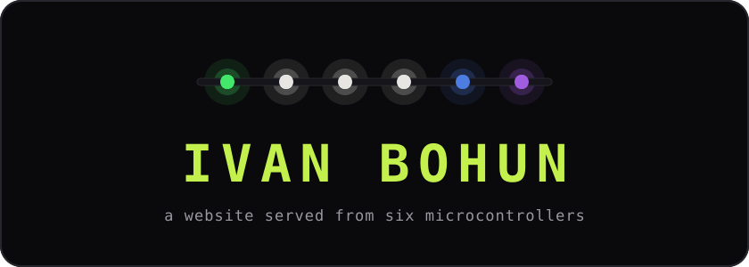
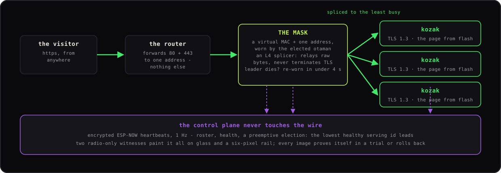
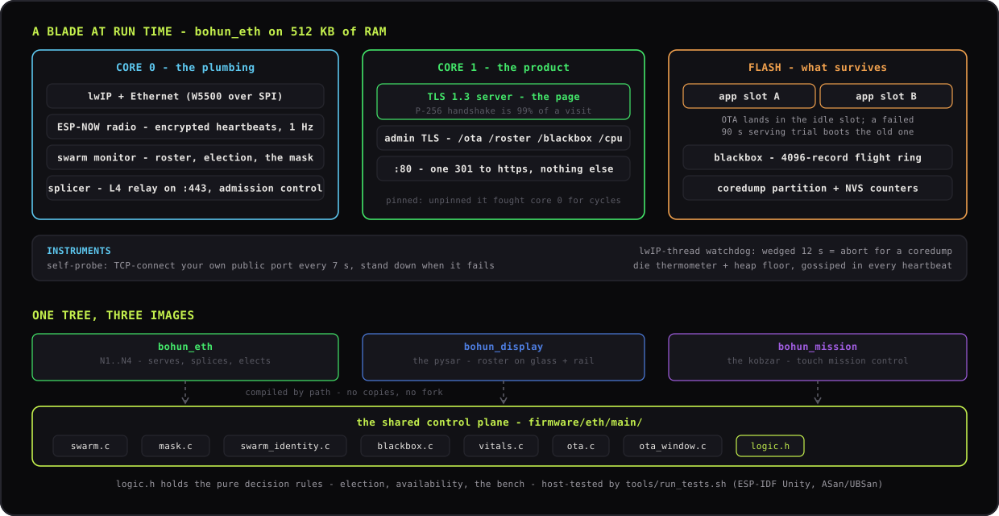

<div align="center">



<br>

**https://kyrylonovotarskyi.com**

**A personal website served from six £12 microcontrollers on a shelf in a London flat.**
No cloud. No CDN. No Raspberry Pi. No reverse-proxy box.

[](https://kyrylonovotarskyi.com)
[](https://docs.espressif.com/projects/esp-idf/)
[](#hardware)
[](LICENSE)

</div>

---

Four ESP32-S3 blades with wired Ethernet hold an election over encrypted
radio. The winner puts on **the mask** - a virtual MAC address no factory ever
issued, plus the one LAN address the router forwards - and becomes a
**layer-4 TCP splicer**: it accepts your connection and relays the raw bytes
to whichever other blade is least busy. That blade terminates TLS 1.3 and
serves the page out of its own flash.

Kill the leader, and another blade wears the mask in under four seconds -
same MAC, same address, same certificate, different silicon. Kill everything
but one, and the survivor splices to itself over loopback and keeps serving.
Two more boards - a 2.8" roster screen (the **pysar**) and a 4.3" touch
panel (the **kobzar**) - hear every heartbeat and paint the fleet on glass
and on a six-pixel LED rail, one pixel per member.



Named after the Cossack colonel *Ivan Bohun*, who broke his sabre rather than
swear the oath at Pereiaslav - the right patron for a website that refuses to
be hosted by anyone.

## Why it is interesting

- **Load balancing is an elected role, not a box.** Every blade carries both
  programs. The splicer's backend set is rebuilt every second from radio
  gossip; no configuration file names a backend.
- **The election never rides the wire it protects.** Heartbeats travel over
  encrypted ESP-NOW at 1 Hz, so a switch or cable failure cannot split the
  brain. The election is preemptive arithmetic - the lowest healthy, serving
  id leads - with nothing to wedge and nothing to time out.
- **Health is proven twice, from both sides.** Every blade TCP-connects to
  its own public port every 7 seconds and stands down from the election when
  it fails; the splicer independently benches backends by the bytes that
  actually come back, because a self-reported flag can lie.
- **Releases cannot brick the fleet.** One key-gated, variant-guarded OTA
  door for all six members. Deploys roll followers first, leader last, and a
  fresh image must survive a 90-second serving trial or the bootloader rolls
  it back. The radio-only displays update through a touch-opened OTA window
  under the same rollback contract.
- **No reboot goes unexplained.** Every node keeps a 4096-record blackbox
  ring and a coredump partition in flash; the heartbeat carries every boot's
  cause, and the kobzar's chronicle names it on glass.

Measured on the machine itself: fresh TLS connections at **2.9-3.0/s with
nothing dropped** (a ~650 ms P-256 handshake is 99% of the toll), warm
keep-alive requests in ~40-60 ms at ~40-50 req/s fleet-wide, the splicer's
own wire the limit past ~100 req/s - and the site stays up through any
single power plug being pulled.

The full architecture, with every diagram:
**[`docs/SYSTEM_DESIGN.md`](docs/SYSTEM_DESIGN.md)**. How it came to be,
cascade of failures included: **[`STORY.md`](STORY.md)**.

## 🇺🇦 Donate to Ukraine's defenders

Everything above is, in the end, a plug for this section.

- **[Come Back Alive Foundation](https://savelife.in.ua/en/donate-en/)**
- **[Serhiy Prytula Charity Foundation](https://prytulafoundation.org/en/donation)**
- **[The Hospitallers Battalion](https://www.hospitallers.life/needs-hospitallers)**
- **[UNITED 24](https://u24.gov.ua/)**

Or [place your trust in me directly](https://monzo.me/Novotarskyi) by
donating in support of the Ukrainian Medical Corps with best-in-class
hemostatic agents, procured at manufacturing source and shipped straight to
the front-line hotspots where the need is most critical.
**$50 saves a life - literally.** $150,000+ deployed, 2250+ Celox
Haemostatics delivered so far.
[Full nomenclature is and always will be publicly available here](https://docs.google.com/spreadsheets/d/11mWVBJDrpQaJfEoERbiEmESVg5paxcoPQ7fkLouUGLo/edit?gid=0#gid=0).

## Firmware



Three images from one tree. `bohun_eth` is the blade: a TLS server pinned
to its own core (a P-256 handshake is 99% of the cost of a visit), the
radio, lwIP and the splicer sharing the other, and a key-gated admin plane
that never leaves the LAN. `bohun_display` and `bohun_mission` are the
witnesses - and they compile the blades' control-plane sources straight
from `firmware/eth/main/` by path, so a display can never drift out of
protocol with the blades it listens to.

The firmware assumes it will fail, and instruments every way it ever has:
each blade TCP-connects its own public port every 7 seconds and stands
down from the election when that fails, a watchdog aborts to a coredump if
the lwIP thread wedges, and a 4096-record blackbox ring in flash survives
reboot, OTA and panic - when a blade dies, it leaves a note saying why.

The rules the fleet lives by - who leads, what availability means, when
the balancer benches a blade - are pure functions in one header,
[`logic.h`](firmware/eth/main/logic.h), proven on the host by
[`tools/run_tests.sh`](tools/run_tests.sh) with ESP-IDF's own Unity
(39 tests, ASan/UBSan). The serving path proves itself on the machine
instead: a fresh image must survive a 90-second public serving trial or
the bootloader rolls it back. Module-by-module detail:
[`docs/2_firmware/`](docs/2_firmware/).

## Hardware


A 10-inch, 8U desktop rack: four blades in 3D-printed cases, both screens
behind a smoked-acrylic face with the LED rail glowing through it, one
Ethernet switch, one USB charger, three fans - about 22 W for the whole
machine. The build is documented to be repeatable, from the first solder
joint to the last cage screw: [`docs/1_hardware/`](docs/1_hardware/).

## Build your own

You need:

- **2+ LILYGO T-ETH-Lite ESP32-S3 boards** - one serves with no failover;
  this fleet runs four plus two spares.
- An Ethernet switch, USB-C power, a router you can port-forward on, a
  **static public IP**, a domain.
- A computer with [ESP-IDF](https://docs.espressif.com/projects/esp-idf/)
  **v6.0.2** exported in the shell.
- Optional: the two display boards + an SK6812 strip
  ([`docs/1_hardware/`](docs/1_hardware/)), a 10" rack and the printed cases
  ([`docs/1_hardware/16_rack.md`](docs/1_hardware/16_rack.md),
  [`hardware/`](hardware/)).

Then, in order:

1. **Mint your secrets** (once):
   ```bash
   tools/gen_secrets.sh
   ```
   Writes the OTA key and the ESP-NOW PMK/LMK into
   `firmware/eth/main/secrets.h` - gitignored, never committed, baked into
   every binary (which is why build directories are gitignored too). Then
   fill in the deployment fields by hand: `BOHUN_MASK_IP` (the mask's
   reserved LAN address, outside your DHCP pool), `BOHUN_MASK_GW` (your
   gateway), and - if you build the displays - `BOHUN_WIFI_SSID`/`_PASS`
   for their OTA window. `secrets.h.example` shows the shape. Keep a copy:
   losing it means USB reflashes to rejoin, and rotating keys is a flag day
   for all nodes at once.

2. **Get a TLS certificate** for your domain (Let's Encrypt via DNS-01
   works while the fleet is still LAN-only) and drop the pair into
   `firmware/eth/main/certs/` as `servercert.pem` (full chain) and
   `prvtkey.pem`. Both gitignored.

3. **Teach the fleet its members** - edit
   `firmware/eth/main/swarm_identity.c`: each board's eFuse MAC, id, name,
   shortname, eligibility. Blades are eligible; displays are witnesses.
   (`idf.py monitor` prints a board's MAC on boot if you need it.)

4. **Make it your site** - replace `assets/personal.html` (one
   self-contained file, no external requests), then refresh the compressed
   copies the firmware embeds:
   ```bash
   gzip -9 -n -c assets/personal.html > firmware/eth/main/personal.html.gz
   brotli -f -q 11 assets/personal.html -o firmware/eth/main/personal.html.br
   ```

5. **Run the tests** - seconds, on your machine, no board:
   ```bash
   tools/run_tests.sh
   ```
   39 checks over the fleet's decision rules (election, availability, the
   balancer's bench), compiled against ESP-IDF's Unity with sanitizers on.
   Run them again after any change to `firmware/eth/main/logic.h`.

6. **First flash of each blade over USB** (every later update goes over the
   air):
   ```bash
   cd firmware/eth
   idf.py -B build.lilygo -D SDKCONFIG=build.lilygo/sdkconfig \
          -D SDKCONFIG_DEFAULTS="sdkconfig.defaults;boards/lilygo.defaults" \
          build flash
   ```
   The per-board defaults matter: they carry 240 MHz, PSRAM and the TLS
   session-ticket config - a plain `idf.py build` produces a slower image
   with a different TLS stack shape.

7. **Displays, if you built them** - plain `idf.py build flash` in
   `firmware/display` and `firmware/mission`. The kobzar additionally
   flashes a baked image of the site into its page partition; regenerate it
   after site changes with `firmware/mission/render_page_asset.py` (needs
   Chrome, nothing else). Later display releases go over the air: hold the
   touch surface for 4 s to open the OTA window, then
   `tools/deploy_observer.sh`
   ([`docs/2_firmware/26_ota_deployments.md`](docs/2_firmware/26_ota_deployments.md)).

8. **Open the doors** - forward TCP/80 + TCP/443 to your mask address and
   point your domain's A record at your public IP. **Never forward the
   backend or admin ports.**

9. **Prove it**:
   ```bash
   tools/fleet_check.sh
   ```
   Every blade must PASS: page 200, OTA closed on the public port, admin
   open on the LAN, identical content hashes fleet-wide, plus the live
   roster from the mask holder.

10. **Every later release goes over the air**:
   ```bash
   export BOHUN_OTA_KEY=$(grep BOHUN_OTA_KEY firmware/eth/main/secrets.h | cut -d'"' -f2)
   tools/deploy.sh
   ```
   Followers first, leader last, four gates per node including the
   90-second rollback trial. Re-running is idempotent - blades already on
   the target image are skipped.

## Map

| Where | What |
|---|---|
| [`docs/SYSTEM_DESIGN.md`](docs/SYSTEM_DESIGN.md) | **the architecture** - read this first |
| [`STORY.md`](STORY.md) | the build story - how six microcontrollers ended up serving a website |
| [`docs/1_hardware/`](docs/1_hardware/) | building the fleet: soldering, power, data wiring, the LED rail, blade cases, the rack |
| [`docs/2_firmware/`](docs/2_firmware/) | the firmware: intake, the serving blade, the swarm control plane, both displays, OTA and deploys |
| [`firmware/`](firmware/) | the code: `eth` (blades), `display` (pysar), `mission` (kobzar) - the displays compile the blades' swarm sources by path, no copies |
| [`hardware/`](hardware/) | OpenSCAD + STLs for the printed blade cases |
| [`assets/`](assets/) | the site: one self-contained `personal.html` |
| [`firmware/tests/`](firmware/tests/) | host tests for the decision kernels - `tools/run_tests.sh` runs them in seconds |
| [`tools/`](tools/) | `gen_secrets.sh` · `deploy.sh` · `deploy_observer.sh` · `fleet_check.sh` · `fleet_discover.sh` · `run_tests.sh` |

## License

[MIT](LICENSE).
