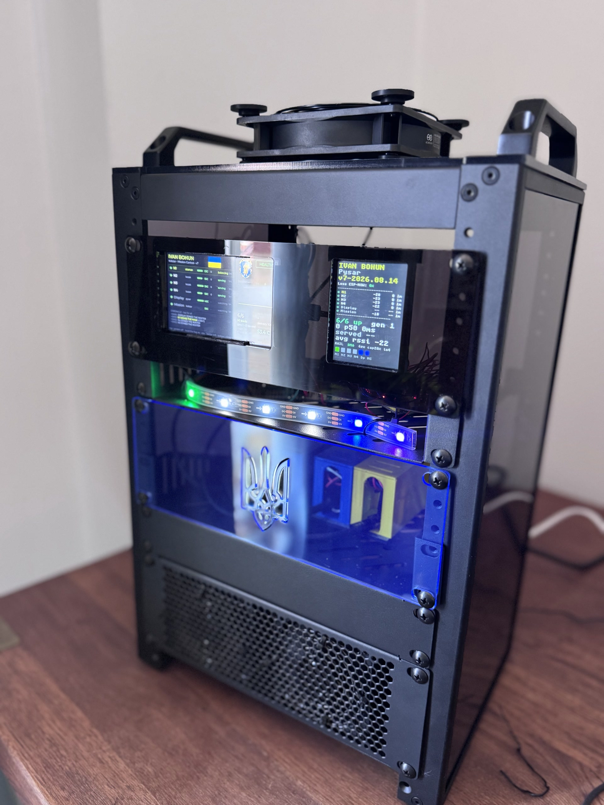
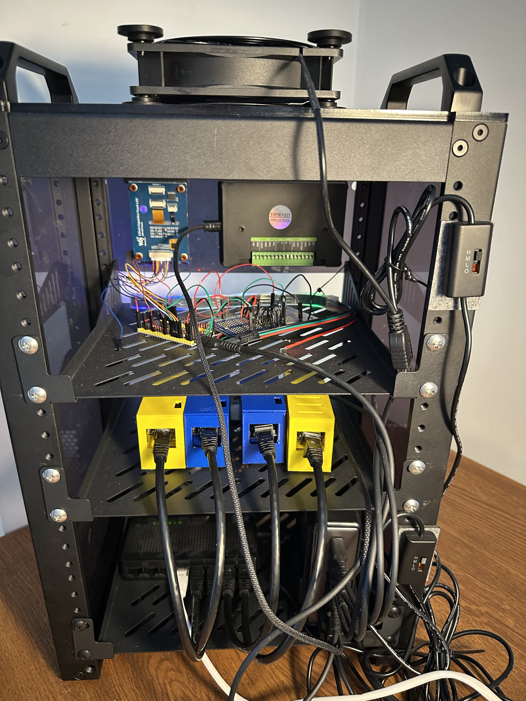
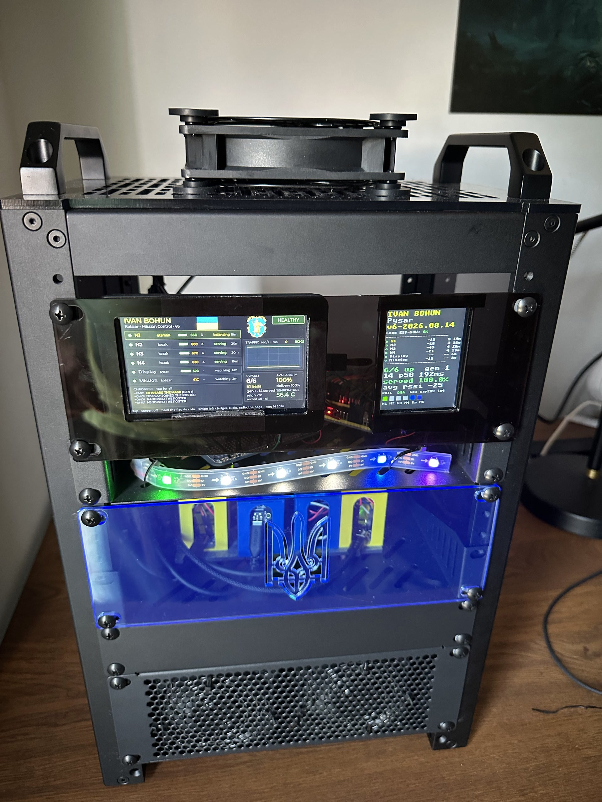
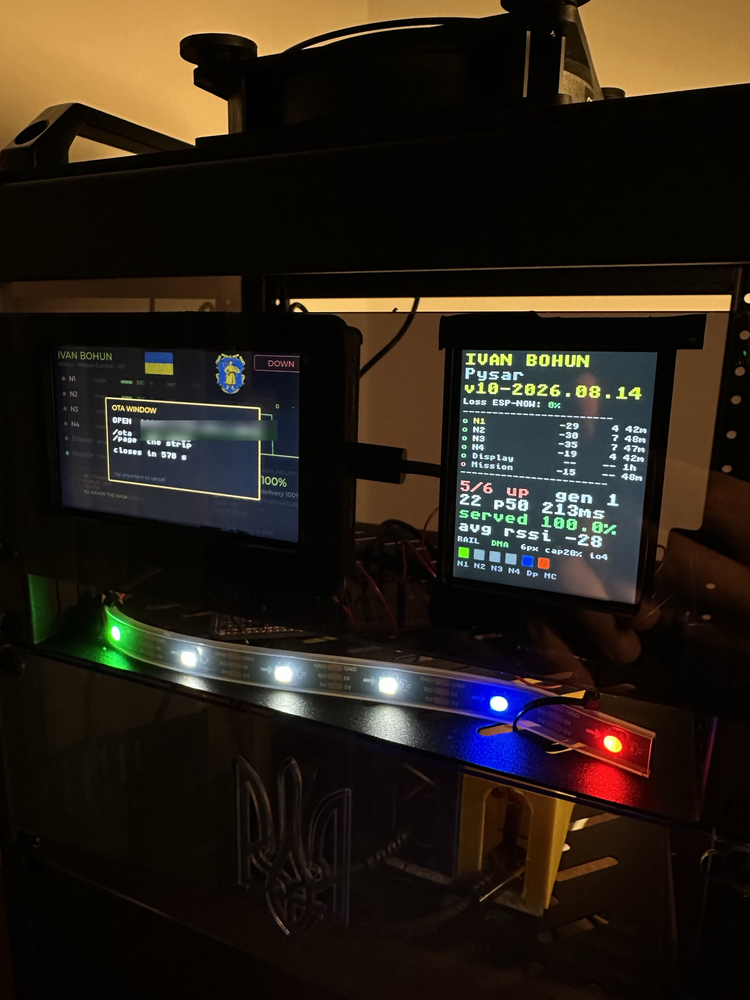

 I serve my website from six ESP32 microcontrollers on a shelf
---

I've loved microcontrollers since uni.
For me, studying ASM clicked the physics and maths fundamentals together: 
1. Electrical circuits → transistors → logic gates → ICs → SoCs on one end
2. Boolean logic → min canonical forms → Zhegalkin algebra → combinational circuits → computer arithmetic → finite state machines → Markov chains on the other.    

There is beauty in it, and the feeling that my field of study starts making sense is priceless.

Decades later, my career has firmly gone into distributed systems. 
I've had the chance to witness the emergence of CUDA, as well as the rise of Cloud Computing: from virtualization, to containerization, to "serverless" at scale. 

Nowadays, hosting your own website on hardware that you own and manage seems almost laughable.
Having some time on my hands this summer, I have embarked on a journey to disprove such a ridiculous notion!

First, I wanted to host _a website_ from my own closet, to make a point (mainly to myself), and going with a Raspberry Pi would have probably been the prudent way of doing it.

But what's the fun in that?

The project below is the result of figuring out the fun:
1. What if... the website is hosted on a 5x3cm microcontroller board weighing under 20 grams? 
2. It wouldn't scale, though? Now we're talking, let's make it four microcontrollers then!
3. How do we distribute the work then? Let's make one of them tell the others what to do!
4. And how would I know what's going on in my own system? Let's get a display and render things on it!
5. What about knowing that everything's okay quickly? Fine, let's add a bright LED rail to color-code the state!
6. Tiny screen is a tiny window for a lot of data, though? Right, let's buy a Bigger Screen and show All The Data there!
7. But the screens don't have Ethernet! How would they even learn about anything in the fleet? Indeed, so we'll make the fleet talk to each other over radio instead!
8. How would I deploy any changes for this system? Let's do it over the air and make it safe, too!
9. Where would all this hardware reside? On a shelf, of course, in tiny plastic cases!
10. The screens are useless in a closet though. Also, what about the power supply, and networking, in this heat? Fine, let's build a rack for it all!

As a result, https://kyrylonovotarskyi.com is served from six ESP32-S3 microcontrollers on a shelf
in a London flat.

No CDN in front, no Cloud behind, no hosting provider, no Raspberry Pis, and most definitely no hardware load balancers anywhere in the building. 
The whole rack, screens and fans included, draws about 22 watts.
The primary fleet serves the website and terminates TLS on 240 MHz chips, load-balances across itself with a bespoke L4 TCP splicer, monitors itself, and heals itself.
It survives pulling any plug in it, including the leader's, recovering in under four seconds.

Whether the fleet will be able to survive visitors this thread - only time will tell. 
I must ask the readers to be forgiving and gentle with it - there is a very real ceiling on how much TLS termination an ESP32 is able to physically do.
Under nominal pressure, a fresh HTTPS connection costs ~650 ms for a P-256 handshake, with a ~325 ms TTFB.
Spread across the existing fleet, ~2.9-3.0 new visitors per second is where the first connection drops would start.
Once your browser is in, however, requests over the warm connections return within ~40-60 ms, and the fleet does okay at ~40-50 RPS.
Beyond ~100 RPS the network throughput of a single splicer blade starts becoming a limiting factor. 

Under severe backpressure, the website shouldn't cascade and fall over: it will serve at its ceiling and gradually shed the excess.
If the site is slow when you try it, chances are it's not because the machines are struggling, but rather because you're sitting in a queue behind other visitors.

Here is what it took to get there.

## Origin Lore
A good story must have its own lore!
Since I'm Ukrainian, the fleet is named after Ivan Bohun, a renowned Cossack colonel, but also a folklore hero. 
As the story goes, he broke his sabre rather than swear the oath of allegiance to the Russian monarch at Pereiaslav. 
He's also a Kharakternyk (__Ukrainian: Характерник__) - a shamanistic warrior mage, a shapeshifter with superhuman abilities, a brilliant tactician, and an avid warfare intelligence practitioner. 
In other words, the right patron for a website where the entire design is a refusal to be hosted. 
The leader of the fleet is the Otaman and the mask is the office he holds.

## Key rule of thumb

There was only one hard constraint in this project:  **the serving path is
microcontrollers only.** 
No single-board computer, no mini PC, nothing with a Linux kernel anywhere near a request.
This is what made the whole thing interesting to me.
Arguably, using ESP32-S3 microcontrollers to serve HTTPS traffic en-masse is not the sharpest idea.
However! It is surely doable, because the tiny cute ESP32-S3s can do a lot!
In raw integer work, one is roughly a match for a mid-90s desktop CPU.
And if people have famously run Doom on these chips, surely we'd be able to serve a page or two as well!
And we'll most definitely do it, because we can and for the sake of it!

The serving blades ended up being, rather accidentally, four LILYGO T-ETH-Lite boards, costing about £12 (~$16) each: an ESP32-S3 with a
W5500 wired-Ethernet chip.
Everything else in the rack exists to power them, connect them, or tell me the truth about them.

## Shapeshifting Problem 

The interesting problem in a fleet like this is not necessarily about serving itself, but rather about figuring out **who
answers**.

Four blades share one public identity: a vMAC address, which I've locally
administered, and one LAN IPv4 address that the router
forwards port 80 and 443 to. 
Whoever in the serving fleet wins the election writes that MAC into its 
W5500 and announces it with a gratuitous ARP. Failover is fast precisely
because nothing upstream learns anything: the router's ARP entry never
changes, only the local switch relearns one port. The W5500 makes the trick
possible by having no factory MAC at all.
Instead, the host must program one, which, ironically, turned a nuisance into a key design feature.

The election itself runs over the ESP-NOW encrypted radio protocol and off the wire. This means a
cable or a switch failure cannot split the brain that decides who owns the
cable. 
The leader election mechanics are deliberately simple: 
the lowest-numbered blade that is alive on the radio, healthy on the wire, and is actually able to serve - leads.
Determinism often beats cleverness hands-down, and this case is no exception.

## The leader does not serve
Initially, the elected blade served every request while three blades
idled. 
However, having active hardware sitting there idling just for the sake of failover didn't feel right. 
To make use of it all, the fleet leader now acts as a **layer-4 TCP splicer**: it accepts your connection
on 443 and relays raw bytes to whichever blade has the fewest connections in
flight, never terminating TLS or parsing HTTP. The encrypted session
runs from your browser straight past the balancer to a downstream serving blade which answers on a port that is never forwarded.

The balancer is an elected role that moves between blades. Every blade
carries both programs, and which one it runs is decided by the election.
The splicer rebuilds its set every
second from the radio gossip, taking whoever is alive, serving, and holding
an address. Kill the leader, and the next blade takes the mask and balances to
what remains. Kill all but one and the survivor splices to its own server
over loopback: the ladder ends at the original single-blade site.

Misbehaving backends go on a bench: accept a connection and return nothing
three times, and you sit out 15s, doubling up to 240s. The blade is
forgiven completely if a single byte is returned. 
Hard lesson learned while implementing: the bench should **only** decide who gets the next visitor, never **whether** there is
one to receive, otherwise a fully benched fleet will turn visitors away forever. 
Now, in the case where every downstream backend becomes suspect, one is going to be tried anyway.

## Blades that prove their own health

The nastiest bug this fleet ever had was a blade whose TCP stack wedged
while everything else stayed alive. It gossiped on the radio, held its link,
reported 'serving', and ate real traffic for hours - because the 'serving' flag was set at boot and never re-examined.
The flag got eventually replaced by two mechanics. 
1. Every blade now opens a TCP connection to its own public port every 7s. On two consecutive failures, the blade reports
itself out, leaves the election, and the balancer benches it within about ~2s. Six failures and the blade crashes itself **on purpose**, followed by a clean reboot attempt. A forced deliberate
crash felt like the sensible path allowing the blade to write a recoverable coredump naming the exact task its server was stuck in to troubleshoot.
2. Separately, the balancer judges backends only by what
comes back from them, independently of their self-reported state.

Fixing this bug was the toughest firmware bit of this project. 
The root cause, in the end, was quite typical for a person who doesn't __really__ know C well:
a `break` statement that was intended for an `if` bound to the enclosing `for` loop instead - which is
exactly what `break` does in C, just not what I meant. The relay task returned. 
I have subsequently also learned that FreeRTOS treats a relay task returning as fatal :)

## The Metal

The whole project is best described as one massive cascade of failures.
I never soldered anything in my entire life and didn't intend to learn.
However, when the LILYGO blades arrived, I was eventually confronted with reality: how are we going to power this thing?

A LILYGO T-ETH-Lite board does have an Ethernet port. And I have assumed that, technically, Ethernet should be able to draw some current to power the tiny thing, right?
Well, yes, in theory, but no - not this port and not on this board it can't! 
Throwing away six perfectly good microcontrollers felt like a waste, so let's order a pack of USB-C breakout ports!
So how do we connect the two? With some wires, right? Absolutely! 
But wait, where are the board pins? Ah, a separate plastic bag...well, at least they're there!

The sunk cost was high, so I figured that it's about time to learn how to solder things!

In the end, almost everything got soldered by hand, 292 total joints across the fleet. 
The soldering and the wiring quickly turned my work desk into a wired mess.
To compress space, each blade now lives in a Kurin (__Ukrainian: Курінь__), a 3D-printed ventilated barracks it slides into like a drawer, RJ45 nose out.

To reduce entropy further, the four Kurins rack into a 10-inch, 8U desktop cabinet behind a laser-cut
smoked-acrylic face: both screens glow through the smoke, six status pixels
glow beneath them.

Finally, since summer in London is extra hot this year, three fans got plugged in to pull one vertical draw of air through the
whole thing: intake low, exhaust high.

Networking is an eight-port switch that uplinks to the home router, which forwards exactly two ports to the
mask's address and nothing to anything else. The admin plane, the OTA door, and the backend port exist only on the LAN.

Power supply comes from a single 200W GaN charger feeding six USB-C leads up an internal
spine. The rack itself draws a ~1/10th of what's available, taking up two wall
plugs: one for the charger, the other for the switch.

## Glass Menagerie

The rack is very much physical, so the observability stack is too.

A six-pixel LED rail glows through the face's lower band, one pixel per
member, driven through a separately built level shifter circuit.
The reason I needed one is that ESP32's 3.3V data line is
out of spec for LED strip expecting 5V. 
The color-coding of the LED rail is status-based: lime-green for fleet leader, white for blades serving, amber solid for a benched blade, blinking amber for blades booting or taking a release, red for lost. 
The scribe screen's pixel burns deepest blue and the bard's deepest purple.

The 2.8" screen is the **pysar**, the scribe: the live roster, per-blade
served counts, signal bars, fleet availability. The 4.3" touch panel is the
**kobzar**, the bard: a mission control blade with a
chronicle that explains every reboot by cause (the chip latches why it died
in a register that survives reset), a
ledger page counting every HTTP 200 and every refusal per blade, a radio page
showing the last 45 seconds of gossip with missed-heartbeat markers, and a
fourth page holding the website itself, baked to RGB565 into a 12 MB flash
partition, scrollable under a finger. 
The website rendering page serves no particular purpose, built to learn a bit about LVGL.

None of the observer blades poll the fleet. The screens only witness via listening to the same encrypted
radio, hearing the same 1 Hz heartbeats as everyone else.

## Updates that cannot brick the fleet

Early on, bad config updates bricked the fleet's update path itself on multiple occasions, making the nodes recoverable only by hand via USB-C.

To make updates less risky, deployments now run on followers first, leader last, and every node holds a new image
**on trial**: it must survive 90 seconds of continuous serving within a 5min deadline, otherwise the bootloader rolls back to the previous slot.

Hard lesson re-learned: a release must never brick its own delivery path.

## Who built it

Claude did most of the typing on this project.

To my surprise, it proved much less capable at this kind of software than I expected, and it performed **extremely poorly** at designing anything for the physical world. Model tier mattered more than I would have guessed, too: Fable 5 could mostly keep up with the engineering, while dropping down to Opus regularly cost three steps back for every step forward.

Still, it types much faster than I do, so we made it work. The division of labour we've settled on: I decide what is true and what ships. Every measurement came off my bench, every disaster above happened to my actual hardware, and the solder burns are mine.

The whole build is open source and is available in a Github repo here - https://github.com/Novotarskyi/ivan-bohun. It contains the firmware for all three images, the OpenSCADs, various tooling, and a comprehensive build guide that starts at the first solder joint and ends with a fleet holding an election.

The living proof is the website itself: https://kyrylonovotarskyi.com

The roster at the top of the page is an actual live status of the setup sitting on my desk.

---

## Donate to Ukraine's defenders

Everything above is, in the end, a plug for this section.

- [Come Back Alive Foundation](https://savelife.in.ua/en/donate-en/)
- [Serhiy Prytula Charity Foundation](https://prytulafoundation.org/en/donation)
- [The Hospitallers Battalion](https://www.hospitallers.life/needs-hospitallers)
- [UNITED 24](https://u24.gov.ua/)

Or [place your trust in me directly](https://monzo.me/Novotarskyi): donations
buy best-in-class hemostatic agents for the Ukrainian Medical Corps, shipped
straight to the front-line hotspots where the need is most critical.
**$50 saves a life - literally.** $150,000+ deployed, 2250+ Celox
Haemostatics delivered so far, with the
[full nomenclature always public](https://docs.google.com/spreadsheets/d/11mWVBJDrpQaJfEoERbiEmESVg5paxcoPQ7fkLouUGLo/edit?gid=0#gid=0).
