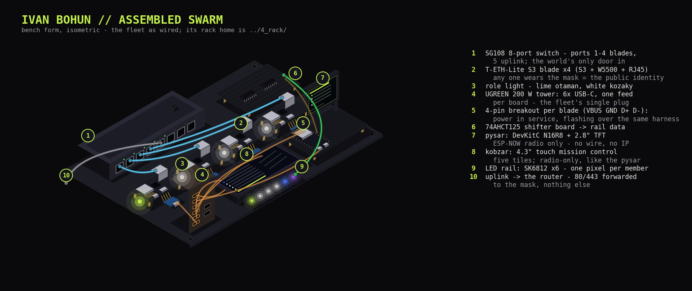

# Hardware build

The build sequence for the whole machine, plus the bench rules that apply
everywhere. The detail lives in the numbered docs:

| Doc | One line |
|---|---|
| `11_soldering.md` | raw electronics: blade + display headers, breakout pins |
| `12_power_circuits.md` | 5 V delivery: the two islands, feed chains, first light |
| `13_data_connectivity.md` | data wiring: which cable carries data where (RJ45 leads, display loom) |
| `14_led_rail.md` | the LED rail: one pixel per member (strip work, shifter board, hookup in `led/`) |
| `15_blade_cases.md` | the kurin: the printed case each blade rides in |
| `16_rack.md` | the rack the fleet lives in |

Keep a hardware inventory alongside the build - every board's base MAC, flash size and revision, recorded at intake.

---

## Build Sequence

**What you're building** (bench form; the rack build is `16_rack.md`):

**End state:** 4 blades + displays powered, fabric connected, every identity logged - firmware bring-up unblocked.

### Soldering
Full teach-in, per-pin maps, and the meter rituals: `11_soldering.md`.

1. **Blade headers x6** - 31 joints each, tack-and-square; the full header-strip meter ritual per board before it ever sees power.
2. **Breakout pins x4** - every blade breakout carries the full 4-pin harness (power + data); bond and live checks in the breakout-pins section.
3. **Display headers** - the `display` DevKitC's two strips (~44 joints), meter mini-ritual; real-unit signal map in `11_soldering.md`, display node headers.
4. Per board: rake-light visual inspection of every joint.

### Blade power + first flash
First light through the feed chain (5.2 V and 3.3 V rails verified), then identity over the blade's own breakout (the intake ritual, `../2_firmware/21_intake.md`). Whole-system power map and per-blade procedure: `12_power_circuits.md`.

Rules that apply at every power-up: the meter check before any first power (continuity feed-to-pin, **no** 5V-GND continuity), and **never two 5 V sources into one board** - GND is shared on purpose.

### Fabric
Per-blade link tests first, switch-side witnessed; then the constellation - four link lights at once. **Port map** (sticker on the SG108 PCB): `p1-4 = node-1..4`, `p5 = uplink`, `p6-8 = bench/free`. Uplink goes to the **router's LAN port** - the router is the permanent gateway. Full cable map: `13_data_connectivity.md`, Ethernet plane.

### Display hookup
The TFT's included loom (JST to 13 female Duponts) from Interface 2 onto the display DevKitC per the real-unit map in `11_soldering.md`, display node headers. **TFT VCC to 3V3**; MISO stays unwired. The white ribbon is the Interface-1 alternative path - unused. The LED rail - one pixel per member, driven by the same DevKitC - is its own build: `14_led_rail.md`.

### Arrangement
Blades ride in kurin cases (`15_blade_cases.md`); the rack build is `16_rack.md`.

**Done when:** all link lights on, every MAC in the inventory, boards labelled, a 10-minute powered soak. Then the firmware takes over - elections, the mask, the serving path (`../SYSTEM_DESIGN.md`).

---

## Bench Rules

### On the Bench
Multimeter with continuity beep · laptop + `esptool` + each blade's own 4-pin breakout · sticky labels + fine marker. Iron, solder, and strippers come out only for soldering work.

### Safety + handling
- **ESD:** touch a radiator first, handle PCBs by the edges, no carpet shuffling while boards are out.
- **NEVER DUAL-POWER:** a board on a laptop USB must have its charger feed unplugged first. Muscle memory: *USB in hand, feed out first.*
- **Strapping pins:** never attach signals to ESP32-S3 GPIO **0, 3, 45, 46** - they decide boot behaviour.
- **Mains:** only the sealed chargers/warts touch mains. Nothing in this build exposes it.

### Labels + colours
- Wire colours: **red=5V, black=GND, green=LED data, yellow=TFT/SPI, white=I2C/touch, blue=spare**.
- Board labels (sticker + inventory row): `node-1..4`, `spare-1/2`, `display`. Identity before assembly, always.
- Lead labels (tape flags): `n1`-`n4`, `uplink`.
- Mounting standard: **kurin cases** (`15_blade_cases.md`) - no drill, completely functional.

### Deliberately out of scope
Out of scope here: firmware (`../2_firmware/20_firmware.md` and siblings) · the rack build (`16_rack.md`) · no fused taps (risk accepted) · no eFuse burning (assessed, deliberately not burned).

