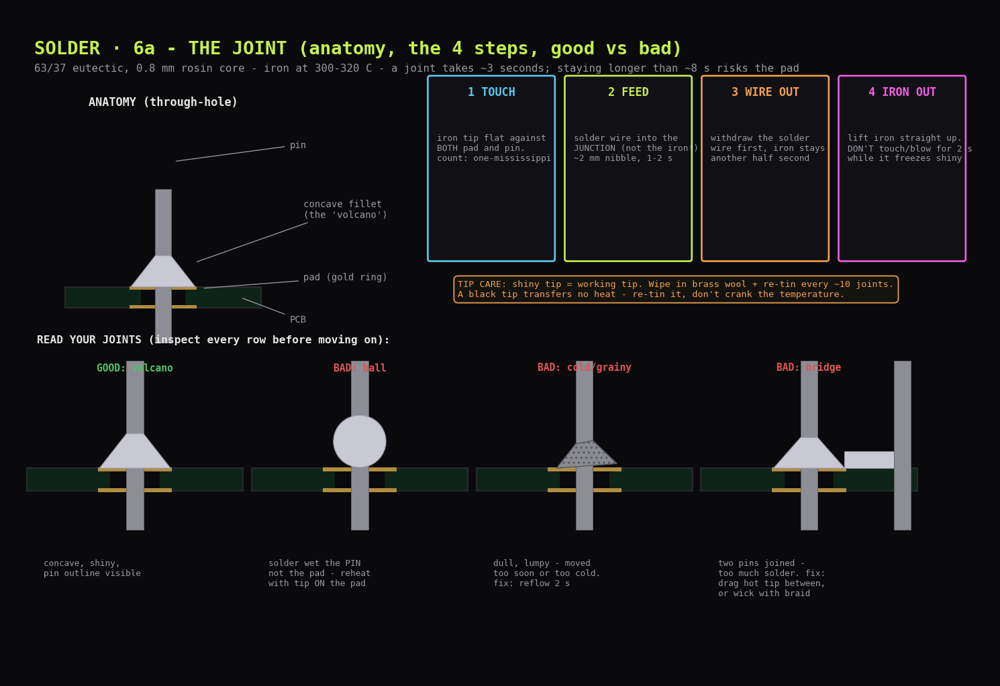
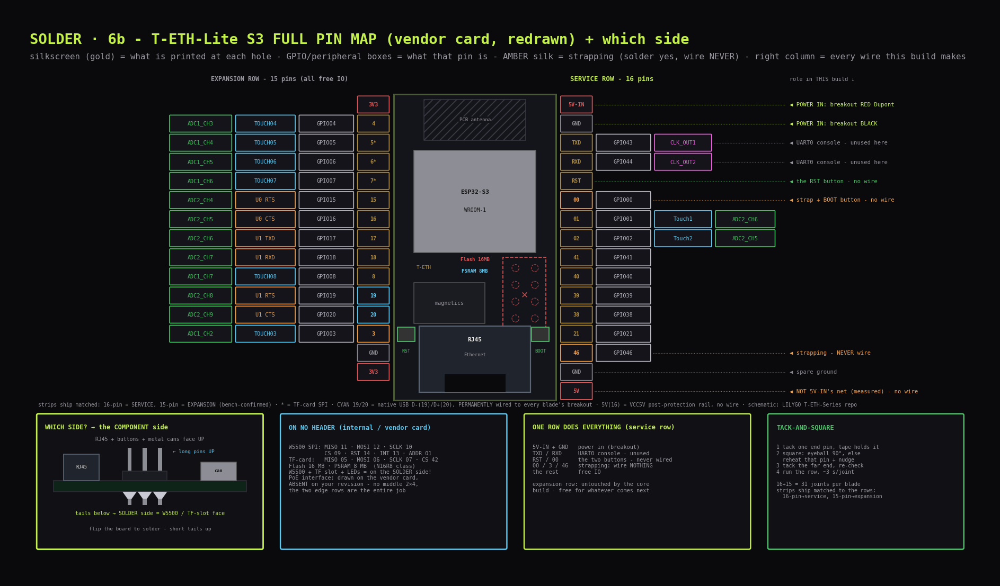
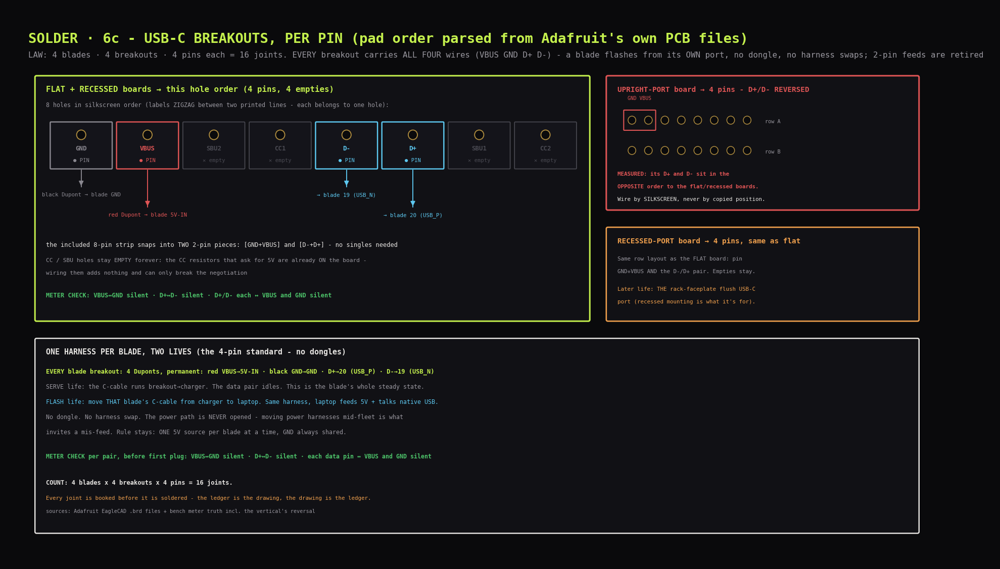
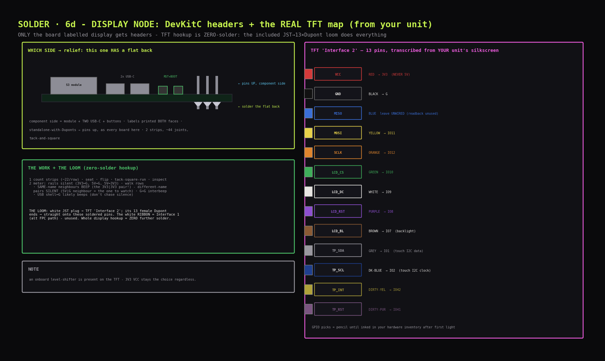

# Soldering guide: headers, breakouts, and the meter rituals

## What soldering actually is (30 seconds of theory)

You are not gluing. You are making a **metallurgical bond**: molten solder flows into the microscopic gap between a **pin** and the **plated hole** (its gold ring = the **pad**), wetting both, then freezes into one continuous conductor. Two things make or break it:

- **Heat both parts, not the solder.** You heat the pin *and* the pad with the iron, then touch the solder wire to the **heated junction** - it melts *from the parts' heat*, not from touching the iron. Solder melted by the iron alone and dripped on = a **cold joint** that looks connected but isn't.
- **Flux.** Metal oxidises the instant it's hot; oxide blocks wetting. The **rosin core** running through your 63/37 wire releases flux exactly when heated, cleaning the surfaces so solder flows. This is why you use rosin-core wire and never solid wire.

---

## Bench setup (do this before the iron is hot)

- **Ventilation:** open a window or a small fan pulling air *sideways* across the bench (not at your face). Rosin smoke is an irritant, not acutely toxic, but don't breathe it. This solder is leaded - **wash hands before eating**, don't eat at the bench.
- **Surface:** something heatproof - a ceramic tile, a metal tray, the back of a baking sheet. Not the nice table.
- **Light + magnification:** bright, raking (from the side - it makes joint shape readable). Your phone camera in macro is your inspection microscope.
- **Third hand:** a blob of Blu-Tack or a bit of masking tape holds a board steady. You have two hands: one iron, one solder wire - the board must not be the third.
- **Tip choice: a 2 mm bevel ("hoof")** - its small flat face is what bridges pad+pin in the joint section. Not a needle tip: a point contact transfers almost no heat, and joints go slow and cold.
- **Tip tinning (first power-on ritual):** iron to temperature → wipe once on the brass wool → melt a little solder onto the tip until it's silver and shiny → wipe again. A shiny tinned tip transfers heat; a dull grey/black tip doesn't. Re-tin like this every ~10 joints and at every "why won't this melt" moment.
- **Temperature:** **300-320 °C.** (183°C melt + ~120-140°C working margin.) If joints are slow, re-tin the tip *before* you reach for the temp dial - a de-tinned tip is the usual culprit, not low heat.

---

## Joint - the motion you'll repeat 200 times



The rhythm, four beats, ~3 seconds total:

1. **TOUCH** - lay the iron tip so it contacts **both the pad and the pin at once** (tip angled ~45°, the flat of the tip bridging them). Count "one-mississippi" - you're heating both parts.
2. **FEED** - touch the solder wire to the **junction on the far side from the iron** (so it has to melt off the *parts*, proving they're hot enough). Feed a ~2 mm nibble. It should flow and cup around the pin in ~1-2 s.
3. **WIRE OUT** - pull the solder wire away *first*, iron still down.
4. **IRON OUT** - lift the iron straight up. **Don't touch, blow on, or move the board for ~2 seconds** while it freezes. Eutectic sets fast; just don't disturb it.

**A good joint = a tiny shiny concave "volcano"** - solder fillets up from the pad to the pin, the pin's outline still visible through it, surface bright. Not a ball, not a dome, not dull.

### Reading joints (inspect every board before the next)

| Looks like | It is | Fix |
|---|---|---|
| Shiny concave volcano, pin visible | **Good** | move on |
| Ball sitting *on* the pin, not touching the pad | Solder wet the pin only (pad wasn't hot) | reheat with the tip pressed on the **pad**, add a touch of solder |
| Dull, grey, grainy, lumpy | **Cold joint** (moved too soon / too little heat) | just reheat it 2-3 s until it flashes shiny, lift, hold still |
| Solder blob linking two adjacent pins | **Bridge** (too much solder) | drag the clean hot tip across the gap to pull it apart; or lay desoldering braid on it + iron to wick the excess away |
| Brown crusty residue around joints | Flux residue (harmless, cosmetic) | leave it, or wipe with isopropyl once cool |

**When in doubt, reheat.** Eutectic solder tolerates reflowing many times. A joint you're unsure about costs 3 seconds to redo and zero to inspect.

---

## Header strips - 6 blades (+ display)



This is the bulk of the work: each T-ETH-Lite gets **two strips - one 16-pin and one 15-pin** (LILYGO ships them matched to the rows - **16-pin → service row, 15-pin → expansion row**). **There is no middle 2×4 header on this board revision** (no PoE-shield footprint) - the two edge rows are the entire job.

### Which side do the strips enter? (the one orientation that matters)
**The RJ45 side - the face where the Ethernet jack's opening, the two buttons (RST + BOOT) and the metal ESP32 can live.** The strip has a **long pin side, a plastic spacer, and a short tail**: it inserts from that face, **long pins pointing up** (that's the Dupont-plug side you'll use forever), spacer flat on the board, short tails poking through to the **other face - the W5500 side - and that's where you solder**. Rule of thumb: if you can see into the Ethernet jack's opening, you're looking at the side the pins must rise from.

**WARNING: this board has NO "flat back" - both faces carry components and full pin silkscreen** (the W5500 chip, the TF-card slot and the POWER/LINK/ACT LEDs live on the *solder* side). Never identify the sides by "components vs bare" or by where labels are printed - identify by **RJ45 opening + buttons + ESP can = pin side; W5500 + TF slot = solder side**.

**Why pins UP and not down (the breadboard doubt):** there are two conventions. Boards that *plug into something* (breadboard, socket, carrier) get pins DOWN - the pins are legs. Boards that live *standalone with jumper wires* get pins UP - the board lies flat on its back and female Duponts push onto the pins from above. Every board in this build is the second kind (nothing here plugs into anything; connections are the RJ45 + a few Duponts), and pins-down would stop a blade lying flat at all - it would stand on 31 pin-legs, wobbling and shorting-prone. So: pins up.

**The plastic bar rides with the LONG pins, on the component side - never on the solder side.** (In the flipped soldering position it does end up "underneath" in the gravity sense - that's the whole board being upside down, not the strip inserted from the back.) Pre-tack check per strip: long pins + plastic on the jack's side; only short ~3 mm bare stubs on the W5500 side. Long pins poking from the W5500 side = inserted backwards, pull it out. The iron never works near the plastic - melt it and the pins wander. On the solder side, also keep the iron's barrel clear of the **TF-card slot** at the can end (its shell tabs are factory-soldered and grounded - extra solder on a tab is harmless if isolated, but a melted shell is avoidable).

### Real pin map (vendor pinout, LILYGO T-ETH-Lite ESP32-S3)
Every wire this build ever attaches lands on **one row - the SERVICE ROW** (the edge whose corner pin reads `5V-IN`, up at the ESP-can end). The other row is the **expansion row**: all free IO, untouched by the core build. Wire by the silkscreen on your board; the map:

| service row (can end → jack end) | GPIO | in this build |
|---|---|---|
| `5V-IN` | - | **POWER IN**: breakout's red Dupont. Net `VBUS` → ideal-diode Q1 → internal `VCC5V` rail |
| `GND` | - | **POWER IN**: breakout's black Dupont |
| `TXD` | 43 | free (UART0 console pins - unused in this build) |
| `RXD` | 44 | free (UART0 console pins - unused in this build) |
| `RST` | - | the RST button does this - never wired |
| `00` | 0 | strapping + the BOOT button - never wired |
| `01` `02` `41` `40` `39` `38` `21` | same | free |
| `46` | 46 | **strapping - never wire** |
| `GND` | - | spare ground |
| `5V` | - | = `VCC5V`, the post-protection internal rail (schematic-confirmed - hence silent to `5V-IN`) - never feed power here, do-not-wire |

Expansion row (can end → jack end): `3V3 · 04 · 05* · 06* · 07* · 15 · 16 · 17 · 18 · 08 · 19 · 20 · 03 · GND · 3V3` - all free IO except **`03` = strapping, never wire**. `*` = doubles as the TF-card SPI, relevant only if a card is ever inserted. GPIO **09-14 are consumed by the W5500 on-board** and appear on no header. The strapping rule as it lands on this board: `00`, `03`, `46` get solder (mechanical strength), never a wire; `45` lives on the separate 3-hole header (P4: `47`/`48`/`45`, near the PoE footprint) - stays bare. Schematic bonus: expansion-row `19`/`20` are **USB_N/USB_P, the S3's native USB-Serial-JTAG** - land a USB-C breakout's D-/D+ there (plus `5V-IN`/`GND`) and a blade flashes DevKitC-style over `/dev/cu.usbmodem*`. That is exactly what the 4-pin breakout harness does (breakout-pins section; chain detail in `12_power_circuits.md`, two islands). Full schematic: the T-ETH-Lite-S3 PDF in LILYGO's `LilyGO-T-ETH-Series` GitHub repo.

**Strip↔row matching:** the supplied strips are **one 16-pin + one 15-pin per blade**, matched to the rows - the 16-pin strip is the **service row**, the 15-pin strip is the **expansion row** (15 holes; the vendor card's 15 labels are complete). Nothing to snip, nothing unlabelled - if a strip won't span its row, you've swapped them.

### Tack-and-square method (why headers don't come out crooked)
A free-floating strip tilts while you solder. So:

1. **TACK** one end pin only. Hold the strip in place with a scrap of masking tape on the top while you do this first joint.
2. **SQUARE** - look at the board edge-on. Is the strip standing at a clean 90°? If it leans, press the iron back onto **that one tacked pin** to re-melt it and nudge the strip upright with a finger (on the plastic, not the hot pin). Eutectic re-freezes the instant you lift.
3. **TACK THE FAR END** - solder the opposite-end pin. Re-check square. Now the strip is locked; remove the tape.
4. **RUN THE ROW** - solder every remaining pin in the touch-feed-out rhythm, ~3 s each. Then inspect the whole row under raking light before touching the next strip.

### Meter check per finished board (before it EVER sees power)

**Setup (once):** black → COM, red → V/Ω, mode = continuity •))) via FUNC/SEL (never AUTO - no beep, range-hunts). Tips together = beep. Probe the **long pins under the board, at the BASE**. This ritual is blades-only - the display DevKitC has its own mini-ritual (display node headers).

**THE ROUNDS - glance card:**

| Round | Touches | Pass |
|---|---|---|
| **1 RAILS** | `5V-IN`↔`GND` · `3V3`↔`GND` · `5V-IN`↔`3V3` | all SILENT (dying chirp = caps, fine; solid beep = SHORT → stop, find it) |
| **2 WALK** | every neighbour pair, both rows (16+15 pins = 29 pairs) | all SILENT (any solid beep = bridge → reheat, drag, re-test that pair) |
| **3 BEEPS** | `GND`(2)↔`GND`(15) · `GND`↔exp `GND` · `3V3`(1)↔`3V3`(15) · `GND`↔TF shell | all BEEP (silence = joint wet the pin, missed the pad → reheat on the PAD) |
| **4 DIODE** | diode mode `->|-`: red `5V-IN`, black `5V`(16), at pin base | **0.50 V ± 0.05** forward; swapped probes = OL |
| *(opt)* **BUTTONS** | `GND`↔`RST` while holding RST; `GND`↔`00` while holding BOOT | beeps only while held (or skip - the first flash proves the buttons anyway) |

**Notes (the why):**
- Any pin of a rail works: the 3× `GND` and 2× `3V3` are one net each. Handy rails combo: the adjacent `GND`↔`3V3` at the expansion row's jack end.
- **RJ45 shell exempt** - Ethernet shields are cap-coupled/floating by design; silence there is normal. Never probe the jack's gold fingers (transformer windings, not ground).
- `5V-IN` = net **VBUS**, alone behind ideal-diode Q1 → no continuity-reachable second point exists (PoE `5V IN` holes = `POE_5V` behind Schottky D7; `5V`(16) = `VCC5V` itself - do-not-wire). Round 4's body-diode drop **is** the power-entry bond proof. Schematic sheet 2 (LILYGO's `LilyGO-T-ETH-Series` repo).
- The meter can't judge signal joints (their nets end inside chips) - rake-light visual is their test. Buttons with two hands: F-F Dupont onto a GND long pin, black probe tip into its other end = hands-free ground.
- **At first power-up (A2), DC-volts mode:** `5V`(16)↔`GND` ≈ **4.9-5.25 V, 5.2 typical** (powered, Q1's ideal-diode FET is fully ON = millivolt drop; the cold ~0.5 V reading is its body diode, a different mode), then `3V3`↔`GND` ≈ 3.3 V = the powered proof of the whole chain (the red LED says the same with less precision).

### Adjacent-pin caution
Header pins sit 2.54 mm apart - close enough that a heavy hand bridges them. Keep feeds to ~2 mm nibbles. A bridge is a 5-second fix (drag or wick), not a disaster - but catch it now, not at power-up.

---

## Breakout pins - 4 blades, 4 breakouts, 4 pins each = 16 joints



Four Adafruit boards - one per blade - across three SHAPES (forget product numbers): **FLAT** (port lies along the edge), **UPRIGHT/VERTICAL** (port points up - this shape's D+/D- hole order is REVERSED), **RECESSED-PORT** (port sunk into a cutout, made for flush panel mounting). All of them are "downstream" boards = the 5.1 kΩ CC resistors that ask a charger for 5 V are already on the PCB - which is exactly why the CC/SBU holes never get wired.

**Every breakout gets the same four pins: `GND`, `VBUS`, `D-`, `D+`.** The full harness is what lets any blade be flashed over its own cable - `12_power_circuits.md`'s two-islands section carries the reason.

### Hole map (FLAT board shown; all shapes carry the same four nets)
The 8 holes in silkscreen order (the labels **zigzag between two printed lines** - each label still belongs to one hole; order verified from Adafruit's own PCB design file):

| hole | pin? | wired to (later, F-F Duponts) |
|---|---|---|
| `GND` | ● PIN | black → blade `GND` |
| `VBUS` | ● PIN | red → blade `5V-IN` |
| `SBU2` | ✕ empty | never |
| `CC1` | ✕ empty | never (its 5.1k resistor lives on the board) |
| `D-` | ● PIN | → blade `19` (USB_N, expansion row) |
| `D+` | ● PIN | → blade `20` (USB_P, expansion row) |
| `SBU1` | ✕ empty | never |
| `CC2` | ✕ empty | never |

The four wanted holes form **two adjacent pairs**, so the included 8-pin strip snaps into two 2-pin pieces (`GND`+`VBUS` and `D-`+`D+`) - no singles needed. **Why the data pins matter:** plugged into the PC, the breakout powers AND USB-connects its blade (hold BOOT, tap RST → `/dev/cu.usbmodem*` → esptool) - the whole flash path with no UART bridge. The D+/D- Duponts never come off.

### Shape notes
- **UPRIGHT-PORT:** TWO identical 8-hole rows on opposite edges - pick either. **Its D+/D- hole order is REVERSED vs the flat and recessed boards** - wire by the silkscreen label, never by position copied from another board.
- **RECESSED-PORT:** same row layout as the flat board.

### Method
Pin in from the top (long pins up on the connector/label side, solder the tails on the bare underside - same convention and reason as the blades), tack, check vertical, finish. Same joint as the header rows, on bigger and lonelier pads; a scrap of tape over the top holds these tiny boards still.

### Breakout meter checklist (per board)
**COLD - continuity •))):**
1. `VBUS`↔`GND` → silent
2. `D+`↔`D-` silent; each of `D+`/`D-` ↔ each of `VBUS`/`GND` silent (4 touches)

**BOND - Ω mode:**
3. `GND` pin ↔ tip pressed into the empty `CC1` hole → **≈ 5.1 kΩ** - one reading proves the GND joint bonds AND the ask-for-5V resistor is real (`CC2` hole = second opinion). The resistors are the tiny parts marked **512** on the board (= 51 + 2 zeros = 5100 Ω). Continuity mode stays SILENT on this path by design (5.1 k is far above the beep threshold) - the number is the pass signal. OL = press the tip harder into the hole's plating before suspecting the joint. *(nets verified from Adafruit's .brd files)*
4. upright-port only: `GND` pin ↔ connector shell → beep (shell grounded on this variant only - don't chase shells on the other two, they're not in the GND net)

**LIVE - DC volts = the V⎓ symbol, V over line+dashes (breakout ALONE, nothing wired downstream). Volts mode LISTENS to live circuits; Ω/beeper modes stay for dead ones:**
5. charger in via C-cable → `VBUS` pin ↔ `GND` pin → **≈ 4.9-5.2 V**
6. unplug, **flip the C plug**, re-plug → same reading (each orientation uses a different CC resistor - the flip tests both)
7. unplug. Board proven end-to-end. (`D+`/`D-`: no cold test exists - the proof is the blade enumerating as `/dev/cu.usbmodem*` on its first service plug.)

### Two lives of the same harness (all plug-in from here)
```
FEED    (steady, one per blade):  charger → C-cable → breakout → red VBUS→5V-IN · black GND→GND · D+→20 · D-→19 → blade
SERVICE (flash/console):          PC → the same C-cable, moved → the same breakout → the same four Duponts
```
One 5 V source per blade at a time - **whoever holds the C-cable IS the power source**; GND always shared.

---

## Meter check - before any blade sees power

This is the one step that turns "I hope I wired it right" into "I know." With the multimeter in **continuity (beep) mode**, per blade, **before** first power-up:

1. Breakout **VBUS pin ↔ blade `5V-IN` pin** (through the Dupont jumper) → **beeps** (connected).
2. Breakout **GND pin ↔ blade `GND` pin** → **beeps**.
3. Blade **`5V-IN` ↔ `GND`** → **silence** (NO beep). *A beep here = a short; find and fix it before power, or you damage the board.*

Passed all three? Plug in the charger. The blade's onboard power LED lights; nothing gets more than mildly warm. Wait, watch for 20 s, then move to the next blade. **One board at a time** - if something's wrong you want it isolated to one board, not smoking across four.

---

## Safety recap (the short list that matters)

- **Never dual-power:** a blade must never see two 5 V sources: its cable is in the charger OR the PC. Two 5 V sources fighting = damage.
- **Hot iron discipline:** it looks identical hot and cold. Return it to the stand every single time you let go. 320 °C brands skin instantly.
- **Leaded solder:** wash hands before eating; don't eat/drink at the bench; ventilate.
- **ESD:** touch a radiator before handling boards; hold by edges; don't build on carpet in socks.
- **Strapping pins:** headers are mechanical, so no signal-pin risk while soldering them - but when you wire signals later, GPIO **0, 3, 45, 46** stay clear.

---

## First-timer troubleshooting

| Symptom | Cause | Fix |
|---|---|---|
| Solder won't melt / balls up on the tip | De-tinned (dull) tip, or not heating the parts | Re-tin: wipe brass wool, melt fresh solder on tip. Then heat the *junction*, not the wire |
| Joint looks dull/grainy | Moved before it froze, or too cool | Reheat 2-3 s until it flashes shiny, hold dead still 2 s |
| Two pins bridged | Too much solder | Drag clean hot tip across the gap; or wick with braid |
| Pad lifted / ring came off | Too much heat too long (>~10 s on one spot) | Rare on plated holes; if it happens, the pin still works via the other side's pad - or move to a spare board |
| Strip crooked | Tacked both ends before squaring | Reheat one end pin, nudge upright, re-tack |
| Whole thing intimidating | First time | Do all of `spare-2` before judging yourself; joint #30 is a different experience from joint #1 |

---

## Display node headers - the DevKitC



- **Which side:** component side = the S3 module + TWO USB-C ports + RST/BOOT buttons → long pins UP there, solder on the back. Unlike the T-ETH-Lite, **this board genuinely has a flat back** - though labels are printed on both faces, which is handy mid-solder.
- **Method:** the two supplied strips (~22 pins each - count yours), tack-and-square, ~44 joints.
- **Meter mini-ritual after:** rails silent (`3V3`↔`G`, `5V`↔`G`, `5V`↔`3V3`); neighbour walk both rows **with the DevKitC amendment: neighbours sharing a printed name legitimately BEEP** (this layout has `3V3`|`3V3` side by side; same for any adjacent `G`|`G`) - **every differently-named pair must be silent**, and if `5V` sits next to a `G`, that pair gets an extra beat (a bridge there = power short); positives: the multiple `G` pins interbeep; USB-C shell↔`G` likely beeps (typical grounded shell - silent = don't chase). Silkscreen names differ from the blades (`G`, not `GND`) - wire by what your board prints.
- **The hookup is ZERO-solder:** the TFT's **Interface 2** is a labelled 13-pin header, and the included loom (white JST plug → 13 female Duponts) is the entire connection - JST into the display, females onto these soldered pins. The white ribbon belongs to **Interface 1** (alternative FPC path) - unused. An onboard level-shifter chip is present; `VCC`→**3V3** stays the choice regardless.
- **Interface-2 map, transcribed from the unit's silkscreen** (record it in your hardware inventory too):

| Loom wire | TFT pin | → DevKitC | Loom wire | TFT pin | → DevKitC |
|---|---|---|---|---|---|
| RED | `VCC` | **3V3 (never 5V)** | PURPLE | `LCD_RST` | IO8 |
| BLACK | `GND` | `G` | BROWN | `LCD_BL` | IO7 (backlight) |
| BLUE | `MISO` | **leave UNWIRED** | GREY | `TP_SDA` | IO1 (touch I2C data) |
| YELLOW | `MOSI` | IO11 | DARK-BLUE | `TP_SCL` | IO2 (touch I2C clock) |
| ORANGE | `SCLK` | IO12 | DIRTY-YELLOW | `TP_INT` | **IO42** (beside SCL) |
| GREEN | `LCD_CS` | IO10 | DIRTY-PURPLE | `TP_RST` | **IO41** (beside IO42) |
| WHITE | `LCD_DC` | IO9 | | | |

  *(Wire colours = the physical loom's Dupont colours.)*

  Plus, elsewhere on the node: LED data→IO4 (via the shifter board).

