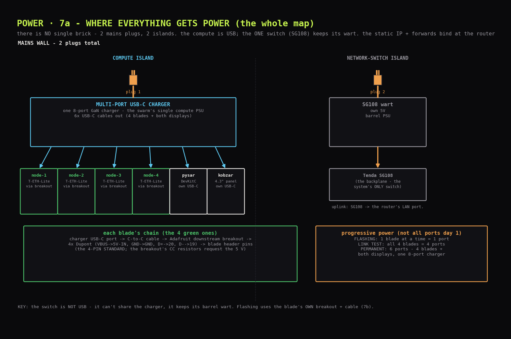

# Power: who gets 5 V, from where, and how

## One-paragraph answer

**There is no single power brick.** Power is *distributed*: **2 mains plugs feeding 2 islands**. The four blades + the display observers are USB devices, all fed from **one multi-port USB-C charger**. The one Ethernet switch, the SG108, is **not** USB - it keeps its barrel-jack 5 V wall-wart. That's it: one USB charger + one switch wart = two plugs.

---

## Two islands, enumerated



| Island | What's in it | Powered by |
|---|---|---|
| **Compute** | 4 blades (`node-1..4`) + the display observers | **one multi-port USB-C charger** → USB-C cables. Blades go *through their breakouts*; the displays use their own USB-C ports |
| **Backplane switch** | Tenda SG108 - the system's ONLY switch | its own 5 V barrel wart (came in the box) |

Why the switch can't join the charger: it takes a **barrel-jack 5 V input**, not USB - a different connector. Cutting and splicing its wart would buy nothing. Leave it be.

### Blade harness (each of the 4) - FOUR wires
```
USB-C charger port → C-to-C cable → Adafruit downstream breakout
  → 4× Dupont F-F → blade header pins:
       red    VBUS → 5V-IN
       black  GND  → GND
       data   D+   → 20 (USB_P)     <- on EVERY blade
       data   D-   → 19 (USB_N)
```
The breakout matters because of one physics fact: **a USB-C port supplies 0 V until the device asks for 5 V** by putting resistors on the CC pins. A bare wire can't ask. The Adafruit *downstream* breakout has those 5.1 kΩ CC resistors onboard - it does the asking - so the charger delivers 5 V to its VBUS pad, which you wire to the blade. (This is also why a snipped USB-**A** cable works as a crude feed - A ports supply 5 V unconditionally - and why a snipped C-to-C cable is dead: its resistors are in the end you cut off.)

**Why the data pair is permanent.** Reflashing a blade must never require opening the power path, swapping harnesses, or touching any other blade. With D+/D- permanently wired on every blade's own breakout:

- **Flashing a blade = moving that blade's C-to-C cable from the charger to the PC.**
  Same harness, same four wires; the PC supplies the 5 V and talks native USB.
- No shared service dongle, no harness swap, no other blade touched, the power path never
  opened (a 5 V path opened mid-recovery is exactly how a W5500 gets starved).

**HARDWARE TRAP: the VERTICAL breakout's D+ and D- holes sit in the OPPOSITE order to
the flat and recessed boards.** Wire by the silkscreen label, never by position copied
from another board, and meter every pair before its first plug (check: VBUS↔GND silent,
D+↔D- silent, each data pin ↔ VBUS and GND silent).

---

## You don't need all the ports on day one *(progressive power)*

Power scales with what you're doing - don't let "I need a multi-port charger" block the first blade:

| Stage | Boards live | Ports needed | Source |
|---|---|---|---|
| **Flashing** | 1 at a time | **1** | any single USB-C charger (even a phone brick) |
| **Link-light test** | all 4 blades | 4 | scattered chargers, or the multi-port |
| **Permanent swarm** | 4 + displays | 6 | one dedicated multi-port USB-C charger |

Current draw is trivial either way: five idle ESP32 boards pull well under 2 A total; any multi-port charger has vast margin.

---

## Steady-state fleet allocation (UGREEN 8-port)

| Port | Feeds | Via |
|---|---|---|
| C1 | node-1 | upright-port breakout, 4-pin (its D+/D- hole order is REVERSED vs the others - the two-islands trap above) |
| C2 | node-2 | recessed-port breakout, 4-pin |
| C3 | node-3 | flat breakout, 4-pin |
| C5 | node-4 | vertical breakout #2, 4-pin (same port-points-up type as C1 → same REVERSED D+/D- order) |
| C4 | display DevKitC | its own USB-C port, plain cable |
| C6 | Mission Control (kobzar) | its own USB-C port, plain cable |
| A1 | the rack roof fan (1× 120 mm) | one USB-A plug |
| A2 | the rack intake fan pair (2× 80 mm) | one USB-A plug for both |

The LED rail feeds from the display DevKitC's 5 V pin, not from its own port.

---

## First light

**Once, before the round:** charger into mains; one feed breakout + red/black F-F Duponts at hand; meter in continuity mode.

Per blade:

1. **Assemble UNPOWERED:** red Dupont breakout `VBUS` pin → blade **`5V-IN`** (the can-end corner of the service row); black Dupont breakout `GND` → blade **`GND`** (the very next pin).
2. **Check (20 s, continuity):** breakout-`VBUS`↔blade-`5V-IN` **beeps** · `GND`↔`GND` **beeps** · blade `5V-IN`↔`GND` **silent**.
3. **Power:** C-cable charger→breakout. **The red LED lights.** Nothing warms. (That light is the formal end-to-end proof of the blade's power path - see details.)
4. **Spot-read (10 s, DC volts V⎓):** blade `5V`(pos 16)↔`GND` ≈ **4.9-5.25 V** (5.2 typical - powered, Q1's ideal-diode FET is ON and drops millivolts; the cold test's ~0.5 V is its body diode, a different mode) · `3V3`↔`GND` ≈ **3.3 V**. Jot both.
5. **Unplug the C-cable** (never yank Duponts hot), move both Duponts to the next blade, repeat.

*Details, for the curious: the LED sits on the 3V3 rail at the very end of the chain VBUS → ideal-diode Q1 → VCC5V → buck → 3V3 - first light therefore proves the 5V-IN joint, Q1, the buck and the LED in one photon. The `5V`(16) pin is the VCC5V rail's measurement tap (do-not-wire, fine to probe). A single feed breakout can serve the whole round; the steady-state allocation (below) assembles afterwards. Hot-swap discipline: make/break at the cable or charger, never at live Duponts.*

Identity - reading each blade's MAC over its own breakout - is the intake ritual:
[`../2_firmware/21_intake.md`](../2_firmware/21_intake.md).

---

## Troubleshooting

| Symptom | Cause | Fix |
|---|---|---|
| Blade LED dark on power | chain fault | re-run the first-light checks; check Dupont seating, charger port (test with a phone), right blade pins |
| Powers but no `/dev/cu.usbmodem*` | the OS "allow accessory" prompt, D+/D- swapped, wrong pins, dud cable, not in ROM | approve the accessory prompt (BOOT+RST re-enumeration surfaces it); swap the two data Duponts; confirm `IO19`/`IO20` silk; another cable; redo the boot dance (hold BOOT, tap RST, release) |
| `Failed to connect… no serial data` | not in download mode | redo it - hold BOOT a beat longer |
| `flash-id` shows 8 MB | variant mismatch (not expected on this SKU) | note it - genuine T-ETH-Lite is 16 MB |
| Read fine, forgot which board | unplugged before recording | re-read; MACs are unique, cross-check the inventory |
| esptool not found | pipx PATH | `../2_firmware/21_intake.md` (PIPX_HOME workaround) |
