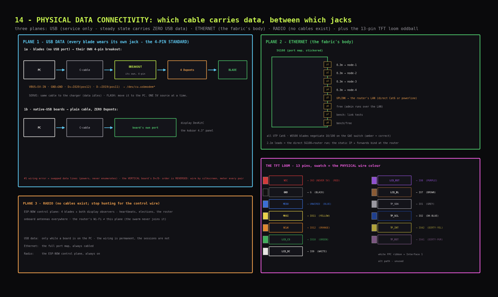

# Data connectivity: which cable carries data where

Three data planes exist: **USB** (service), **Ethernet** (the fabric's body), **radio** (no cable at all - listed so the map has no missing wire to hunt for). Plus one oddball: the TFT loom (its own section below), the only data cable that is neither.



---

## USB data plane

Every blade's breakout permanently carries the data pair alongside power - the **4-pin standard** (the two-islands section of `12_power_circuits.md` carries the why). USB data flows only while a board is plugged into the PC, but the wiring for it is in place on every blade, always.

### Blades (T-ETH-Lite, no USB port) → their OWN 4-pin breakout

| Breakout pin | → blade pin | Carries |
|---|---|---|
| `VBUS` | **`5V-IN`** (service row, can-end corner) | 5 V - whoever holds the C-cable (charger or PC) is the source |
| `GND` | **`GND`** (the very next pin) | common 0 V reference |
| `D+` | **`IO20`** (expansion row, position 12 from the can end) | USB data + |
| `D-` | **`IO19`** (expansion row, position 11 from the can end) | USB data - |

Chain, both lives of the same harness:
**SERVE: charger → C-cable → breakout → 4 Duponts → blade** (data pair idles).
**FLASH: PC → the same C-cable moved → the same breakout → the same 4 Duponts.**
The blade enumerates as `/dev/cu.usbmodem*` - the S3's built-in USB-Serial/JTAG
peripheral; IO19/IO20 *are* its native USB pins, the breakout just gives them a jack.
**TRAP: the VERTICAL breakout's D+/D- hole order is REVERSED vs the flat/recessed
boards - wire by silkscreen, meter every pair.**

### Native-USB boards → plain cable

**Display DevKitC, the kobzar panel:** own USB-C port, one plain C-cable to the PC. Zero Duponts - their port IS the 19/20 hookup, factory-made.

*Details: the data Duponts stay on permanently. The #1 wiring error is swapped data
lines - blade powers but never enumerates; the fix is swapping the two data Duponts, and
the vertical breakout's reversed hole order is exactly where that error waits.*

---

## Ethernet plane

### SG108 port map (stickered on the switch)

| Port | Lead | Far end |
|---|---|---|
| p1-p4 | 0.3 m, flag-labelled `n1`-`n4` | node-1 … node-4 RJ45 jacks |
| p5 | uplink | the router's LAN port - the far end never changes |
| p6-p8 | bench/free | spare-blade link tests, the PC |

### Uplink: one shape, two media

The router is the permanent gateway - the mask's static address and the port
forwards are bound there. Only the medium between SG108 p5 and the router
varies, with room geometry:

```
rack near the router:
  router LAN ──(Cat6)── SG108 p5

rack far from the router:
  router LAN ──eth── powerline adapter ══mains══ second powerline adapter
  (wall socket, passthrough) ──eth── SG108 p5
  the powerline pair bridges L2 (DHCP/ARP/broadcasts pass); AV1000-class ≫ the rig's needs
```

*Details: all leads are UTP Cat6, correct for an all-unshielded chain; the W5500 blades
negotiate 10/100 against the gigabit SG108 and nobody minds.*

---

## Radio plane *(no wires; listed for completeness)*

- **ESP-NOW control plane:** the 4 blades + the two display observers. Heartbeats, elections, the roster - all of it airborne by design (`../SYSTEM_DESIGN.md`). There is no cable to install, seat, or troubleshoot; if you are hunting for the "control wire", stop.
- **Antennas:** everything runs its onboard antenna.
- **The router's Wi-Fi** is the home network, and the swarm never joins it - it plays no part in this plane.

---

## TFT display loom *(the 13-pin oddball; zero solder)*

One included loom: **white JST plug → TFT Interface 2, 13 female Duponts → display DevKitC header pins.** That is the entire connection. The white FPC ribbon belongs to Interface 1 (alternative path) - unused.

| Loom wire | TFT pin | → DevKitC | Loom wire | TFT pin | → DevKitC |
|---|---|---|---|---|---|
| RED | `VCC` | **3V3 (never 5V)** | PURPLE | `LCD_RST` | IO8 |
| BLACK | `GND` | `G` | BROWN | `LCD_BL` | IO7 (backlight) |
| BLUE | `MISO` | **leave UNWIRED** | GREY | `TP_SDA` | IO1 (touch I2C data) |
| YELLOW | `MOSI` | IO11 | DARK-BLUE | `TP_SCL` | IO2 (touch I2C clock) |
| ORANGE | `SCLK` | IO12 | DIRTY-YELLOW | `TP_INT` | **IO42** (beside SCL) |
| GREEN | `LCD_CS` | IO10 | DIRTY-PURPLE | `TP_RST` | **IO41** (beside IO42) |
| WHITE | `LCD_DC` | IO9 | | | |

*(Wire colours = the physical loom's Dupont colours.)*

*Details: map transcribed from the unit's silkscreen (`11_soldering.md`, display node headers), also recorded in the hardware inventory. An onboard level-shifter is present but `VCC`→3V3 stays the choice regardless. This loom never sits on the swarm's critical path.*

---

## Connectivity matrix *(every device, every plane)*

| Device | USB-data link | Ethernet link | Radio |
|---|---|---|---|
| node-1 | own 4-pin breakout → PC (D+→IO20, D-→IO19) | 0.3 m → SG108 p1 | ESP-NOW |
| node-2 | own 4-pin breakout → PC | 0.3 m → SG108 p2 | ESP-NOW |
| node-3 | own 4-pin breakout → PC | 0.3 m → SG108 p3 | ESP-NOW |
| node-4 | own 4-pin breakout → PC | 0.3 m → SG108 p4 | ESP-NOW |
| display DevKitC (pysar) | own C port → PC (service) | none (no PHY on board) | ESP-NOW observer |
| the kobzar panel | own C port → PC (service) | none | ESP-NOW observer |
| the PC | host end of every USB service hookup | admin runs over the LAN; p6-p8 exist for bench jacks | none |
| SG108 | none | the hub: p1-p8 per the map | none |
| the router | none | the permanent gateway (static address + forwards bound here): LAN ← SG108 p5 | home Wi-Fi (out of scope) |
