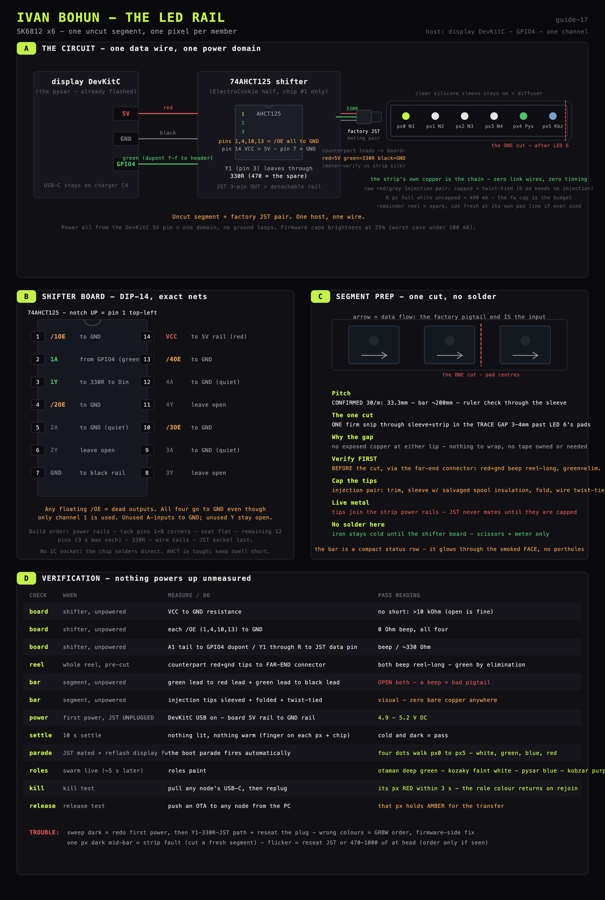
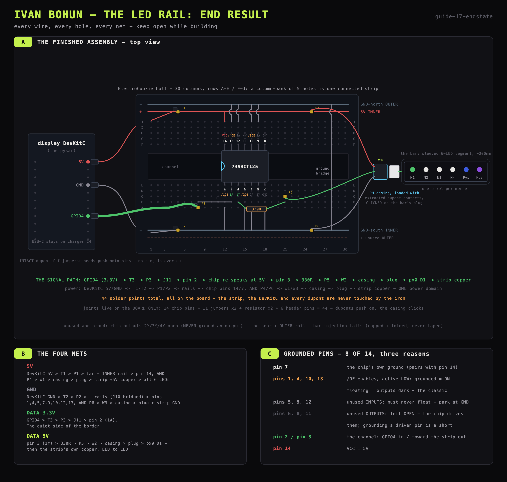

# LED rail: a six-pixel status bar

One uncut 6-LED segment of SK6812 RGBW strip - **one pixel per swarm member**,
driven by the display DevKitC. The joint technique is `11_soldering.md`'s joint section; the
rail-specific work is expanded move-by-move in
[`led/14_1_wire_strip_work.md`](led/14_1_wire_strip_work.md),
[`led/14_2_shifter_board.md`](led/14_2_shifter_board.md) and
[`led/14_3_first_light.md`](led/14_3_first_light.md). The firmware side is
already built into `firmware/display/` - the colour law lives in
[`../2_firmware/24_display_led.md`](../2_firmware/24_display_led.md).

The strip's own copper is the chain; its **factory plug is the detachable head
link** - no loose mating half ships with the strip, so the board presents a PH
casing loaded with extracted dupont contacts, and the plug clicks onto that.
The clear silicone sleeve stays on as the diffuser.

## Decisions, with reasons

| Decision | Why |
|---|---|
| **Host = the display DevKitC**, data **GPIO4** | The witness already knows the whole roster; free GPIO; USB-flashable in seconds; no serving duties to disturb. GPIO4 is unused (TFT = 7-12, touch loom = 1, 2, 41, 42) and not a strapping pin. |
| **ONE data channel** through AHCT125 ch-1 | One wire, one host; one channel of the chip's four is enough. |
| **Power from the DevKitC 5V pin** | One power domain = guaranteed common ground, no loop through a second charger port (a longer rail would need its own feed). |
| **Brightness capped in firmware** | 6 px full white = 480 mA; capped worst case is well under 100 mA on the same USB-C feed as the TFT. The power budget is software, enforced at the driver (`BRIGHT_CAP` in `led.c`). |
| **SK6812 RGBW = 32-bit GRBW** | Not a plain WS2812. `led.c` already speaks GRBW; scrambled colours are a firmware-side report, not a solder problem. |

## Parts

- the SK6812 RGBW strip - ONE 6-LED segment comes off the reel (cut in the
  plain trace gap 3-4 mm past LED 6's pads), sleeve kept, factory plug kept
- 1× 74AHCT125 DIP-14 + an ElectroCookie half board
- one **330 Ω** resistor (anything 250-600 works, tolerance irrelevant)
- solid-core wire: red / green / black; one bare 3-pin PH casing, loaded with
  contacts extracted from intact dupont jumpers
- 6× intact F-F duponts (three DevKitC-side, three casing-side)
- iron + 63/37 solder, wire strippers, the multimeter
- only if flicker is ever actually observed: a 470-1000 µF electrolytic at the
  head of the strip

## Build, in order

1. **Strip work** (`led/14_1_wire_strip_work.md`): verify the pigtail mapping
   end to end with the meter, cut through sleeve AND strip in the trace gap
   past LED 6, cap the raw injection tips with salvaged insulation and a wire
   twist-tie. No pad tinning, no link wires - the factory pigtail is the loom.
2. **The shifter board** (`led/14_2_shifter_board.md`): the 74AHCT125 at
   columns 12-18 notch-left, 8 pins to GND (pin 7, the four /OE, three unused
   inputs), eleven jumpers including the ground bridge, the 330 Ω off pin 3,
   and six header pins P1-P6. The only soldering in the rail project. No
   dupont jumper is ever cut - heads push onto pins.
3. **Hookup + first light** (`led/14_3_first_light.md`): three intact duponts
   DevKitC 5V/GND/GPIO4 ↔ P1/P2/P3, a voltage check with the bar unplugged,
   click the loaded casing onto the bar's plug, reflash the display, watch the
   boot parade walk px0 → px5.

## Firmware

`firmware/display/main/led.c`: `espressif/led_strip` over RMT, GPIO4, 6 px,
GRBW, one global brightness cap. `led_init()` runs the boot parade;
`led_render()` rides the same 1 Hz snapshot as the TFT. With no rail attached
it is electrically inert - a display build carries it whether or not the bar
is plugged in, so the reflash can happen before or after the soldering.
