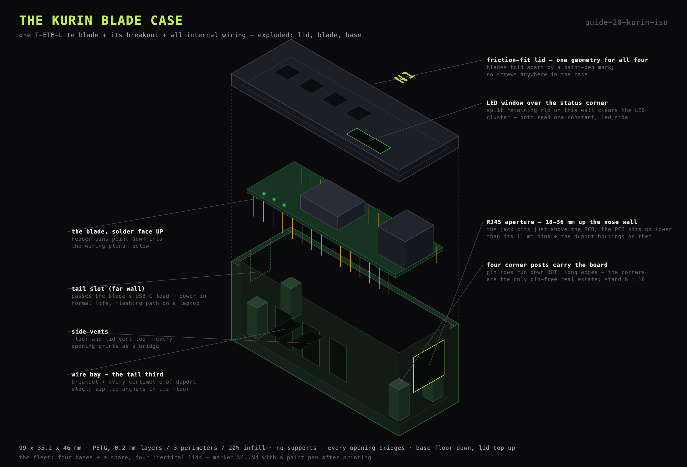

# Kurin blade case

The kurin is the 3D-printed case that houses one T-ETH-Lite blade together
with its USB-C breakout and all of its internal wiring - a combination no
commercial case fits. The design is parametric OpenSCAD: `hardware/kurin.scad`,
with `hardware/README.md` carrying the measurement checklist, print settings
and export loop. The exports are `hardware/stl/kurin_base_v4.stl` and
`hardware/stl/kurin_lid_v4.stl`.

## Shape

**99 x 35.2 x 46 mm.** The blade lies solder face up, header pins pointing
down into the wiring plenum beneath it. Two parts: a base and a friction-fit
lid with an LED window over the board's status corner - one geometry for every
blade, lids told apart by a paint-pen mark (N1..N4). Vents on the sides, floor
and lid.

- **Four corner posts carry the board.** The pin rows run down both long
  edges of the PCB, so a side ledge would rest the board on its own pins; the
  corners are the only pin-free real estate. Retaining ribs above trap the
  board when the lid closes.
- **RJ45 aperture low in the nose wall, 18-36 mm.** The jack sits just above
  the PCB, and the PCB can sit no lower than its 11 mm pins plus the dupont
  housings seated on them.
- **Wire bay in the tail third** holds the USB-C breakout and every
  centimetre of dupont slack, with zip-tie anchors in its floor. The tail
  slot is sized to admit any of the three breakout shapes (horizontal, sunken
  or vertical) at any height.

## LED-side constant

The POWER/LINK/ACT LEDs live on the solder side of the board
(`11_soldering.md`), and the board lies solder face up in
the case - so any feature positioned from a component-side view of the blade
is mirrored in y. Two features depend on which long edge carries the LEDs:
the lid window, and the choice of which wall gets the *split* retaining rib
(split so the rib clears the LED cluster). Both read a single constant,
`led_side = -1`, so they cannot drift apart:

| Feature | Position |
|---|---|
| lid window | y 2.6 .. 8.6 |
| split rib wall | y 1.8 |
| continuous rib wall | y 30.8 |

The board sits at y 3.6 .. 31.6; the LEDs are 2 mm in from the low-y edge, at
y 5.6, and the window is centred on them.

## Fit parameters

- `stand_h = 16` - corner-post height; assumes a seated female dupont stands
  ~15 mm below the PCB.
- `fit = 2.4` and `lip_fit = 0.40` - deliberately loose, sized so a print
  fits on the first try from roller-rule measurements. Tighten only after a
  trial fit says so.

## Printing

PETG - the case lives in a warm rack, and PLA sags at a sustained 60 C.
0.2 mm layers, 3 perimeters, 20% infill, no supports (every opening bridges).
The base prints floor down, the lid top up. The fleet is four bases plus a
spare and four identical lids, marked N1..N4 with a paint pen after
printing.

## Assembly

Pre-wire the blade, then lower it onto its posts - once it is seated, nothing
underneath is reachable. Seat the breakout in the bay behind the USB-C slot,
zip-tie the dupont bundle through the floor slots, dress the slack in the
headroom, press the lid on. The tail slot passes the blade's USB-C lead - the
same lead is power in normal life and the flashing path when moved to a
laptop (`16_rack.md`).

## In the rack

Four kurins ride the U4 shelf and stand up into U5 - 2U of rack, because the
case is 46 mm against the 44.45 mm U pitch (`16_rack.md`).
4 x 35.2 = 140.8 mm across the 222.25 mm clear opening, spread evenly for
16.3 mm of air between cases, RJ45 noses aft toward the switch. Each case
sits on adhesive foam pads: grip on the steel shelf and a little vibration
decoupling.
