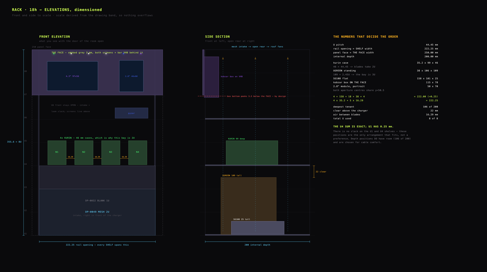
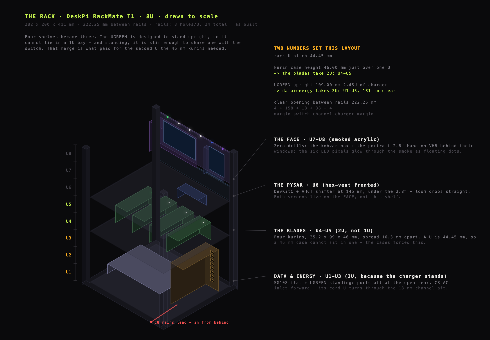
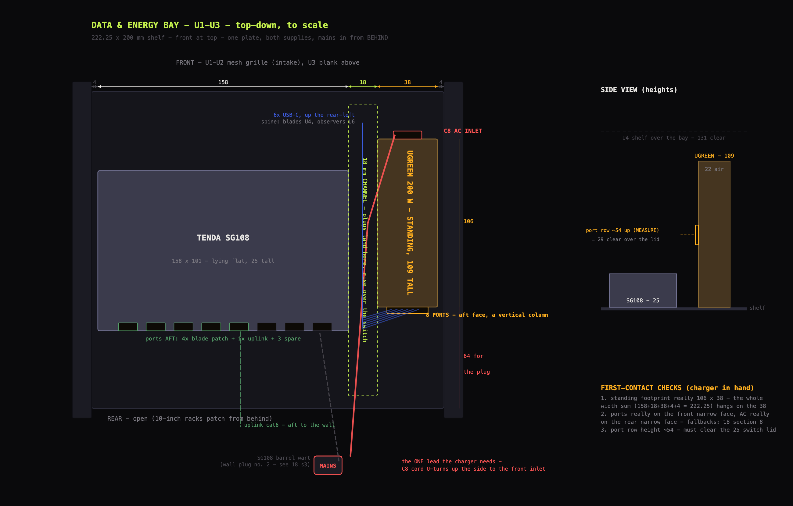
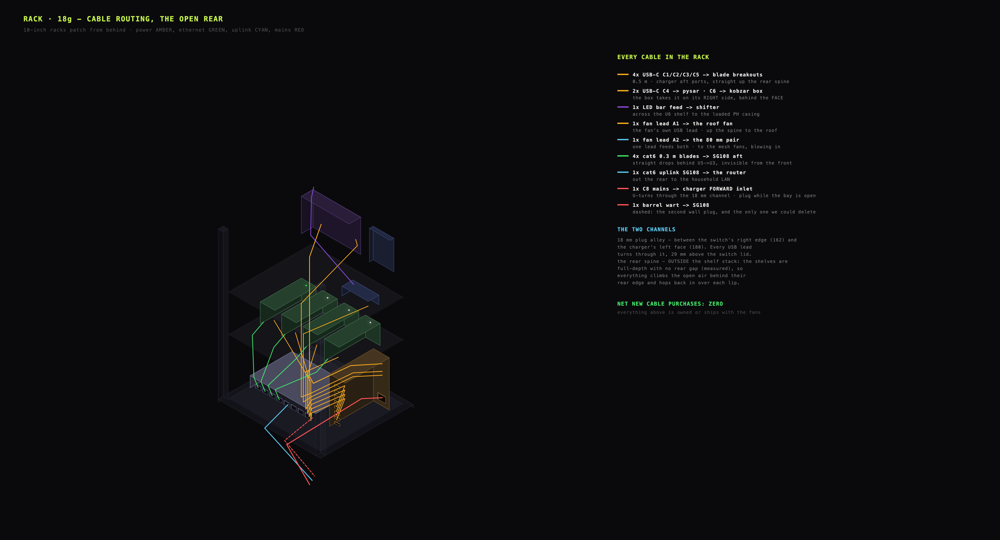
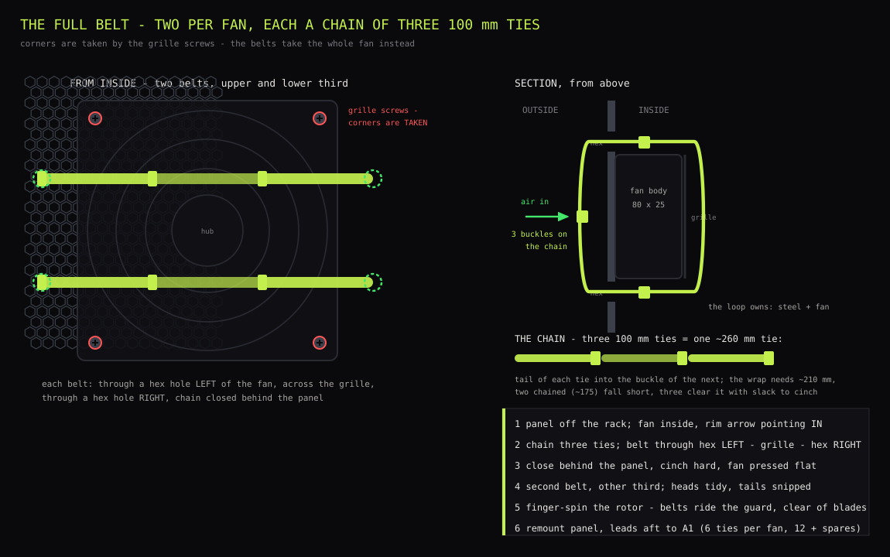
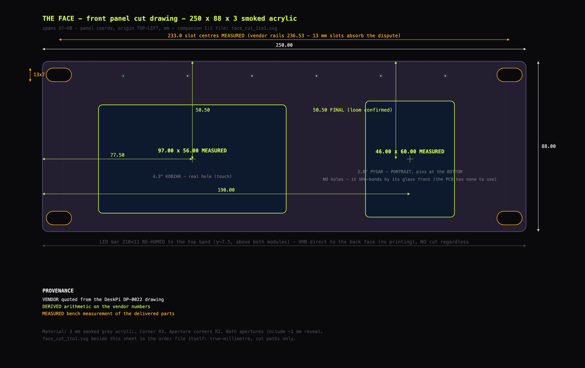
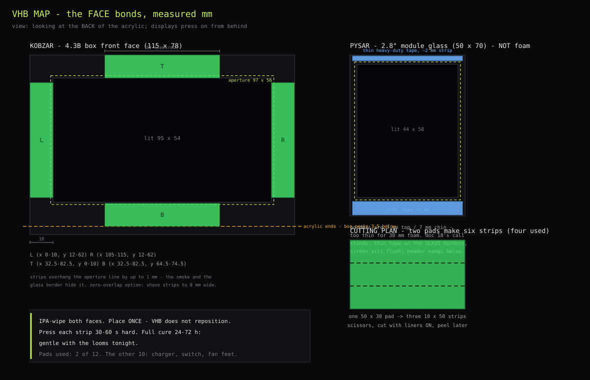
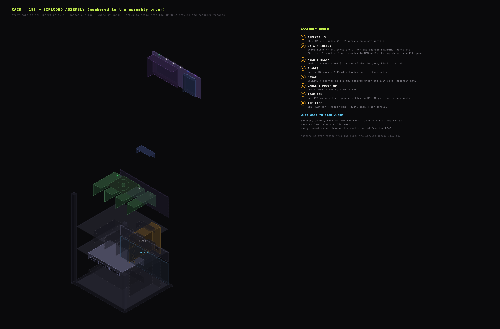
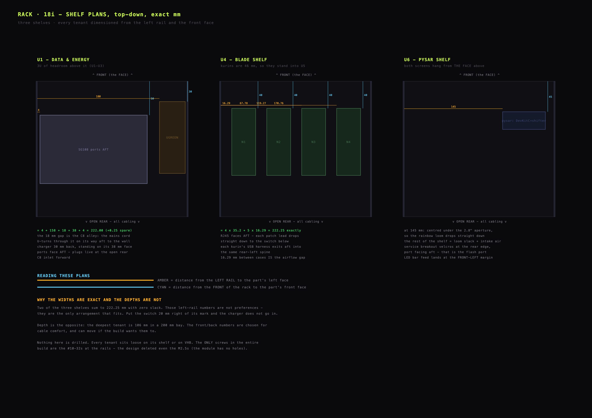
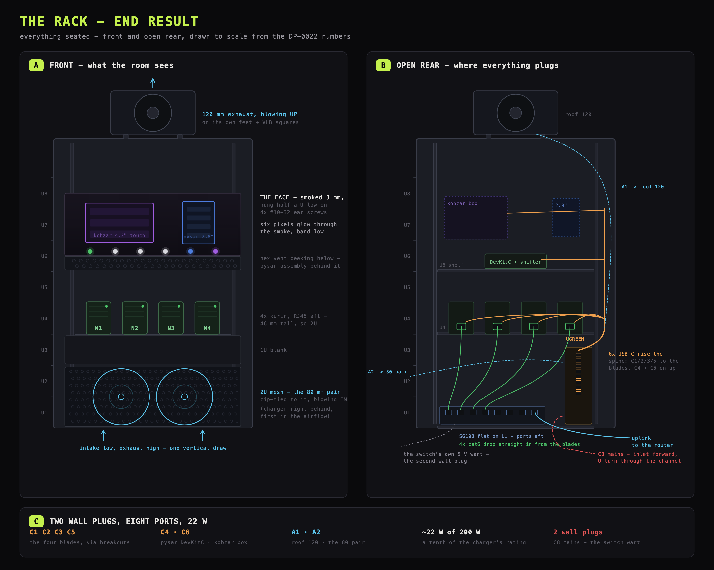

# Rack

The fleet lives in a 10-inch, 8U desktop rack: four kurin-cased blades, the
two observer screens on a smoked-acrylic front panel, one Ethernet switch,
one USB charger and three fans. This is the standing build reference - the
chassis with its real numbers, the U-map, power and cabling, airflow and
thermals, THE FACE, and the assembly sequence. The kurin case itself is
`15_blade_cases.md`.

## Chassis, with real numbers

**DeskPi RackMate T1** - 10-inch, 8U, die-cast aluminium frame with
translucent acrylic side panels. Dimensions from DeskPi's official mechanical
drawings (`DeskPi-Team/3DPrint-Models` on GitHub, `DP-0022 T1 8U
Chassis.pdf`):

| Fact | Value |
|---|---|
| External body W×D×H | **282.25 × 200 × 410.95 mm** (450.95 mm over the carry handles) |
| Rail mounting holes | **236.53 mm** centre-to-centre, **#10-32 UNF** cage screws |
| Clear opening between rails | **222.25 mm** |
| Panel width (10-inch standard) | **250 mm** face |
| U pitch | 44.45 mm (holes at 6.35 / 15.88 / 31.75 within each U) |
| Roof | vented slot field - no fan bolt pattern; fans mount on feet and ties (see airflow) |
| Feet / handles | rubber feet; handles removable |

Panel facts from the same drawings: **DP-0032 1U blank = 250 × 43 mm** solid
steel, flat field ~229 mm wide between ear slots (R3.5 × 5.5 slots).
**DP-0049 2U = 250 × 88 mm hex-perforated mesh** - a free intake grille.



## What lives inside

| Tenant | Size (mm) | Home |
|---|---|---|
| kobzar's 4.3" box (Mission Control, sealed case) | box **115 × 78**, lit area **95 × 54** | behind THE FACE |
| pysar's 2.8" module | **50 × 70** portrait, lit **44 × 58** | behind THE FACE |
| LED rail | one sleeved 6-LED SK6812 segment (30/m), **~200 mm** | behind THE FACE, glowing through it |
| 4× T-ETH-Lite blades in kurins | case **35.2 × 99 × 46** each (`15_blade_cases.md`); the board itself 55 × 28 | **U4-U5** shelf, RJ45 aft |
| pysar's DevKitC + AHCT shifter | ~63 × 26, on half an ElectroCookie board | U6 shelf |
| SG108 switch | **158 × 101 × 25** | **U1-U3** shelf, lying flat, ports aft |
| UGREEN 200 W 8-port charger | **109 × 106 × 38** | **U1-U3** shelf, standing upright beside the switch |

Depth check: the deepest tenant is the standing charger at 106 mm against
200 mm internal - every shelf keeps at least 90 mm of rear cable air.

## U-map



Two measured parts refuse to fit one U each, and between them they spend
every spare U in the chassis:

1. A kurin is **46 mm tall against a 44.45 mm U**, so the blades take **2U**.
2. The charger is built to stand upright and is **109 mm tall** doing so -
   two and a half U. Standing, though, it is slim, and that is what makes
   the layout work: it shares the bottom bay with the switch instead of
   needing one of its own, and four shelves become three.

| U | Tenant | Notes |
|---|---|---|
| **U8-U7** | **THE FACE** | 3 mm smoked acrylic, laser-cut (see the face-panel section). Both screens get real apertures; the six pixels glow *through* the smoke |
| **U6** | pysar assembly | DevKitC + shifter, the kobzar box's belly, wire slack; a factory hex-vent 1U panel in front |
| **U5-U4** | **4× kurin** | 4 × 35.2 = 140.8 mm across the 222.25 mm opening → spread evenly gives **16.3 mm of air between blades**; 99 mm deep of 200; RJ45 noses aft |
| **U3-U1** | **data & energy** | one shelf, one bay: SG108 flat + charger standing edge-on; 2U mesh grille and intake fans in front, 1U blank at U3 |

### Data-and-energy bay, across the 222.25 mm clear opening

**Mind which width.** Two different numbers live in this document and they
are not interchangeable: **229 mm** is the flat field on a 250 mm *panel*
face (THE FACE's number, face-panel section), while **222.25 mm** is the *clear opening
between the rails* - and a shelf tenant cannot be wider than the gap its
shelf drops into. Every sum below is against 222.25.



Width forces the charger's orientation. Its standing footprint is 106 × 38,
and only one way round fits:

| Charger stood | Width the pair eats | Verdict |
|---|---|---|
| wide face forward (106 across) | 158 + 106 = **264 mm** | does not fit the 222.25 mm opening |
| **slim face forward (38 across)** | 158 + 38 = **196 mm** | fits, with 26.25 mm spare |

So the charger presents a **38 mm narrow face** fore and aft - and on this
unit (UGREEN Nexode 200 W station) the narrow faces are exactly the two that
matter: one carries the vertical column of eight ports, the other the C8 AC
inlet near the base. In the rack the **ports face aft**: the service flow
(see the power-network-service section) plugs and unplugs at the open rear, and the mesh in front carries the
intake fans. The C8 inlet therefore faces forward, and its cord U-turns
through the 18 mm channel beside the charger on its way aft to the wall. The
channel serves that one fat cable; the USB leads rise straight up the rear
spine.

The 26.25 mm of width slack is spent as **4 margin / 18 channel / 4 margin**
(0.25 mm spare):

```
|<-4->|<-------- SG108, 158 -------->|<- 18 ->|<- 38 ->|<-4->|
       lying flat, 25 mm tall          channel  charger
                                                standing,
                                                109 mm tall
```

Height: 3U is 133.4 mm, less 2 mm of shelf plate, leaves **131 mm clear over
a 109 mm charger - 22 mm of air**. It is enough because no cable ever needs
the space above the charger: the leads leave the aft port column and rise
straight up the rear spine, so the headroom is pure breathing room.

**There is no front console.** The fleet is administered over the LAN - OTA
on 8443, `fleet_check`, the roster - and every blade carries its own USB
service harness reachable from the open rear (power-network-service section). The switch keeps spare
ports at the rear if a laptop ever needs to jack in; every extra front
connector is one more thing to fail.

## Power, network, service (the rear is open - 10-inch racks patch from behind)

**Two wall plugs** sit behind the rack:

1. **The charger's C8 cord** (supplied with it), U-turning through the 18 mm
   channel and running straight aft.
2. **The switch's 5 V barrel wart.** The SG108 is not USB-powered, and as the
   critical path for every backend it keeps its own proven supply rather
   than an adapter lead off the charger.

Everything else is USB-C off the charger's eight ports.

### Power ledger

| Port | Feeds | Via | Note |
|---|---|---|---|
| C1 | N1 | upright-port breakout + 4× dupont | this breakout's D+/D- order is reversed |
| C2 | N2 | recessed-port breakout + 4× dupont | |
| C3 | N3 | flat breakout + 4× dupont | |
| C5 | N4 | vertical breakout + 4× dupont | same upright type as C1 - reversed order |
| C4 | pysar DevKitC | plain C-to-C | the LED rail rides its 5 V pin |
| C6 | kobzar box (Mission Control) | plain C-to-C | |
| A1 | 120 mm roof fan | its own lead | 3-speed inline switch |
| A2 | 80 mm intake fan pair | one lead for the pair | 3-speed inline switch |

Current budget: 4 blades ~0.5 A each + two displays ~0.9 A each + fans
~0.3 A ≈ **4.4 A ≈ 22 W of 200 W**. The charger idles at a tenth of its
rating - thermally the bay is far tamer than the label suggests.

**Ethernet:** one Cat6 uplink leaves the bay aft to the household LAN.
Internal patching is 4× 0.3 m leads, blade to switch, entirely behind U5→U3 -
invisible from the front.

**Service - the 4-pin standard.** Each blade's breakout permanently carries
four dupont lines to the blade's headers: **VBUS, GND, D+→20, D-→19**.
Flashing a blade in the rack means pulling that blade's C-to-C out of the
charger and plugging it into the laptop at the open rear - the same harness
in both lives, no dongle, no shared tap, no other blade touched, the power
spine never opened. The kurin's tail slot passes the lead, and THE FACE
carries no service aperture. Per-pin detail, including the vertical
breakout's reversed D+/D- order, lives in
`12_power_circuits.md`.

### Cable ledger



| # | Cable | From → To | Run | Length |
|---|---|---|---|---|
| 4 | USB-C C-to-C | charger C1/C2/C3/C5 → blade breakouts, U4 | rear spine, ~250 mm rise | 0.5 m |
| 1 | USB-C C-to-C | C4 → pysar DevKitC, U6 | rear spine, ~310 mm rise | 0.5-1 m |
| 1 | USB-C C-to-C | C6 → kobzar box, U6 | rear spine, ~310 mm rise | 0.5-1 m |
| 2 | fan leads | A1 → roof fan · A2 → mesh fan pair | to roof / spine to mesh | the fans' own |
| 4 | Cat6 patch | blades U4 → switch aft ports | straight drop behind U5→U3 | 0.3 m |
| 1 | Cat6 uplink | switch aft → household LAN | out the rear | to suit |
| 1 | C8 mains | wall socket → charger inlet | U-turn through the 18 mm channel | supplied cord |
| 1 | barrel lead | wall wart → switch | out the rear | the wart's own |
| 16 | dupont F-F | breakouts → blade headers, **4 per blade** (VBUS, GND, D+→20, D-→19) | inside each kurin | - |

The spine runs outside the shelf stack - the shelves are full-depth, with no
rear gap to thread through.

## Airflow and thermals

Intake is low: through the **2U mesh grille at U1-U2, directly in front of
the charger**, pushed by an 80 mm fan pair, plus the hex vent at U6 and the
open bay fronts. Air rises through the perforated shelves and the open shelf
backs, and **one 120 mm roof fan exhausts upward**. The acrylic sides stay
sealed (dust); the rear stays open (cables and spill air). Positive vertical
draw, no recirculation pocket: the warm blades sit directly in the
intake-to-roof column, and the 200 W charger - the hottest tenant - sits at
the coolest point, first in the intake path.

**Mounting.** The roof is a plain slot field with no fan bolt pattern, so:

- The **120 mm roof fan** (AC Infinity MULTIFAN S3) stands on its own rubber
  feet on top of the roof, VHB squares under the feet, pulling air up
  through the slots - its AV-cabinet free-standing mode, used as designed.
- The **80 mm pair ties to the hex mesh** at the bottom front, blowing in at
  the charger. The fans' corner channels are occupied by the grille's own
  screws, so each fan hangs by **four 100 mm zip-tie loops around its
  outermost grille ring**, threaded through hex pairs.

  
- Nothing fits under the tray - the under-tray gap is below 25 mm.

**Choosing fans.** The rack's only supply is the USB charger at **5 V**, and
the PC-fan market is 12 V - buy natively-5 V USB fans. At this load every
candidate moves enough air, so the spec that decides is **bearing life**: the
fan runs 8,760 hours a year and is the only moving part in the machine.

| Bearing | Rated life | Running 24/7 |
|---|---|---|
| sleeve | ~30,000 h | ~3.4 years, then it whines |
| dual ball | ~67,000 h | ~7.6 years, quietly |

Fan noise climbs roughly with rpm⁵ - a bigger fan makes the same airflow at
lower rpm - so prefer the largest fan the mounting allows.

**Policy and numbers.** All three fans run at full speed through their inline
switches; at these sizes full speed is a low hum. Die temperatures barely
move between low and full speed - what full speed buys is cooler cabinet air
and cooler acrylic to the touch. Steady state, fans at full:

| Member | Role | Die temperature |
|---|---|---|
| N1 | otaman | 57-60 °C |
| N2-N4 | kozaky | 60-66 °C, brief excursions to ~69 °C that clear in minutes |
| Display | pysar | ~53 °C |
| Mission Control | kobzar | ~62 °C |

Two operating characteristics worth knowing. The kozaky run a few degrees
above their open-bench baseline of 55-59 °C - the price of kurin walls plus
cabinet air, with N3/N4 warmest in the middle of the row. And the otaman is
the coolest blade: it mostly relays while the kozaky terminate TLS, so the
backends work harder than the leader that fronts them. All curves stay flat,
under the fleet's 70 °C line.

The fans are not a hard dependency: ~22 W in a cabinet with an open rear and
a 2U mesh intake convects on its own. They buy margin and steadier glass;
the hand test on the acrylic says when more speed is wanted - warm is fine,
hot means more fan.

## Face panel

THE FACE is a **3 mm smoked-grey acrylic panel, laser-cut by an online
cut-to-size service from the 1:1 SVG below**. Every cut arrives already
made; home work is a screwdriver. On the black chassis the smoked panel
reads as one dark object with six pixels floating in it.



*`diagrams/face_cut_1to1.svg` is the order file itself: true-millimetre SVG,
cut paths only, 1 SVG unit = 1 mm - what the cutting service receives.*

### Cut schedule (panel coordinates, origin top-left, mm)

Seven cut paths, no drills - both screens and the LED bar mount by VHB from
behind.

| Feature | Geometry | Position (centre) | Notes |
|---|---|---|---|
| Panel outline | 250.00 × 88.00, corners R3 | - | the 10-inch 2U panel format |
| Ear slot ×4 | horizontal obround 13 × 7 | x **8.5** / **241.5** (= 233.0 c-c), y **7.0** / **81.0** | measured off the vendor's DP-0049 mesh panel; the 13 mm slots absorb the 233-vs-236.53 rail-spacing discrepancy |
| 4.3" aperture | 97.00 × 56.00, corners R2 | (**77.50, 50.50**) | kobzar box 115 × 78, lit 95 × 54 at +10/+10 from the box's top-left; box mounts x 20..135, top edge at 13.5 |
| 2.8" aperture | portrait 46.00 × 60.00, corners R2 | (**190.00, 50.50**) | module 50 × 70, lit 44 × 58 at +3/+4; module x 165..215, header and loom hang below the panel edge |
| LED bar 210 × 11 | no cut - VHB direct | top band, axis y = 7.5, x 20..230 | feed wires at the LEFT end - LED index 0 leftmost gives the natural left-to-right member order |

Both aperture centres share one axis, y = 50.5. A +1 mm reveal on both
display apertures is already inside the table's numbers. The rail posts
occupy x < ~17 and x > ~233 behind the panel, so nothing flat mounts there -
that is what pushes the kobzar box to x 20 and creates the **30 mm gap at
x 135..165** that takes the box's right-side USB-C plug. The 2.8" module has
**no mounting holes** (the orange corner dots are rubber feet); it bonds by
its glass front.

Two width systems meet on this panel - do not mix them: the **250 mm panel
face** (everything in this table) and the **222.25 mm rail opening** behind
it (every shelf tenant in the U-map). The 229 mm "field" is the panel face between
the ear zones; field x0 = 10.5 in panel coordinates.

- **No LED portholes.** The six pixels sit behind the smoke and glow
  through it as soft in-panel dots - dust-proof, and with brightness capped
  they read clearly in daylight.
- **No service aperture.** The service path lives at the open rear (power-network-service section), so
  the panel carries exactly the cuts above and nothing else.

### VHB bonding

The tape is structural - it carries both screens and the LED bar. The
worst-case sustained bond works out to ~7 g/cm², far inside what
acrylic-foam VHB holds.

- **Tape quality check** for any non-3M tape: dense, firm black foam is
  right; a soft translucent squish is not - fall back to a name-brand
  acrylic-foam tape (3M 5952 class).
- IPA-wipe both faces. Align each part lit-side-on against its aperture
  before pressing - the reveal is 1 mm, so eyes beat rulers here. Press
  firmly for 15 s, then let the bond cure face-down for hours before the
  panel goes vertical.
- The kobzar box bonds whole; the 2.8" module bonds by its glass border,
  tape on the top and chin. Blacken white foam edges with a permanent
  marker so they disappear behind the smoke.

  
- The LED bar bonds direct; if its sleeve is silicone (which VHB does not
  hold), strap it with VHB across the ends instead.

### Mounting

THE FACE arrives from a plastics service with no hardware; it mounts on four
spare **#10-32** cage screws from the shelf and panel kits - keep the spares
with the rack, since ordinary shops do not stock a matching #10-32. It hangs
**half a U below the top of the rack**: at the very top the ear slots meet
solid rail, half a U down all four meet threaded holes, and the offset
leaves breathing room above the screens and a half-U open bay below the
panel. The drawing has a top and a bottom, but the cut is symmetric enough
to install either way up; the built rack carries it rotated 180°, which puts
the LED band along the bottom edge.

## Assembly order





Two of the three shelves sum to 222.25 mm with zero slack - the left-rail
numbers on the shelf plans are the only arrangement that fits.

1. **Shelves in at U6 / U4 / U1** (#10-32 cage screws, snug not gorilla).
   Rails are 3 holes per U, 24 total, counted from the lowest small
   threaded hole: shelf ears at 1&3 / 10&12 / 16&18, rear support brackets
   mirroring the same numbers with their 18 mm ledges under the tray. At U1
   the mesh panel's flat strip cannot clear the shelf-ear screw heads, so
   each front ear takes one screw at hole 1, driven through mesh slot and
   ear stacked, and hole 3 stays empty - the rear brackets carry the load;
   the front screws only pin rotation.
2. **Data & energy onto U1** per the U-map's bay plan: SG108 first - flat,
   ports aft, left face 4 mm off the left rail, front edge 50 mm back. Then
   the charger, standing: left face at **180 mm** from the left rail (its
   38 mm spans 180-218), front face 30 mm back, **ports aft, C8 inlet
   forward**. Plug the C8 cord now, while the bay above is still open, and
   dress its U-turn through the 18 mm channel. Neither box is glued: the
   switch is pinned by its own cables, and the charger is steadied by hand
   during the rare re-plug - a strip of VHB under its front edge is the
   ten-second retrofit if it ever walks.
3. **Panels low.** The 2U mesh goes across U1-U2 - low and in front of the
   charger, so intake air enters at the coolest point and washes the
   charger's full 109 mm on the way up - and the 1U blank at U3, which
   covers the front only and traps nothing. The factory hex-vent 1U goes at
   U6 to hide the shelf wiring while keeping intake, held by its bottom
   screw pair alone (the top pair contends with the shelf ears, and a vent
   panel needs no more).
4. **Kurins onto the U4 shelf**, RJ45 aft, an adhesive foam pad under each
   (grip plus vibration decoupling on bare steel), left edges at **16.3 /
   67.8 / 119.3 / 170.8 mm** from the left rail - 16.3 mm of air between
   cases. Patch 4× 0.3 m to the switch; uplink lead aft. Both looms climb
   the rear spine together.
5. **The pysar assembly onto U6** at **145 mm** from the left rail - centred
   under where the 2.8" aperture lands. The rest of U6 is loom slack and
   air.
6. **Cable per the cable ledger** - the spine runs outside the shelf stack -
   and power up: the roster shows 6/6 on both screens within ~10 s.
7. **Fans per the airflow section**: the 120 onto the roof on its feet and VHB squares,
   blowing up; the 80 pair zip-tied to the mesh, blowing in; roof lead to
   A1, the pair's shared lead to A2.
8. **THE FACE last**, everything bonded to its back face per the face-panel section, apertures
   aligned lit-side-on before pressing, bond cured flat. Screw the panel in
   where all four ears meet threaded holes - half a U down - and drop the
   looms: rainbow ribbon to the pysar below the 2.8", USB-C into the 30 mm
   gap right of the kobzar box, LED feed across the shelf to the shifter.


