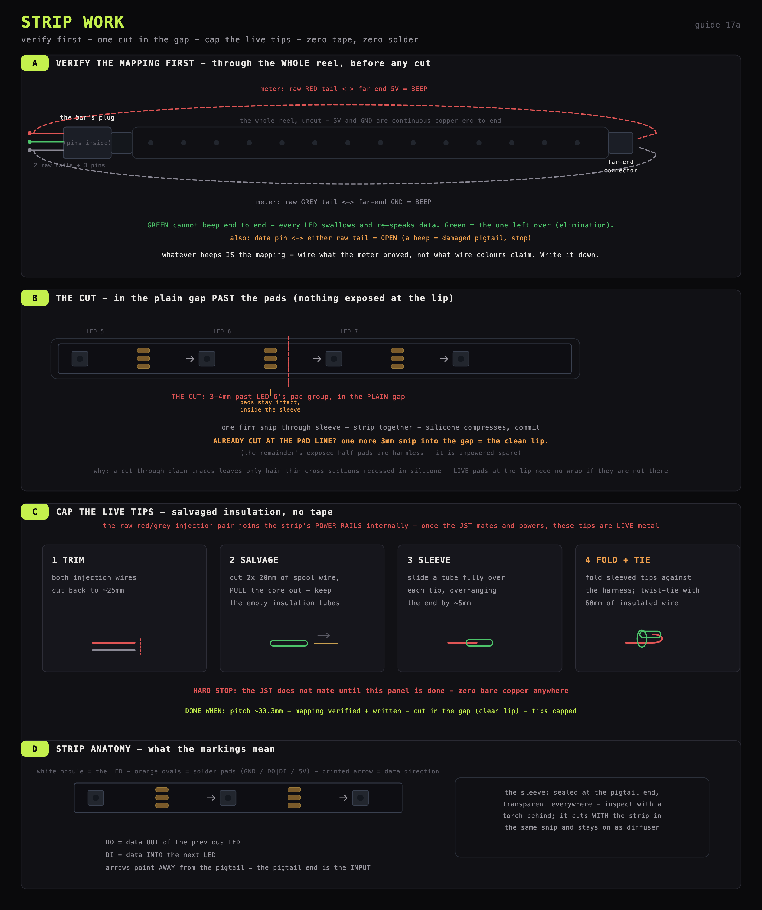

# Strip work: the uncut segment, tape-free

**The method is tape-free:** the mapping is verified END TO END through the whole reel
BEFORE cutting (the strip has connectors at both ends); the cut lands in the plain TRACE
GAP past LED 6's pads so no copper is exposed at either lip; the live injection tips get
capped with insulation salvaged from the wire spools. The sleeve is factory-sealed and
does not slide - the cut goes through sleeve and strip together.

## What you are making (and what the words mean)

One object leaves this step:

**The bar** - a 6-LED length of strip (~200 mm), still inside its sealed sleeve, with
the factory plug hanging off its input end (a PH-2.0-compatible male plug: three pins
in a keyed housing) and two raw pre-stripped injection tails (red + grey), which are
crimped to the plug's power pins inside.

Plus one fact that shapes the next step: **no loose mating half ships with the strip.**
The detachable joint is built on the shifter board instead - a bare PH casing loaded
with metal contacts extracted (not cut) from intact dupont jumpers.

Why the plug still matters: the board grows six header pins and the loaded casing; the
bar simply CLICKS IN - and can be unclicked forever after (rack assembly, repairs,
curiosity) without ever heating an iron again.

Which is why this step needs no soldering at all: everything here is scissors, meter
and salvaged wire insulation. The only soldering in the whole rail project is the
board, next.

## Know the strip (through the clear sleeve)

- The sleeve is transparent: find the **cut lines** (groups of 3 copper ovals between
  LEDs) and the **arrows** by looking through it - a torch behind the strip helps.
- The factory pigtail end is the INPUT (arrows point away from it). That end stays
  sealed exactly as the factory made it - never opened.
- **Pitch: 30/m** (~33.3 mm between LEDs; segment ≈ 200 mm). One ruler check through
  the sleeve to be sure.

## Verify the pigtail mapping FIRST (meter, whole reel)

The strip has a connector at BOTH ends. Before any cutting, the 5 V and GND rails run
as continuous copper through the entire reel - so the mapping check happens end to
end, while everything is still one piece:

1. Meter on continuity. The naming tools are the bar's own raw injection tails.
2. **Raw RED tail tip ↔ the far-end connector's 5 V contact/wire** → beep expected.
3. **Raw GREY tail tip ↔ the far-end GND contact/wire** → beep expected.
   (Any pairing that beeps IS the answer; you are discovering the mapping, not
   grading it.)
4. The plug's remaining pin is therefore data, **by elimination** - data cannot beep
   end to end at all, since every LED swallows and regenerates it. Extra confidence:
   the data pin ↔ either raw tail must read OPEN (a beep = damaged pigtail - stop).
5. Whatever beeped is the mapping. Wire what the meter proved, whatever the wire
   colours claim. Write it down.

## One cut (in the trace gap - deliberately NOT through the pads)

1. Count SIX LEDs from the pigtail end. Find the pad group after LED #6, then look
   **3-4 mm PAST it** (toward LED #7): plain flat strip, no copper ovals. That gap is
   the cut line. Mark the sleeve there.
2. Sharp scissors, **one firm snip through sleeve AND strip together**. Silicone
   compresses - commit; a hesitant half-snip drags the strip and angles the line.
3. Why the gap and not the pad centres: a cut through plain traces leaves **no exposed
   copper worth speaking of at either lip** - just hair-thin trace cross-sections
   recessed inside the silicone mouth. No tape needed, nothing to wrap, on the segment
   OR the remainder. (The segment even keeps its LED-6 pad group intact inside the
   sleeve, and the remainder gets cut fresh at its own next pad line if it is ever
   used.)
4. Missed and hit the pads anyway? No harm - recut 3 mm further along in the next gap.

## Cap the injection wires (salvaged insulation - no tape)

The raw red + grey injection pair is internally joined to the strip's power rails:
once the JST is mated and powered, their bare tinned tips are LIVE metal. They get
capped with insulation salvaged from the wire spools:

1. Trim both injection wires to ~25 mm.
2. Cut two ~20 mm pieces of spool wire, and **pull the copper core out** of each piece
   (solid core slides out of short lengths easily - grip the copper, pull the sleeve
   off). You now hold two empty insulation tubes.
3. Slide a tube fully over each trimmed tip, so it overhangs the end by ~5 mm.
4. Fold both sleeved tips back flat against the pigtail harness.
5. **Twist-tie them down** with a 60 mm piece of insulated wire wrapped twice around
   the fold and twisted closed. No bare copper anywhere.
6. The JST does not get mated until this is done - the capping is what makes the live
   tips safe.

## Dry-fit

Lay the sleeved bar where it will live and check its plug can reach the shifter
board's planned home with the jumpers' length in hand (~200 mm of dupont).
