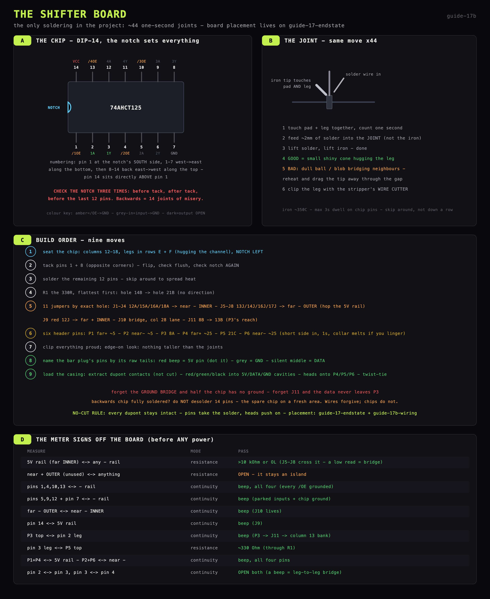
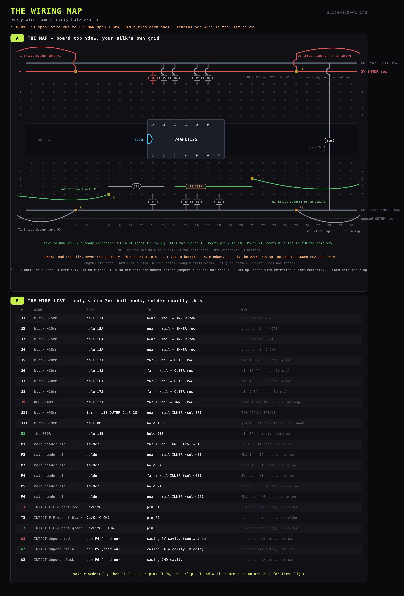
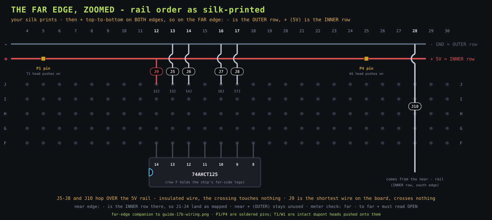

# Shifter board

**The end result is drawn, hole by hole, below - keep it open while building.**

The far-edge zoom (same information, bigger - useful at the bench for J5-J11, P4, T1):

## What you are making (and why this board exists)

The DevKitC speaks with 3.3-volt signals. The strip listens for 5-volt signals. Usually
3.3 V is *just barely* enough for the first LED to understand - "usually" is not a word
to build on. The **74AHCT125** chip is a repeater: signal in at 3.3 V, the same signal
out at a full 5 V. The **330 Ω resistor** sits after it to soften the signal's sharp
edges so they do not echo down the wire. The **ElectroCookie board** is the platform
that holds these two parts and gives every wire a solid home.

When this step ends you hold one small board with: the chip, the resistor, eleven short
jumper wires (J1-J11), and six header pins P1-P6 - nothing soldered to the bar or the
DevKitC, every dupont intact. ~44 solder points, each a one-second touch. This is the
only soldering in the entire rail project.

## Know the board (this is the key to everything)

The ElectroCookie half is a **solderable breadboard**. Its holes are not isolated -
they are pre-wired in groups, exactly like the classic white breadboard:

The silk: **30 numbered columns**, two banks of lettered rows - **A-E** on one side of
the centre channel, **F-J** on the other - and a **`+`/`-` rail pair** along EACH long
edge.

- **Columns of 5**: in each bank, the 5 holes of one column (A-E, or F-J) are one
  connected group. Two wires in the same column-bank are joined - no wire needed
  between them.
- **The centre channel**: the wide gap with the logo. The A-E bank and the F-J bank are
  SEPARATE - the chip straddles the channel, one leg row per bank.
- **The rails**: each edge carries a `+` and a `-` rail, each one long node
  full-length.

**Which physical row is which rail - read the silk, not the geometry.** This board
prints its rail pair `-` then `+` top-to-bottom on BOTH long edges, so the two edges
are NOT mirror images:
- **far edge**: `-` is the **OUTER** row (nearest the board edge), `+` is the **INNER**
  row (nearest row J)
- **near edge**: `-` is the **INNER** row (nearest row A), `+` is the **OUTER** row

The net assignment (matches the diagram; hold the board with columns 1-30 left to
right, rows A-E nearest you):
- **far edge `+` rail (INNER) = 5 V** · **far edge `-` rail (OUTER) = GND-north** ·
  **near edge `-` rail (INNER) = GND-south** · the near `+` (OUTER) stays unused
- Consequence: the four far-side ground jumpers must reach PAST the 5 V rail to the
  outer row, so they cross over it - insulated wire, and the crossing touches nothing.
- GND-north and GND-south are SEPARATE until you join them - one deliberate jumper
  (the "ground bridge") makes them a single ground. Forgetting it is the classic
  silent killer.

## Know the chip

DIP-14 = 14 legs, 7 per side. **The notch (or dot) marks pin 1's end.** Hold the chip
with the notch to the LEFT: pin 1 is the bottom-left leg, numbers run 1-7 along the
bottom (left to right), then jump to 8 at top-right and run 8-14 along the top (right
to left). So pin 14 sits directly ABOVE pin 1, at the notch end.

**Orientation is the one truly unforgiving mistake in this build** - a DIP soldered in
backwards means 14 joints to undo without a desoldering pump. Check the notch three
times: before tacking, after tacking, before the remaining 12 pins.

## Placement (column numbers as drawn on the end-state sheet)

The columns are already numbered on the silk. The chip straddles the channel at
**columns 12-18**, notch LEFT (at column 12) - its near-side legs land in **row E**,
its far-side legs in **row F** (the two rows hugging the channel). Every pin:

| Column | Near hole (row E, the A-E bank) | Far hole (row F, the F-J bank) |
|---|---|---|
| 12 | pin 1 `/1OE` → GND | pin 14 `VCC` → 5 V |
| 13 | pin 2 `1A` ← green dupont tail (from GPIO4) | pin 13 `/4OE` → GND |
| 14 | pin 3 `1Y` → resistor | pin 12 `4A` → GND |
| 15 | pin 4 `/2OE` → GND | pin 11 `4Y` - leave open |
| 16 | pin 5 `2A` → GND | pin 10 `/3OE` → GND |
| 17 | pin 6 `2Y` - leave open | pin 9 `3A` → GND |
| 18 | pin 7 `GND` → GND | pin 8 `3Y` - leave open |

Everything else enters through the SPARE holes of the same column-bank: a chip pin in
row E owns rows A-D of that column too - that is where its jumper or wire goes in.
The resistor runs from **column 14 (any of rows A-D)** to **column 21 (rows A-D)** - a
free column past the chip. The data path leaves as pin P5 at hole 21C - same
column-bank as the resistor's far leg, connected through the board, no joint needed.

## Build order

Iron at ~350 °C. Every through-hole joint is the same move: part in hole, iron tip
touches pad AND leg together for 1 second, feed ~2 mm solder, lift. A good joint is a
small shiny cone. The stripper's WIRE CUTTER clips protruding legs afterwards: come in
from the side with the blades nearly flat against the board, cut ~1 mm above the
solder dome - never into the dome itself - and cup a fingertip over the leg so the
clipped bit cannot fly.

1. **Seat the chip** - columns 12-18, straddling the channel, **NOTCH LEFT**. Fresh
   DIP legs are splayed wider than the holes on purpose: if they resist, lay the chip
   on its SIDE on the desk and gently roll the body to bend each leg row inward a few
   degrees, then insert both rows together. **"Push flat"** = press the body down
   until it sits flush on the board like a book on a table - no gap, no tilt. Then
   look edge-on: all 14 legs poking through underneath, none folded flat under the
   body (the classic missed-hole failure).
2. **Tack pins 1 and 8** (opposite corners). The joints happen on the UNDERSIDE - that
   is where the copper pads are. The flip without losing the chip: hold it in with a
   fingertip, turn the whole board over, and lay it flat on the bench - the board now
   rests ON the chip's body, gravity keeps it pressed flush, and the legs point up at
   you. Tack, then lift and check: body flush, notch still left. Wrong? One or two
   tacked pins can still be reheated and the chip freed.
3. **Solder the remaining 12 pins - ALL 14 legs get a joint**, including the "open"
   ones (6, 8, 11). "Open" means no wire leaves their column afterwards, not no
   solder: the joint holds the chip mechanically, and a column that connects to
   nothing is a harmless dead end. Max ~3 seconds per pin, skip around rather than
   running down one side (spreads the heat).
4. **R1, the 330R - flattest part goes first**: hole **14B** → hole **21B**. Either
   way round - resistors have no direction. Forming the stiff legs: seat one leg in
   14B, lay the body flat along row B, bend the other leg 90° down exactly where it
   meets 21B (the span is 7 columns, ~18 mm). Insert, splay the tips on the underside
   so it stays put, solder both, clip. Instant reward: meter from pin 3's leg (top
   side) to hole **21A** = **~330 Ω** through the column-bank and the resistor.
5. **The ten jumpers - J1 to J10 on the wiring map.** A jumper is spool wire cut to
   **its own span + 6 mm** (3 mm buried in each hole), stripped 3 mm both ends. Too
   long merely arches above the board; too short will not reach. Tick each off as it
   lands:
   - **J1-J4**, black ~15 mm: holes **12A, 15A, 16A, 18A** → the near `-` rail = the
     **INNER** row (nearest hole below each column). Grounds pins 1, 4, 5, 7 through
     their column-banks.
   - **J5-J8**, black ~20 mm: holes **13J, 14J, 16J, 17J** → the far `-` rail = the
     **OUTER** row. Pins 13, 12, 10, 9. Each one lies across the 5 V rail on its way -
     that is expected and harmless; the insulation is the whole reason it is safe.
   - **J9**, RED ~14 mm: hole **12J** → the far `+` rail = the **INNER** row. Pin 14's
     5 V, and the shortest wire on the board - it crosses nothing.
   - **J10**, black ~55 mm, **the ground bridge**: near `-` rail (INNER, south) → far
     `-` rail (OUTER, north), straight up column 28's free lane, crossing the 5 V rail
     near the top. Without it, half the chip has no ground.
6. **Six header pins P1-P6 - the connector layer.** No dupont jumper is ever cut: the
   board grows six single male header pins instead; every link is an intact F-F
   jumper pushed on, or the contact-loaded casing clicked on (step 8). Snap six
   singles off a male header strip. Soldering a single pin: SHORT side into the hole,
   LONG side up (that is what heads grip), one fast joint underneath - the plastic
   collar melts if you linger. Holder trick: push the pin's long end into a spare
   dupont female head first; it becomes a handle that also holds the pin vertical
   while you tack.
   | pin | hole | net |
   |---|---|---|
   | P1 | far `+` INNER rail, ~col 5 | 5 V in, from DevKitC |
   | P2 | near `-` INNER rail, ~col 5 | GND in, from DevKitC |
   | P3 | hole **8A** | data in - see J11 below |
   | P4 | far `+` INNER rail, ~col 25 | 5 V out, to the bar |
   | P5 | hole **21C** | data out - post-resistor, R1's bank |
   | P6 | near `-` INNER rail, ~col 25 | GND out, to the bar |

   P3 deliberately avoids column 13's bank: 13A is buried under the J1/J2 arches, and
   a rigid pin needs vertical headroom that a wire does not. So P3 stands in the open
   at 8A, and one last jumper - **J11, black ~19 mm, hole 8B → hole 13B** - slips in
   under the arches to join P3's bank to pin 2's bank. Solder J11 like any jumper;
   the data path becomes P3 → (8-bank) → J11 → (13-bank) → pin 2.
   If 21C turns out just as cramped for P5, same trick, different column.
7. **The bar's two raw tails are NOT soldered anywhere** - they are the bar's power
   injection tails and the bar must stay removable. They keep their capping from the
   strip work: salvaged-insulation sleeves, folded, twist-tied. Live once power
   flows; capped they touch nothing.
8. **The links - nothing soldered, everything push-on.**
   DevKitC side, three INTACT F-F duponts: **T1 red** DevKitC `5V` ↔ **P1** · **T2
   black** `GND` ↔ **P2** · **T3 green** `4` (GPIO4) ↔ **P3**. (Mated at first
   light, not now.)
   Bar side - first name the plug's pins, bar in hand, nothing disassembled (the raw
   injection tails are crimped to the power pins inside): raw RED tail tip ↔ each
   pin, the beeper = **the 5 V pin** - mark that end of the plug with a red dot ·
   raw GREY tail ↔ the rest, beeper = **GND** · the silent middle = **DATA** (must
   be the middle; anything else, stop and re-check).
   Then **the loaded casing**, three INTACT F-F duponts (red, green, black):
   - **Fit test first**: extract ONE metal contact from a spare jumper's female head
     (press the retention tab through the shell's side window with a pin tip, pull
     the wire gently - the contact slides out, still crimped, reversible) and try it
     in one cavity of a 3-pin PH casing. Snug = proceed. Jams = do NOT force;
     fallback below.
   - Extract one head's contact on each of the three jumpers. Dry-click the empty
     casing onto the plug once to see which cavity meets the red-dot pin. Load:
     red's contact → the 5 V cavity · green's → the middle (DATA) · black's → GND.
   - Push the three intact heads onto **P4 (red) · P5 (green) · P6 (black)**.
   - Twist-tie the three wires into one bundle just behind the casing - the casing
     may not positively lock foreign contacts, so the bundle takes any pull, not one
     wire.
   **Fallback if the fit test jams**: no duponts harmed - three lengths of spool wire
   soldered plug-pin → board-hole directly (tin the pin 1 second, tinned wire on,
   tube of salvaged spool-wire insulation slid over each joint BEFORE soldering; the
   three joints sit 2 mm apart). Costs click-off removability until unsoldered.
9. Clip all protruding legs and wire ends. Look across the board edge-on: nothing
   taller than the joints themselves on the underside.

## Meter checks (nothing powers up unmeasured)

Meter on continuity (beep) unless said otherwise:

- [ ] **the 5 V rail (far INNER) ↔ either `-` rail: resistance mode, >10 kΩ or
      open.** A low reading = solder bridge somewhere - find it before anything ever
      gets power. Check the far `-`/`+` pair especially: J5-J8 pass right over the
      5 V rail, so a stray whisker or a nicked jumper there shorts power to ground.
- [ ] **the two rails of each edge pair ↔ each other: open.** The near `+` (OUTER) is
      unused and must stay isolated from everything.
- [ ] each of pins 1, 4, 10, 13 ↔ `-` rail: beep (all four /OE grounded)
- [ ] pins 5, 9, 12 ↔ `-` rail: beep · pin 7 ↔ `-` rail: beep
- [ ] top `-` rail ↔ bottom `-` rail: beep (the ground bridge lives)
- [ ] pin 14 ↔ `+` rail: beep
- [ ] P3's pin top ↔ pin 2's leg: beep (the data path runs P3 → J11 → column 13's
      bank)
- [ ] pin 3's leg ↔ P5's pin top: **~330 Ω** in resistance mode (the signal path
      exists and goes through the resistor)
- [ ] P1 and P4 pin tops ↔ far `+` rail: beep · P2 and P6 ↔ near `-` rail: beep
- [ ] with the casing loaded and its jumpers on P4-P6: each casing contact ↔ its rail
      or P5: beep (the whole bar-side link conducts before it ever meets the bar)
- [ ] adjacent chip pins that should NOT be joined (2↔3, 3↔4): open - a beep here is
      a solder bridge between legs; reheat and drag the excess away

All pass? The board is done and correct by measurement. → `14_3_first_light.md`.

## If something goes wrong

- **Chip in backwards, fully soldered**: stop. Do not force it out - 14-pin
  desoldering without a pump wrecks the board. The honest fix is a fresh chip on a
  fresh area of the same board (or the board's other half).
- **Solder bridge between pins**: reheat the gap, drag the iron tip away through the
  gap; the excess follows the tip. Re-test.
- **Joint looks dull/grainy**: reheat 1 s with a touch of fresh solder.
- **Jumper in the wrong column**: reheat the joint, pull the wire with fingers on the
  insulation while the solder is molten, re-place. Wires forgive; chips do not.
