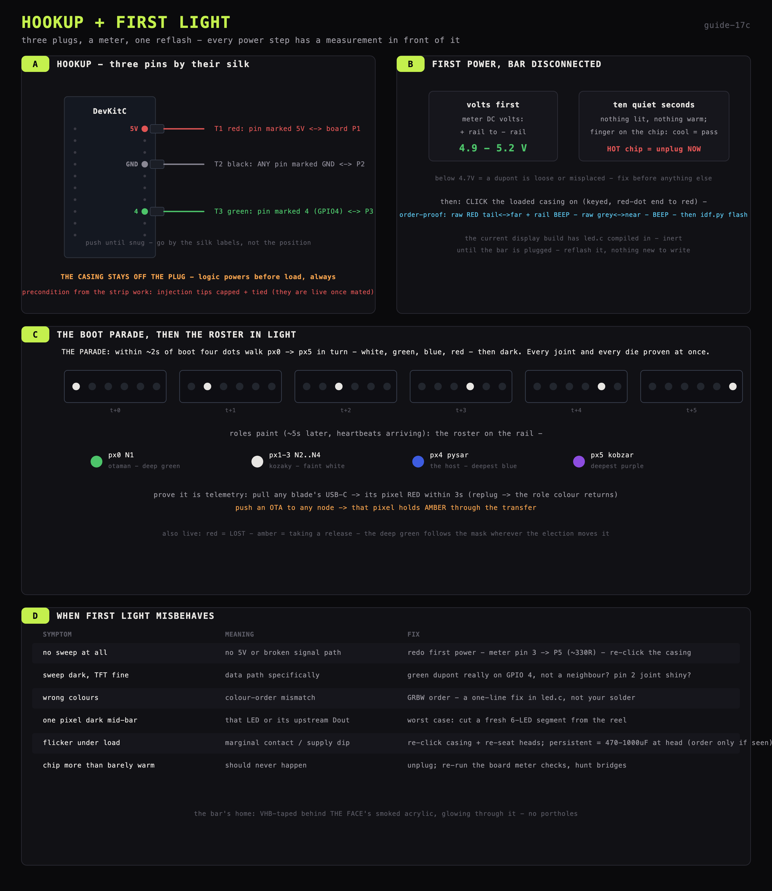
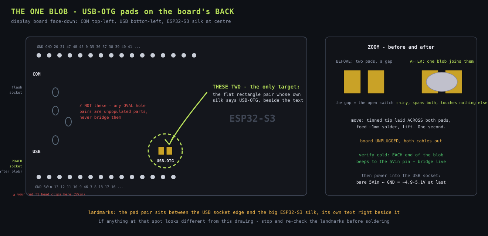

# Hookup and first light

The iron is done - this step is three plugs, a meter, and one reflash.



## What happens here

The shifter board meets the DevKitC and the bar. Three intact jumpers link the
DevKitC's pins to board pins P1-P3, the loaded casing clicks onto the bar's plug, the
display firmware gets reflashed (it already contains the LED code, inert until now),
and the rail comes alive in a specific, watchable order. Every power step has a
measurement in front of it.

## Find the three DevKitC pins (silk labels on the board edge)

The DevKitC's pins are labelled in tiny silk print along the header rows:
- **`5V`** - the 5-volt supply pin (one of the corner-area power pins)
- **`GND`** - any pin marked GND (there are several; any one is fine)
- **`4`** - GPIO4, the data pin the firmware drives

Run the three intact jumpers: **red DevKitC `5V` ↔ board P1 · black `GND` ↔ P2 ·
green `4` ↔ P3**. Heads grip snugly at both ends. The display node's USB-C stays on
its charger port.

**The casing stays OFF the bar's plug through first power** - logic before load.

## Display board's power quirk (and the two solder blobs that fix it)

The display board is a dual-USB-C DevKitC-style clone whose 5 V pin is silk-marked
**`5Vin`** - and on this variant that pin ships **ISOLATED from both USB sockets** by
design (it is an input for external supplies). Bare-pin readings on an unmodified
board: ~3.4-3.6 V powered via `COM`, ~2.6 V via `USB` - diode leakage, not real power,
regardless of charger or cable. The LEDs need ≥ 3.5 V; this alone keeps the bar dark
with perfect wiring.

The fix is two tidy solder blobs, both permanent:

1. **The `USB-OTG` pad pair on the board's BACK** (exact target drawn below) -
   marries the `USB` socket's power line to the board's VBUS island. On its own this
   is NOT enough: it puts 5.2 V on both blob ends, but `5Vin` stays its own island
   (~2.6 V).
2. **The `IN-OUT` pad pair on the FRONT**, in the shadow beside the pin-13 end of the
   header - joins the `5Vin` pin to that VBUS island. This is the load-bearing blob.



Verify cold, before power: `5Vin` ↔ the OTG blob beeps; `5Vin` ↔ `GND` stays open.
Powered proof: `5Vin` ↔ `GND` = **5.2 V** - the pin is a true output, and T1 red
(`5Vin` ↔ P1) is the permanent feed as designed. Both blobs stay - same power island,
no conflict, and the OTG blob doubles as a probe point.

With the bridges in place, **ONE cable in the `USB` socket does everything**: it
powers the 5 V net AND flashes (the S3's native USB-Serial-JTAG lives behind this
socket; that is why the PC names it `/dev/cu.usbmodem...`). The bridges touch only
the power line, never data. `COM` = the backup flashing door (external UART bridge,
its own one-way valve; shows as `usbserial`; both cables at once is safe).

## First power, bar disconnected

DevKitC powers up as always (TFT comes alive). Meter on DC volts:
- probes on the board's `+` rail and `-` rail → **4.9 - 5.2 V** expected.
- Below ~4.7 V: a dupont is loose or on the wrong pin - fix before proceeding.

Then ten quiet seconds: nothing should be lit, nothing warm. Finger on the chip - cold
or barely warm = pass. A HOT chip = power is reversed somewhere - unplug USB
immediately and re-check the dupont placement against the pin-finding section.

## Mate the plug + reflash

1. **Precondition**: the bar's injection tips are capped, folded and twist-tied -
   they are live once power flows. Confirmed? **Click the loaded casing onto the
   bar's plug** - the key only lets it latch one way, red-dot end to red wire. Then
   the order-proof beep, before any power: bar's raw RED tail tip ↔ the board's far
   `+` rail = beep (5 V runs casing-through) · raw GREY tail ↔ near `-` rail = beep.
   Silent or crossed = unclick, re-check the cavity loading order.
2. **Pre-flash nicety: LONG-PRESS the TFT (~1.5 s)** = maintenance blackout - screen
   AND rail go dark together, so the flash starts from darkness instead of the rail
   latching stale colours through the bootloader. Any short tap wakes both.
3. Reflash the display node (the current build already carries the LED code):

```bash
cd firmware/display        # from the repo root
idf.py -p <port> flash monitor
```

4. **The boot parade**: within ~2 s of boot, four dots walk px0 → px5 in turn -
   **white, green, blue, red** - then the bar goes dark. ~4 s that prove the entire
   signal path AND all four dies of every pixel - GPIO4, the chip, the resistor, the
   plug, six LEDs' worth of strip copper, 24 dies. This is THE proof of the whole
   rail.
5. **Roles paint** (~5 s later, once heartbeats arrive), per the colour law in
   [`../../2_firmware/24_display_led.md`](../../2_firmware/24_display_led.md):
   the otaman's pixel deep green, the kozaky faint white, the pysar's own pixel
   deepest blue, the kobzar's deepest purple; a lost member pure red, releases amber.
   The rail now mirrors the roster on the screens above it.

## Prove it tells the truth

- **Kill test**: pull any blade's USB-C. Its pixel turns RED within 3 seconds.
  Replug - its role colour returns when the node rejoins.
- **Release test**: push an OTA to any node from the PC. That node's pixel holds
  AMBER for the transfer, then returns to its role colour.

Both behave? The rail is telemetry, proven.

## When first light misbehaves

| Symptom | Meaning | Fix |
|---|---|---|
| No sweep at all | no 5 V, or signal path broken | redo the first-power checks; then meter pin 3 → P5 (~330 Ω); unclick + re-click the casing; re-seat heads on P4-P6 |
| Sweep dark but TFT fine | data path specifically | check green dupont is on GPIO **4**, not a neighbour; check pin 2 joint |
| Wrong colours (e.g. white shows green) | colour-order mismatch | a firmware one-liner (GRBW order), not your solder - fix in led.c |
| One pixel dark mid-bar | that LED or its upstream neighbour's output | worst case cut a fresh 6-LED segment (`14_1_wire_strip_work.md`) |
| Flicker under load | marginal contact or supply dip | re-click the casing + re-seat all heads; if persistent, a 470-1000 µF cap at the head of the strip |
| Chip warm during operation | it should never be more than barely warm | unplug; re-run the shifter board's meter checks, look for bridges |

## Rail's home

The bar VHB-tapes to the back of THE FACE's smoked acrylic, glowing through it - no
portholes (`../16_rack.md`).
