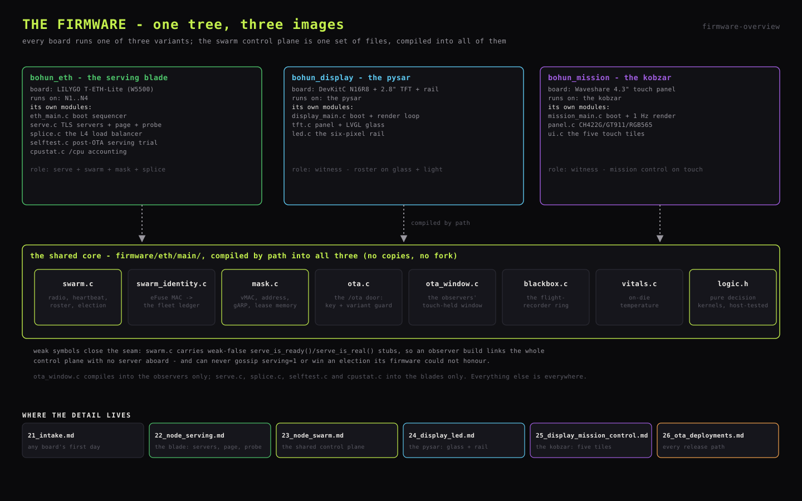

# Firmware

Three ESP-IDF firmware variants, built from one shared tree, run the whole
fleet. The architecture they implement is
[`../SYSTEM_DESIGN.md`](../SYSTEM_DESIGN.md); this family of documents is
the implementation reference:

- [`21_intake.md`](21_intake.md) - board intake: the identity ritual every
  board passes through before its first flash (eFuse MAC, flash check, the
  label)
- [`22_node_serving.md`](22_node_serving.md) - the serving blade: TLS server,
  the embedded page, the admin plane, self-probe
- [`23_node_swarm.md`](23_node_swarm.md) - the swarm control plane: identity
  ledger, heartbeat, election, the mask, the splicer
- [`24_display_led.md`](24_display_led.md) - the pysar: 2.8" roster glass and
  the LED rail
- [`25_display_mission_control.md`](25_display_mission_control.md) - the
  kobzar: 4.3" touch mission control, five tiles
- [`26_ota_deployments.md`](26_ota_deployments.md) - releases: the update
  door, blade deploys, the observer OTA window



## Variants

| Variant | Project | Board | Role |
|---|---|---|---|
| `firmware/eth` | `bohun_eth` | LILYGO T-ETH-Lite ESP32-S3 (W5500 wired Ethernet), blades N1..N4 | serve + swarm + mask + splicer |
| `firmware/display` | `bohun_display` | ESP32-S3 DevKitC N16R8 + 2.8" ST7789 TFT + SK6812 rail | witness (pysar) |
| `firmware/mission` | `bohun_mission` | Waveshare ESP32-S3-Touch-LCD-4.3B | witness (kobzar) |

One binary per board type. Per-node identity (id, name, eligibility) comes
from the eFuse MAC at runtime through the fleet ledger
([`23_node_swarm.md`](23_node_swarm.md), identity ledger) - the build never encodes
which physical board it is for. A board earns its ledger row through the
intake ritual ([`21_intake.md`](21_intake.md)): read the eFuse MAC, verify the
flash, label the board, record the row - before any first flash.

**Release identity.** Each variant carries a `version.txt` (a bare integer) at
its project root. ESP-IDF bakes it into the app descriptor as the project
version; the swarm gossips it in the heartbeat; every glass and the admin
roster show it. Any firmware change bumps that variant's `version.txt` in the
same edit - an image whose code changed but whose version did not cannot be
told apart on the wire. `idf.py reconfigure` must run after a bump: a bare
rebuild does not re-read the file.

## Shared source layout

```
firmware/
  eth/main/          the blade firmware, and the shared core
    eth_main.c         boot sequencer: NVS, W5500, events, swarm, serve
    serve.c/.h         both TLS servers, the page, the admin plane, self-probe
    splice.c/.h        the otaman's L4 TCP splicer
    swarm.c/.h         radio, heartbeat, roster, election
    swarm_identity.c   the fleet ledger (eFuse MAC -> identity)
    mask.c/.h          the mask choreography (vMAC, address, gARP, lease memory)
    ota.c/.h           the /ota door: key gate + variant guard
    ota_window.c/.h    the observers' on-demand OTA window (never in blade builds)
    selftest.c         the post-OTA boot trial (blades)
    blackbox.c         the flight recorder ring
    vitals.c           on-die temperature
    cpustat.c          per-task CPU and stack accounting (/cpu)
    logic.h            the pure decision kernels (election, availability,
                       the bench) - dependency-free, host-tested
    certs/, secrets.h  TLS pair and generated secrets (gitignored)
  display/main/      display_main.c + tft.c + led.c
  mission/main/      mission_main.c + panel.c + ui.c
  tests/             host tests for logic.h (tools/run_tests.sh)
```

The observers do not fork the control plane: their CMake lists compile
`swarm.c`, `swarm_identity.c`, `mask.c`, `blackbox.c`, `vitals.c`, `ota.c` and
`ota_window.c` straight out of `eth/main/` by path. Divergence is impossible
because there is no second copy.

Weak symbols make one control plane fit three firmwares: `swarm.c` carries
weak stubs for `serve_is_ready()`, `serve_is_real()` and `splice_stats_get()`
so observer builds link without a web server or splicer aboard, and the blade's
strong definitions override them at link time. `serve_is_real()` is weak-false
on purpose: a build that has no server can never gossip `serving=1`, so it can
never be elected to a mask its firmware could not honour.

## Toolchain

ESP-IDF, pinned to an exact release, driven by `idf.py`. No Arduino layer, no
PlatformIO. The reasons, in order of weight:

- **The mask needs register-level Ethernet control.** IDF's `esp_eth` exposes
  MAC set via `esp_eth_ioctl` (a W5500 SHAR rewrite) and keeps the
  driver/netif seam visible - exactly where the vMAC swap and gratuitous-ARP
  choreography live. Higher-level Ethernet abstractions hide that seam.
- **TLS 1.3-only is a config knob** in IDF's mbedTLS + `esp_https_server`.
- `esp_now`, NVS, OTA and partition tooling are first-class IDF citizens.

Dependencies are pinned exactly (`==`, no ranges) and bumped deliberately.
The W5500 driver lives in the component registry (`espressif/ethernet_init`
pulling `espressif/w5500`), configured entirely through Kconfig - the per-board
pin permutations live in `boards/*.defaults`. Both observers draw with LVGL
via `esp_lvgl_port` on top of IDF's `esp_lcd`.

## Concurrency conventions

Every ESP-IDF app runs on FreeRTOS from boot, and the reused components all
arrive as tasks (lwIP's `tcpip_thread`, the W5500 RX task, the event loop,
`esp_http_server`'s `httpd` task). The rule for project code:

- every piece of logic is a **named task with a declared priority and stack
  size**, core-pinned when it matters - never an ad-hoc loop;
- **callbacks do no work**: the ESP-NOW RX callback, timers and event handlers
  hand off through a queue to the task that owns the work, because callbacks
  run in the radio's or driver's context.

The task inventory:

| Task | Prio | Stack | Core | Owns |
|---|---|---|---|---|
| `swarm_hb_tx` | 6 | 3 KB | any | the 1 Hz heartbeat |
| `swarm_monitor` | 5 | 4 KB | any | RX queue, roster, election + mask tick |
| `splice` | 5 | 6 KB | 0 | the splicer's select loop (blades) |
| `httpd` (public) | cfg | cfg | 1 | the TLS page server (blades) |
| `serve_probe` | 4 | 3 KB | any | the loopback self-probe (blades) |
| `selftest` | 2 | 3 KB | any | the post-OTA serving trial (blades) |
| `cpustat` | 1 | 3 KB | any | per-task CPU sampling (blades) |
| `tft_render` / `ui_render` | 4 | 6 KB | any | the glass (observers) |
| `led_anim` | 4 | 2.5 KB | any | rail blinking (pysar) |
| `tp_blank` | 3 | 2 KB | any | the touch gesture ladder (pysar) |
| `ota_window` | 5 | 8 KB | any | the on-demand WiFi window (observers) |
| `ota_trial` | 4 | 3 KB | any | the observer boot trial |

## Building

**Blades: one project, per-variant isolated sdkconfig.** ESP-IDF keeps a
single `sdkconfig` at the project root, shared across every `-B` build
directory - building two board variants with only `-B` different silently
gives both the pins of whichever `set-target` ran last. So each variant pins
its config into its own build directory:

```
cd firmware/eth
idf.py -B build.lilygo -D SDKCONFIG=build.lilygo/sdkconfig \
       -D SDKCONFIG_DEFAULTS="sdkconfig.defaults;boards/lilygo.defaults" build
```

Verify the compiled header before flashing anything:

```
grep -E "CONFIG_IDF_TARGET |CONFIG_ETHERNET_SPI_CS0_GPIO " build.lilygo/config/sdkconfig.h
```

(the target is also pinned in `sdkconfig.defaults` as a backstop - a failed
`set-target` can leave the project configured for plain esp32).

**Observers: plain `idf.py build`** in `firmware/display` or
`firmware/mission` - one board each, so the root sdkconfig is fine.

**Secrets first.** `tools/gen_secrets.sh` mints the gitignored
`firmware/eth/main/secrets.h`: ESP-NOW PMK/LMK, the OTA key, the mask's
reserved address and gateway, and empty observer WiFi fields. Every build
fails fast without it. Secrets never enter the tree or its history.

**First contact with any board** is `esptool erase-flash` - factory firmware
leases addresses and chatters, and it dies before this project's image boots.
The first image and any partition-table change go over USB; everything after
that travels over the air.

## Testing

The decision rules the fleet lives by are pure functions in
`eth/main/logic.h`, and the host suite proves them on the development
machine in seconds - no board involved:

```
tools/run_tests.sh
```

It compiles `firmware/tests/test_logic.c` against ESP-IDF's vendored Unity
with ASan/UBSan on and runs it (`IDF_PATH` locates Unity; export.sh sets
it). Election order, liveness windows and their 49-day wrap, the
availability formula, the splicer's bench backoff, header parsing, and the
clamped-JSON repair are all pinned. Run it after any change to `logic.h`
or the tests themselves.

The serving path is proven on-device instead: the boot trial
([`26_ota_deployments.md`](26_ota_deployments.md)) gates every release on
90 s of real serving, and `tools/fleet_check.sh` proves the fleet end to
end - page 200, doors closed where they must be, identical content hashes.

## Releases

Every image lands through the same key-gated, variant-guarded `/ota` door;
blades roll fleet-wide through `tools/deploy.sh`'s gates, observers through
the touch-held OTA window. The whole release path - door, gates, window,
partition tables, rollback contract - is
[`26_ota_deployments.md`](26_ota_deployments.md).

## Flight recorder

Every member keeps two forensic partitions, so no reboot goes unexplained:

- **The blackbox** (`blackbox.c`): a ring of 4096 fixed 64-byte records in
  raw flash - sector-erase-ahead, mutex-guarded, surviving reboot, OTA and
  panic. Every record carries uptime, free internal heap and the largest free
  block (fragmentation can starve a malloc while tens of KB are nominally
  free, which is why both numbers are recorded). Recorded events: boot with
  reset cause, every 5xx with its URI, malloc-guard OOMs, heap crossing the
  amber line (edge-triggered), mask claimed/lost, OTA in/ok, trial verdicts,
  refused variants, chronicle lines, die-temperature crossings.
- **The coredump partition**: full panic post-mortems.

Reading a blade: `GET :8443/blackbox` (text, newest first) and
`GET :8443/coredump -o core.bin`, then

```
python $IDF_PATH/components/espcoredump/espcoredump.py \
    info_corefile -t raw -c core.bin firmware/eth/build.lilygo/bohun_eth.elf
```

The observers keep the same ring and coredump partitions on their own flash;
the heartbeat carries every member's reset cause either way, and the kobzar's
chronicle names it on glass.
