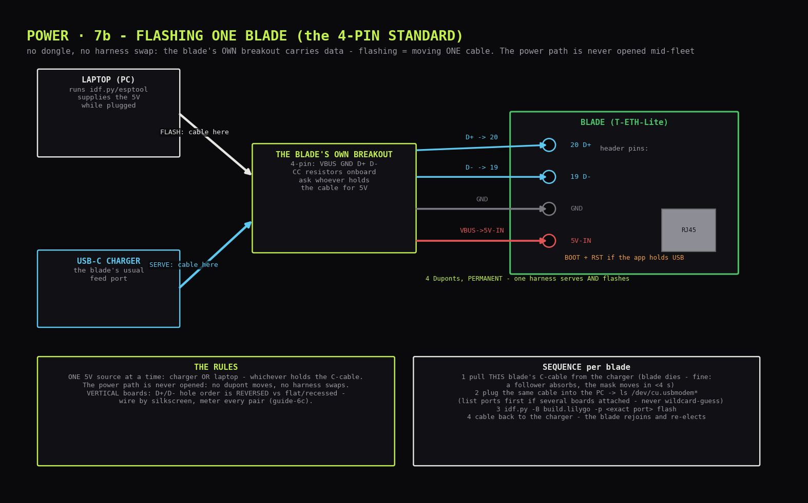

# Board intake: the identity ritual, explained from first principles

The standing procedure for **every board that enters the fleet** - first build, replacements, warranty swaps, expansions. Two read-only commands establish a board's identity; the label and the inventory row make it permanent.

## Mental model

**What's on each board when it arrives.** An ESP32-S3 is a system-on-chip: two CPU cores, RAM, radios - but its *program storage* is a separate little SPI flash chip soldered next to it (that's the "16MB" in N16R8), and its *identity* lives in **eFuses** - a small bank of one-time-programmable bits inside the SoC, some of which Espressif burned at the factory (notably a globally unique **base MAC address**). Boards arrive with either nothing or a vendor demo program in flash. There is no OS. Nothing intake does changes any of this.

**The unbrickable listener.** Every ESP32 has a tiny program called the **ROM bootloader** baked into mask ROM at chip manufacture. It cannot be erased, corrupted, or updated - it is literally part of the silicon. When the chip resets under a particular pin condition (more below), instead of running whatever is in flash, it sits and listens on the serial/USB port for commands in a simple framed protocol: *"identify yourself", "read this", "write that"*. This is why ESP32 development is forgiving: no matter how badly firmware goes wrong later, the ROM bootloader is always there. (The one exception - eFuse burning - is permanent, and this build deliberately never burns any.)

**What esptool is.** [`esptool`](https://github.com/espressif/esptool) is Espressif's official, open-source **Python command-line client for that ROM bootloader protocol**. It runs **on your PC** - never on the board. The board needs no software, no agent, no preparation; the counterpart it talks to has been in the silicon since the factory. Think of esptool as `psql` and the ROM bootloader as the server that's always running.

**What pipx is, and where it runs.** `pipx` is a Python tool-installer for your **laptop**: it puts a CLI app (esptool) into its own isolated virtualenv and links it onto your `$PATH`, so it can't fight your other Python environments. "Where should I run pipx?" - **any terminal on your PC, from any directory.** It's a one-time laptop-side install. Nothing Python-related ever touches the ESP32s.

**How the cable becomes a terminal device.** When the S3's built-in **USB-Serial-JTAG peripheral** reaches the PC - over a DevKitC's native USB-C, or over the blade's own breakout D+/D- (IO20/IO19; the T-ETH-Lite has no USB port of its own, so its 4-pin harness carries the pair permanently) - it enumerates as a standard USB serial device (CDC-ACM class - the same mechanism as any USB modem since the 90s). macOS needs no driver and creates a device file like `/dev/tty.usbmodem101`. esptool opens that file like any serial port. The diymore DevKitC boards have **two** USB-C ports: one is the S3's native USB (shows up as `usbmodem…`), the other goes through a CH343 UART bridge chip (shows up as `wchusbserial…` or `usbserial…`); **either works** - use whichever enumerates.

**How the board drops into the listener.** The S3 samples a few **strapping pins** at reset; if GPIO0 (the **BOOT** button) is held low during reset, it enters the ROM bootloader instead of booting flash. On native-USB boards esptool usually does this dance *for you* by toggling the port's DTR/RTS control lines to pulse reset+boot automatically. When auto-entry fails (it sometimes does on clone boards), the manual version is: **hold BOOT, tap RST, release BOOT** - or simply hold BOOT while plugging the cable in.

**What the two commands actually do:**

- `flash_id` - esptool first uploads a small helper program (the **stub**) into the chip's **RAM** - not flash, gone at next reset - because the stub speaks faster than the bare ROM code. The stub then asks the SPI flash chip for its **JEDEC ID**: a 3-byte manufacturer+capacity code every flash chip self-reports. esptool decodes the capacity byte and prints `Detected flash size: 16MB`. **This is why the check is trustworthy: the flash chip itself is answering, independent of any label.** A relabelled N8R2 cannot lie its way through this.
- `read_mac` - the stub reads the factory eFuse block and prints the **base MAC**. This is the permanent, unique, Espressif-assigned identity logged per board. Firmware later derives the interface MACs from it by fixed offsets (WiFi-STA = base, WiFi-AP = +1, BT = +2, **Ethernet = +3** - so the wired MAC each blade uses natively is `base+3`; record the base, the rest is arithmetic). Note the swarm's *mask* vMAC is unrelated to any of these - it's ours, minted in firmware.

**What intake explicitly does NOT do:** no flashing, no erasing, no configuration, no eFuse writes. Both commands are read-only; the vendor demo firmware (if any) survives untouched. The dangerous member of this tool family, `espefuse.py`, stays sheathed - this build never burns an eFuse.

---

## One-time laptop setup (any directory, zsh)

```bash
# 1) pipx itself (via Homebrew; alternative: python3 -m pip install --user pipx)
brew install pipx
pipx ensurepath          # adds ~/.local/bin to PATH
exec zsh                 # reload the shell so PATH takes effect

# 2) esptool into its own isolated env
pipx install esptool

# 3) confirm + RECORD the version in your hardware inventory
esptool version
```

Version policy (exact pins): install latest, then **write the exact version it reports into the inventory**. That recorded number *is* the pin - any future machine reproduces the toolchain with `pipx install "esptool==<recorded>"`.

If `command not found: esptool` after install: you skipped `pipx ensurepath` or didn't reload the shell. (v5 dropped the `.py` suffix; both names work during the deprecation window.)

---

## Per-board procedure (one board at a time)

**Rule: one board plugged in at a time.** It makes the device path unambiguous and the labels honest.

**Cable path by board type:**

- **Native USB port** (the DevKitCs: either port) - a known-data C-C cable, done.
- **Headerless-USB boards** (the LILYGO blades - no USB port at all): the blade's **own 4-pin breakout harness** - move the blade's C-cable from the charger to the PC. The PC supplies the 5 V through it, and the blade enumerates as `/dev/cu.usbmodem*` exactly like a native port - it *is* the native USB-Serial-JTAG, just on flying leads. Confirm the four Duponts are seated before plugging: `VBUS`→**`5V-IN`** (service row, can end) · `GND`→**`GND`** (next pin) · `D+`→**`IO20`** and `D-`→**`IO19`**, both on the **expansion row**, positions 11-12 from the can end - **read the silkscreen: `IO19`, `IO20` are printed at the holes**. Whoever holds the C-cable IS the blade's 5 V source: PC or charger, never both. First light (the power-path proof that precedes intake) lives in `../1_hardware/12_power_circuits.md`.



**The danceless rule:** the S3's USB-Serial-JTAG is a **hardware peripheral** - it enumerates whether flash is blank or full, and esptool can command it into download mode with no button dance. Dancelessness therefore proves NOTHING about flash contents; T-ETH-Lites in fact ship with LILYGO factory test firmware (it drives the W5500 and asks for a DHCP lease the moment a powered board is cabled). A board that needs the manual dance, or a macOS "allow accessory" prompt, is showing a USB-enumeration/approval quirk, not saying anything about its firmware. Practical rule: **try danceless first, dance on failure** - identity reads the same either way.

```bash
# 0) BEFORE plugging: baseline of serial devices (zsh-proof form - a bare
#    glob like /dev/cu.usbmodem* makes zsh abort with "no matches found"
#    when nothing is attached, which IS the expected baseline).
#    NOTE: macOS creates every port TWICE - tty.X and cu.X twins. Filter for
#    BOTH; USE THE cu FACE for tools (opening tty can block waiting for a
#    carrier signal = silent hang). esptool tolerates either.
ls /dev/ | grep -iE '(tty|cu)\.(usbmodem|wchusbserial|usbserial)'
#    -> empty output = clean baseline (nothing attached)

# 1) plug the board in (native-USB board: its USB-C; LILYGO blade: its
#    own breakout) - re-run; the NEW pair is your board; prefix /dev/ for --port:
ls /dev/ | grep -iE '(tty|cu)\.(usbmodem|wchusbserial|usbserial)'

# 2) identity, using the cu path from step 1 (example path shown):
esptool --port /dev/cu.usbmodem101 flash_id
esptool --port /dev/cu.usbmodem101 read_mac
```

**Annotated expected output** (`flash_id`; yours will differ in details):

```
esptool vX.Y                          # the client version (recorded already)
Serial port /dev/tty.usbmodem101
Connecting...                          # DTR/RTS auto-reset into ROM bootloader
Chip is ESP32-S3 (QFN56) (revision vX.Y)   # the SoC introducing itself
Features: WiFi, BLE, Embedded PSRAM 8MB (AP_3v3)   # if shown: PSRAM confirmed here!
Crystal is 40MHz
MAC: 84:fc:e6:xx:xx:xx                 # base MAC (read_mac shows the same)
Uploading stub...                      # helper program -> RAM (not flash)
Running stub...
Stub running...
Manufacturer: c8                       # flash chip vendor (e.g. GigaDevice)
Device: 4018
Detected flash size: 16MB              # <- THE line. 16MB = N16 confirmed
Hard resetting via RTS pin...          # board reboots back to whatever it had
```

- **`Detected flash size: 16MB`** = intake passes. An 8MB reading on a diymore = N8R2 mislabel - note it in the inventory; it is not blade stock.
- **PSRAM**: newer esptool prints an `Embedded PSRAM 8MB` feature line for N16R8-class modules - if yours shows it, the R8 is confirmed on the spot; if not shown, PSRAM is verified later by the first firmware boot log (`PSRAM initialized, 8MB`). Either way, not a blocker.
- **Then, before unplugging:** sticker the label on the board's underside (naming per `../1_hardware/10_hardware.md`, labels + colours), and fill its row in your hardware inventory (MAC, flash size, revision sticker - the T-ETH-Lites carry an `R201-…` batch sticker; record it).

Identity discipline is the whole point: **label and record while the board is still on the cable.** Nine unlabelled identical boards after a coffee break is a genuinely bad afternoon.

---

## Troubleshooting (in order of actual likelihood)

| Symptom | Cause | Fix |
|---|---|---|
| `bad interpreter: /Users/…/Library/Application: no such file or directory` | pipx's default home on macOS is `~/Library/Application Support/pipx` - a path with a space - and shebang lines truncate at spaces | Move pipx home somewhere space-free and reinstall: `pipx uninstall esptool; echo 'export PIPX_HOME="$HOME/.pipx"' >> ~/.zshrc; echo 'export PIPX_BIN_DIR="$HOME/.local/bin"' >> ~/.zshrc; exec zsh; pipx install esptool`. Shebang-proof fallback: plain venv + `python -m esptool …` |
| No new `/dev/tty.*` appears on plug-in | **Charge-only USB-C cable** - the #1 cause by miles | Use a known-data cable (the one that syncs a phone) |
| Still nothing, data cable confirmed | DevKitC: wrong port flaky, or CH343 oddity; blade: a D+/D- lead unseated | Try the board's *other* USB-C; reseat that blade's breakout IO20/IO19 leads (mind the vertical breakout's REVERSED order); try another physical USB port |
| `Failed to connect… (no serial data received)` / wrong boot mode | Auto-reset dance failed (common on clones); or the board has firmware and parked in it | **Hold BOOT, tap RST, release BOOT**, rerun; or hold BOOT while plugging in; watch for a macOS "allow accessory" prompt hiding behind other windows |
| `command not found: esptool.py` | PATH not reloaded | `pipx ensurepath && exec zsh` |
| Two boards' worth of devices listed | You plugged two in | One at a time - unplug one |
| `Detected flash size: 8MB` on a diymore | N8R2 sold as N16R8 | Note the inventory, keep it as a bench spare, carry on |
| Port exists but esptool hangs at `Connecting...` forever | Some hub/adapter weirdness | Plug direct into the PC, no hub |
| Output shows `ESP32-S3` but odd revision | Fine - silicon revisions vary | Record it, continue |

---

## Glossary (30 seconds)

- **ROM bootloader** - factory-burned listener in the silicon; the reason ESP32s are near-unbrickable; esptool's counterpart.
- **Stub** - small helper esptool uploads to RAM for faster transfers; evaporates on reset; never touches flash.
- **eFuse** - one-time-programmable bits in the SoC. Factory ones hold the MAC. Writing them is permanent - this build never does it.
- **JEDEC ID** - a flash chip's self-reported vendor/capacity code; the ground truth behind `flash_id`.
- **Strapping pin** - a GPIO sampled at reset to choose boot behaviour; BOOT = GPIO0; also why GPIOs 0/3/45/46 stay unwired in this build.
- **CDC-ACM** - the USB class that makes a chip look like a serial port with zero drivers.
- **Base MAC** - the factory identity; interface MACs derive from it (+0 WiFi, +3 Ethernet). The *mask* (swarm vMAC) is separate and ours.

