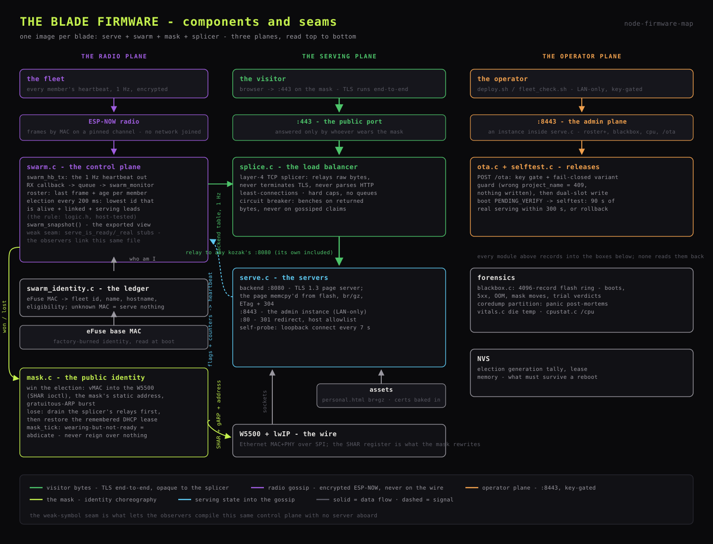

# Serving blade

Every blade (kozak) runs the same image: the page server, the swarm control
plane, the mask choreography and the splicer. This document covers the serving
side - the TLS servers, the embedded page, the admin plane and the
self-probe. The control plane is
[`23_node_swarm.md`](23_node_swarm.md); the umbrella is
[`20_firmware.md`](20_firmware.md).

## Listeners

`serve.c` starts three servers on every blade; the splicer
([`23_node_swarm.md`](23_node_swarm.md), splicer) owns the fourth port on
whichever blade wears the mask.

| Port | Reachability | What answers |
|---|---|---|
| backend port (default 8080, `CONFIG_BOHUN_PUBLIC_PORT`) | LAN only, never forwarded | this blade's TLS 1.3 page server - the splicer's relay target |
| 443 | forwarded to the mask | the leader's splicer; TLS terminates on a kozak's backend port, never here |
| 8443 | LAN only, never forwarded | the admin plane, over TLS |
| 80 | forwarded to the mask | 301 to https with a host allowlist; nothing else served |

`CONFIG_BOHUN_BACKEND_PORT` (what the splicer dials) must match
`CONFIG_BOHUN_PUBLIC_PORT` (what the server binds) across the fleet.

## Assets served

One self-contained `assets/personal.html`, embedded in the image at build time
(CMake `EMBED_FILES`) in both brotli and gzip form. Serving it is a memcpy
from flash:

- **Content negotiation** on `Accept-Encoding`; a truncated or absent header
  falls back to gzip, which every client accepts.
- **Memoized ETags** and 304s; short max-age with revalidation, because the
  page changes only on a release.
- `/favicon.ico` in br/gz/identity with a one-week cache; `/og.png`,
  `/llms.txt` and `/robots.txt` static and hard-cached. `robots.txt` asks
  crawlers to leave `/roster` alone.

`GET /` stamps two headers the tooling depends on:

- `X-Bohun-Build` - compile date plus a prefix of the app descriptor's
  ELF SHA. The SHA is computed at link time over the whole image, so it moves
  when anything does; a `__DATE__`/`__TIME__` stamp only moves when the file
  that prints it recompiles, which can call an updated image unchanged.
- `X-Bohun-Page` - a size-and-CRC tag over **both** embedded encodings,
  so a refresh of one encoding cannot read as an unchanged page while clients
  of the other are served stale content.

`tools/deploy.sh` and `tools/fleet_check.sh` read both from each blade's own
backend port - the public port answers from whichever backend the splicer
picked, so it cannot identify a blade.

## Endpoint inventory

| Port | Path | Notes |
|---|---|---|
| backend | `GET /` | the page, br or gz, ETag + 304, build/page stamps |
| | `GET /favicon.ico` | br / gz / identity, 1-week cache |
| | `GET /roster` | live fleet JSON - **no addresses, ever**; cross-origin refused; `no-store` |
| | `GET /og.png`, `/llms.txt`, `/robots.txt` | static, hard-cached |
| 8443 | `POST /ota` | key-gated, fail-closed variant guard, trial on the far side ([`26_ota_deployments.md`](26_ota_deployments.md)) |
| | `GET /roster` | the public view **plus** each node's address, boot cause, heap floors, die temperature, `on_trial` |
| | `POST /reset` | key-gated: zeroes every counter, including the NVS-persisted election tally |
| | `POST /standby?s=NN` | key-gated failover drill: report not-ready for NN seconds (capped at 300), which moves the mask if this blade holds it |
| | `GET /blackbox` | the flight recorder, newest first |
| | `GET /coredump` | raw panic core, for `espcoredump.py` |
| | `GET /cpu` | per-core idle, per-task CPU share and stack headroom |
| 80 | `*` | 301 to https; host allowlist and private-literal echo only |

## TLS server

- **TLS 1.3 only.** An mbedTLS quirk makes 1.2 impossible to compile out
  (`MBEDTLS_TLS_ENABLED` force-selects it), so it is starved instead: the
  only compiled 1.2 key exchange demands an RSA server certificate, and the
  server carries only an EC one, so every 1.2 handshake fails.
- **Certificate**: Let's Encrypt (DNS-01), EC P-256, baked into the image;
  renewal is a redeploy.
- **Session tickets on** - a resumed handshake skips the expensive P-256
  exchange, and returning visitors (and every roster poll) benefit. Both
  halves are required: `session_tickets` in the server config **and**
  `CONFIG_ESP_TLS_SERVER_SESSION_TICKETS`. Without the Kconfig half,
  `httpd_ssl_start` fails outright and the blade serves nothing.
- **Pinned to core 1.** WiFi, lwIP, the event loop and the system tasks live
  on core 0; unpinned, the server task lands beside them and fights for the
  core while the other sits idle. The pin does not make serving parallel -
  `esp_http_server` is one task by design.
- **CPU at 240 MHz, octal PSRAM on** (`boards/lilygo.defaults`). The TLS
  handshake is pure CPU - the ESP32-S3 has no ECC accelerator, so P-256 runs
  in software and scales with the clock; SHA/AES/MPI acceleration does not
  help ECDHE. PSRAM lifts the heap floor from tens of KB to megabytes and
  pays for 8 open sockets.
- **`TCP_NODELAY` set before the handshake.** Sender-side Nagle against an
  lwIP peer's 250 ms delayed ACK quantizes every spliced flight; mandatory
  behind the splicer, harmless for direct LAN visitors.
- **Timeouts**: handshake 10 s (behind the splicer a queued handshake spends
  wall clock at near-zero CPU, and killing it mid-flight wastes both the
  visitor and the splice slot; the squat defence lives in the splicer, and
  this port is LAN-only), recv/send 5 s, LRU purge on,
  keep-alive `timeout=5, max=20`. Keep-alive is the big lever: a handshake
  dwarfs serving, so connection reuse multiplies throughput.
- **The admin server** runs 2 sockets and `ctrl_port` offset +2; the port-80
  redirect takes +3. Every httpd instance needs its own control socket - the
  SSL default is already +1, and a collision silently kills the second server
  while everything else looks healthy. The redirect server is capped at 2
  sockets because a redirect is one-shot, and a bigger cap just drains the
  shared lwIP socket pool under scanner traffic.

## Self-probe

Every 7 s the blade makes a non-blocking loopback TCP connect to its own
backend port, with a hard deadline so the probe cannot hang.

- **Two consecutive failures**: the blade reports itself not-serving, leaves
  the election, and every splicer benches it within about 2 s.
- **Six failures** (about 42 s of a dead server): a deliberate `abort()`, so
  the coredump names the task the server was stuck in, then reboot.
- Any success clears the count.

`POST /standby` drives the same not-ready path on demand - the standard way
to rehearse a failover without pulling a plug. The probe is one half of the
self-healing pair; the splicer's circuit breaker
([`23_node_swarm.md`](23_node_swarm.md), splicer) judges the same blade
from the outside, by the bytes that actually come back, because a
self-reported flag can lie.

## Roster

`GET /roster` on the backend port is the site's live fleet table: roles,
status in plain words, served counts, refusal tallies, availability, link
state, die temperature, firmware versions, the balancer's ledger and fleet
latency percentiles. It never carries addresses, MACs or internal ports, and
cross-origin reads are refused. The admin variant on 8443 is the same view
plus each node's address, boot cause, heap floors and trial state - the swarm
already gossips these, so tooling reads them from any one blade instead of
sweeping the subnet.
