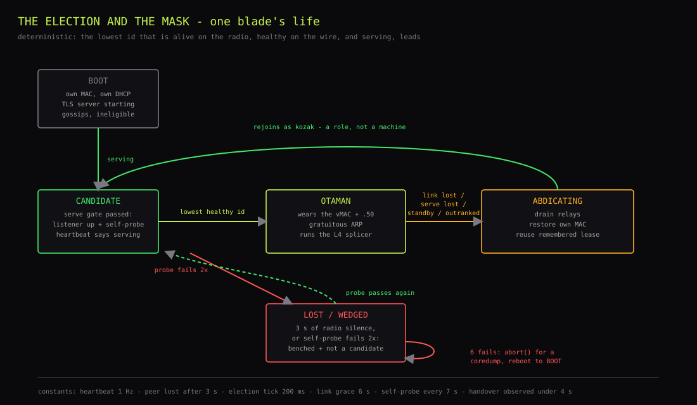
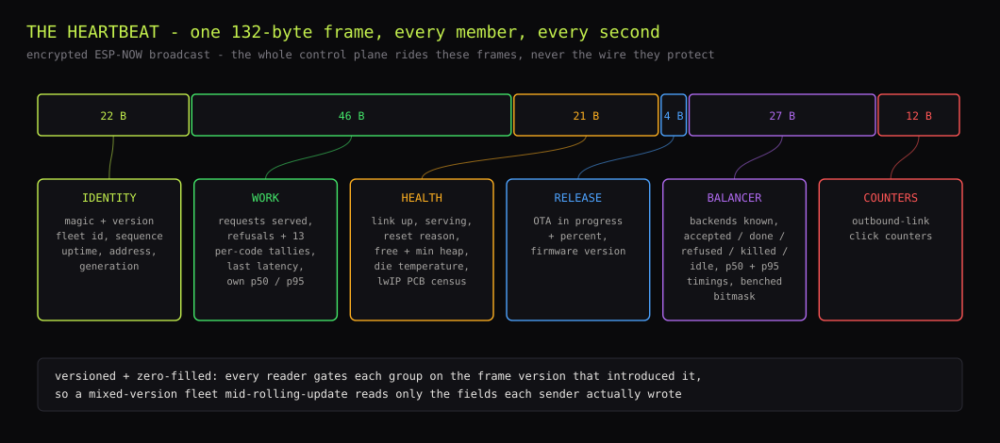
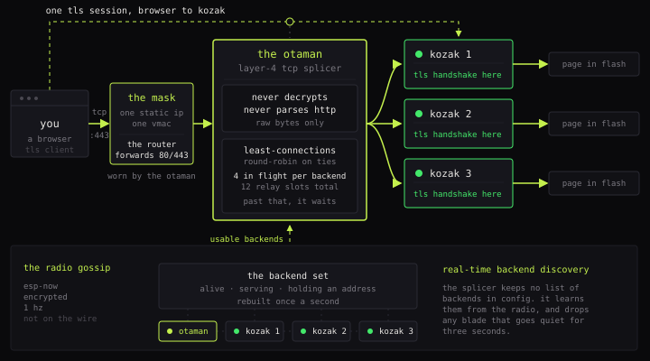
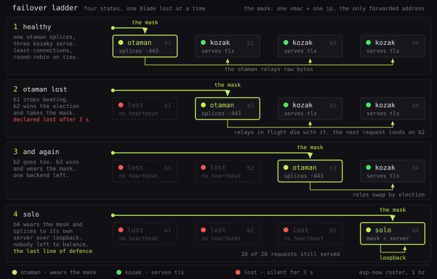
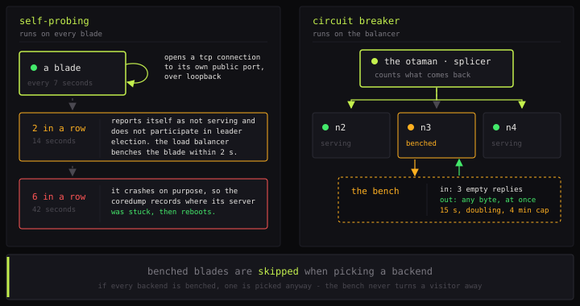

# Swarm control plane

Four blades behave as one immortal server: they gossip over encrypted radio,
elect an otaman, and the winner wears the mask and splices the public port
across the others. The architecture is
[`../SYSTEM_DESIGN.md`](../SYSTEM_DESIGN.md); this document is the
implementation - the identity ledger, the heartbeat, the election, the mask
choreography and the splicer, as they exist in
`firmware/eth/main/{swarm,swarm_identity,mask,splice}.c`.

## Identity ledger

`swarm_identity.c` is the fleet's single roster of record: eFuse base MAC to
fleet id, name, shortname, DHCP hostname, eligibility and (for witnesses) the
role word. Identity comes from silicon, so there is **one binary per board
type** and the build never knows which physical board it is for. A board whose
MAC is not in the ledger boots, says so on the console, and serves nothing.

The blades are eligible; the observers are witnesses with `eligible=false` -
they hear everything and can win nothing. The ledger also feeds the ESP-NOW
peer table: heartbeats are unicast to ledgered peers only, encrypted per
peer, and the fleet size sits comfortably under ESP-NOW's encrypted-peer
ceiling.

Role words are computed, never configured: the current leader is the
**otaman**, every other eligible blade a **kozak**, and each witness carries
its ledger role (**pysar**, **kobzar**).

## Radio

The control plane is ESP-NOW: encrypted 250-byte frames exchanged by MAC
address on a pinned channel, with no network joined and no wire involved.
PMK/LMK come from the generated `secrets.h`, so a neighbour cannot vote in
the election. The election that decides who owns the wire never rides the
wire it protects - a switch or cable failure cannot split the brain.

Per the concurrency rules in [`20_firmware.md`](20_firmware.md), the
ESP-NOW RX callback only enqueues frames; `swarm_monitor` consumes the queue,
keeps the roster, and runs the election and the mask tick every 200 ms.
`swarm_hb_tx` sends the heartbeat once per second.

## Heartbeat

One packed frame, **132 bytes**, sent at 1 Hz by every member. The frame is
versioned and zero-filled: receivers gate each field group on the version
that introduced it, so a mixed-version fleet mid-rolling-update reads only
what the sender actually said. A `_Static_assert` pins the wire size -
growing a mid-frame array shifts every field after it while the version says
otherwise, so the layout is a compile-time contract: change it, bump the
version and the RX gates together.

| Group | Fields |
|---|---|
| Identity | magic, version, fleet id, sequence, uptime, current address |
| Work | requests served, refusals (split ours/theirs), per-code error tallies, last latency, own p50/p95 |
| Health | link up, serving, reset reason, free + minimum heap, die temperature (a sentinel means unknown - never a plausible zero), lwIP PCB census (active / TIME_WAIT / bound / **listening** - zero listeners means every port is dead) |
| Release | OTA-in-progress flag + percent, firmware version (the variant's `version.txt`; 0 renders as "-") |
| Balancer | the splicer's ledger: backends known and routable, accepted / done / refused / killed / idle-reaped, p50 connect / first-byte / total, p95, benched bitmask |
| Counters | the page's outbound-link click counters |

The `serving` bit is deliberately strict:
`serve_is_ready() && serve_is_real() && mask_has_ip()`. Peers elect on this
bit, so a build with no server must never set it, and a blade between the
mask and a fresh lease has no address - nothing can reach it, so advertising
`serving=1` would put an unreachable blade in the backend pool.

Two side products of the TX loop:

- **The tcpip-thread watchdog.** The PCB census runs on lwIP's tcpip thread;
  if its beat freezes for ~12 s while the link is up and boot has settled,
  the thread is hung and no connection will ever be accepted again - the node
  records the fact and calls `abort()`, because a panic writes every stack
  (including the frozen one) to the coredump partition, and `esp_restart()`
  would record nothing.
- **The radio tail**: a ring of every heartbeat heard - timestamp, sender,
  RSSI, sequence gap - covering the last ~45 s of the fleet's gossip, kept
  for the kobzar's THE RADIO tile.

Consumers: the election, the public `/roster` JSON (which never carries
addresses - the admin variant adds them), and both observers.

## Election

Deterministic arithmetic, no consensus protocol: **the lowest fleet id that
is alive on the radio, healthy on the wire, and actually serving leads.**
Every node computes the same answer from the same heartbeats, so there is
nothing to wedge and nothing to time out.

| Parameter | Value |
|---|---|
| Heartbeat period | 1 s |
| Peer declared lost | 3 s of silence |
| Election tick | 200 ms |
| Peer gate | alive, `link_up`, `serving` from its heartbeat |
| Self gate | eligible, `serve_is_real()`, link not lost, `serve_is_ready()` |
| Link grace | 6 s down before a blade is ineligible (a relink takes 1-3 s; 6 s is not a bounce) |

`serve_is_real()` sits in the self gate because a firmware that lacks a
server would otherwise boot, see no link loss (its link was never up),
self-nominate, and claim a mask it cannot honour - the weak-false stub makes
that structurally impossible. A blade that is alive but cannot serve
(booting, probe-failing, on standby) is simply not a candidate.

A **generation counter** increments on every change of reign, is persisted in
NVS, travels in the heartbeat, and feeds the observers' churn and
failover-age views; the kobzar keeps reign records. During a rolling update,
receivers treat a pre-link-field sender as `link_up` rather than letting the
zero-fill mark half the fleet ineligible mid-flight.

## Mask

The public identity is a locally administered virtual MAC that no factory
ever issued, paired with a reserved LAN address that sits outside the DHCP
pool. Both are deployment configuration, defined in exactly one place each -
changing either means one edit.

**Winning:** the new otaman writes the vMAC into its own W5500 (an
`esp_eth_ioctl` SHAR rewrite - the register-level seam the toolchain was
chosen for), applies the mask's static address, and announces with a
gratuitous ARP burst so the switch relearns the port. The visitor sees the
same MAC, same address, same certificate - different silicon.

**Losing** is the mirror image, and two hardenings make it invisible:

- **Drain first.** `splice_drain()` closes every in-flight relay pair
  cleanly before the interface drops - they would otherwise die as resets.
- **Lease memory.** Follower identity uses DHCP, and a blade remembers the
  lease it held before taking the mask. On abdication it re-applies that
  lease immediately instead of waiting out a fresh DISCOVER round (the DHCP
  client zeroes the address before asking), so an ex-otaman is reachable -
  and back in the backend pool - the moment it steps down. Discovery is
  retried until a lease lands; an address-less blade never claims to serve.

**Abdication paths**, all converging on the same choreography:

- a lower id comes back healthy (the election is preemptive);
- the link dies under the leader (after the 6 s grace - the election must
  see link loss, or a dead leader keeps the mask);
- `mask_tick` catches the leader wearing the mask while not ready to serve -
  wearing while not ready means drain, abdicate, re-elect, rather than
  reigning over nothing;
- an operator posts `/standby` (the failover drill).

## Splicer

The otaman does not serve pages. `splice.c` is a **layer-4 TCP splicer**: it
accepts on the public port and relays raw bytes to a kozak's LAN-only backend
port. It never terminates TLS and never parses a byte it moves - the
encrypted session runs from the browser straight past it to the blade that
answers.

Its rules:

- **Least connections, round-robin on ties.**
- **Hard caps instead of queues**: 12 relay pairs total, 4 in flight per
  backend, listen backlog 8. Past the cap it stops accepting and SYNs park
  in the backlog; idle pairs are reaped after 30 s.
- **The backend table is rebuilt every second** from the gossip roster -
  alive, serving, holding an address. No configuration file names a backend.
- **The circuit breaker judges by measured outcomes only.** The heartbeat's
  `serving` flag is a claim, and a wedged blade can gossip `serving=1` for
  hours - so the splicer benches on the bytes that actually come back. Three
  connections that accept and return nothing bench a backend for 15 s,
  doubling per repeat up to 240 s; a backend with bench history re-benches
  after a single failure; any byte returned clears it completely.
- **The bench shapes backend choice and never refuses a visitor.** If every
  backend is benched, one is picked anyway.
- **Bench state is keyed by node id**, never by table slot - the table is
  rebuilt every second in unstable order, and per-slot state would evaporate
  or be inherited by the wrong blade.
- **Solo is the last rung.** With no other backend alive, the otaman splices
  to its own server over loopback. The degradation ladder is N backends,
  then fewer, then one, then solo.

The splicer's ledger - counts, phase medians (accept to backend-connect,
accept to first byte, accept to close) and the benched bitmask - is gossiped
in the heartbeat and rendered by the page and both observers. The total time
is a **connection lifetime**, not a response time: a keep-alive browser holds
one connection across the page, its favicon and every roster poll, and an L4
splicer cannot see request boundaries.

A deliberate stand-down drains relays gracefully, so a handover kills
nothing. A power-pull takes its in-flight relays with it, and the next
request lands on the new otaman.

The breaker is one half of the self-healing pair; the other half is each
blade's own loopback self-probe
([`22_node_serving.md`](22_node_serving.md), self-probe). One judges
from outside by returned bytes, one from inside by connecting to itself, and
neither trusts the other's opinion.
