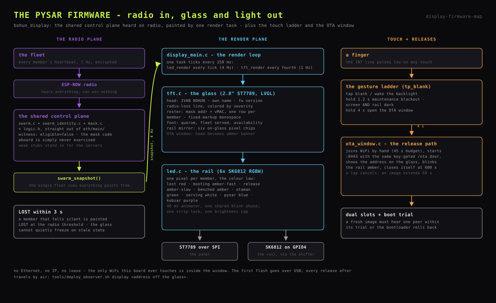

# Pysar display firmware

The scribe: an ESP32-S3 DevKitC N16R8 driving a 2.8" ST7789 TFT (240x320,
SPI) and the six-pixel SK6812 LED rail. It joins the ESP-NOW control plane as
a **witness** - `eligible=false` - hears every heartbeat, and paints the
fleet on glass and light. It has no Ethernet, no IP and no lease; the only
time it touches WiFi is inside the OTA window
([`26_ota_deployments.md`](26_ota_deployments.md)).

Firmware lives in `firmware/display/main/` - `display_main.c` (boot + render
loop), `tft.c` (panel + LVGL UI), `led.c` (the rail) - and compiles the swarm
control plane straight out of `eth/main/`
([`20_firmware.md`](20_firmware.md), shared source layout). Being ineligible, it can never win
the election, so the mask code it carries is simply never exercised.

Panel pins: SCLK 12, MOSI 11, CS 10, DC 9, RST 8, backlight 7; touch INT 42,
RST 41. Wiring truth:
[`../1_hardware/13_data_connectivity.md`](../1_hardware/13_data_connectivity.md).



## Render loop

Per the concurrency rules, the ESP-NOW RX callback only enqueues; one render
task owns all the glass. It ticks every 250 ms:

- **`led_render` every tick (4 Hz).** Booting lasts under a second and a
  rebooting blade is "lost" for only a second or two - at 1 Hz those states
  land between samples and never appear. Sampling faster shows what is
  actually there; latching would overstate how long it lasted.
- **`tft_render` every fourth tick (1 Hz).** Redrawing LVGL labels four
  times a second costs real work to say the same thing.

Both consume the same `swarm_snapshot()` - the single fleet view the control
plane exports. A member that falls silent is painted LOST within the 3 s
radio threshold, so the glass cannot quietly freeze on stale state.

## Glass

The screen is a stack of monospace recolor labels, sized so the identity and
totals read big and only the dense table is small:

- **Head** (16 px): IVAN BOHUN, the pysar's own name, and this image's
  firmware version - every glass names the exact image it runs.
- **Radio-loss line** (8 px): the pysar's own heartbeat loss percentage,
  colored by severity.
- **The roster** (8 px): the mask's address and vMAC, then one row per
  member - name (leader in lime with a LEAD marker), role, RSSI bars,
  served count, uptime - sorted by id, clamped to the line budget. Wrapping
  is disabled: rows are fixed-markup so the monospace columns stay aligned,
  and a wrapped line breaks LVGL's recolor parser.
- **Foot** (16 px): quorum, fleet served count (k-form to fit the 14-char
  line), average RSSI, and fleet availability colored green / amber / red.
- **The rail mirror**: a status line (DARK / BLACKOUT / DMA mode) plus six
  on-glass chips with member initials, live copies of the six physical
  pixels - the rail can be read even from the side the LEDs do not face.
- **The booting boot**: an amber boot-shaped glyph, bottom-right, hidden
  unless some member is mid-boot.

During an OTA window the head is replaced by an amber `OTA WINDOW` banner
carrying state, address, seconds left and receive percentage.

## LED rail

`led.c` drives 6 SK6812 RGBW pixels, one per member: px0..px3 are N1..N4,
px4 the pysar itself (a lit rail is the pysar's own proof of life), px5 the
kobzar. Hardware - level shifter, resistor, the uncut strip - is
[`../1_hardware/14_led_rail.md`](../1_hardware/14_led_rail.md).

**The colour law** (matching the roster words on the site):

| State | Pixel |
|---|---|
| lost | red, solid |
| booting | amber, fast blink |
| release (OTA landing) | amber, slow blink |
| benched (the balancer skips it) | amber, solid |
| balancing (the otaman) | deep green |
| serving | faint white |
| pysar | deepest blue |
| kobzar | deepest purple |
| OTA window | amber slow blink across the rail |

Every pixel is scaled under **one global brightness cap** - the rail is a
status lamp, and full-brightness pixels read as glare off the rack. The power
budget is enforced in this one place.

Mechanics worth knowing:

- SK6812 RGBW is 32 bits per pixel (GRBW), so the white channel is folded
  into the mirror colours but driven natively on the strip.
- A 40 ms animation task does the winking; fast and slow blink share one
  phase so all blinking pixels wink together and read as one deliberate
  signal. The strip is refreshed only when something changed.
- Two tasks paint the rail (the 4 Hz render and the animator), so every
  painter takes one strip lock - an interleave would push a half-written
  frame, and concurrent RMT transmits on one channel are not a documented
  pattern.
- A member whose uptime runs backwards has rebooted; the rail treats that as
  a fresh boot rather than continuity.

## Touch

The touch controller runs autonomously after reset release and pulses its INT
line low on any finger - enough for the whole gesture ladder without knowing
which controller IC is fitted. The ladder, by hold length:

| Gesture | Action |
|---|---|
| tap | toggle the backlight (blank / wake) |
| hold 1.2 s | maintenance blackout: screen **and** rail dark, for working on the rack in the dark |
| hold 4 s | open the OTA window ([`26_ota_deployments.md`](26_ota_deployments.md)); the rail turns amber at the threshold as the let-go cue |

A tap during an open window cancels it.

## Building and flashing

```
cd firmware/display
idf.py build          # single board - the root sdkconfig is the config
```

The first flash and any partition-table change go over USB. After that,
releases travel through the OTA window:

```
tools/deploy_observer.sh display <address off the glass>
```

Dual OTA slots and the peer-hearing boot trial are the rollback contract -
[`26_ota_deployments.md`](26_ota_deployments.md). A version bump follows the
fleet rule: edit `version.txt`, `idf.py reconfigure`, then build
([`20_firmware.md`](20_firmware.md), variants).
