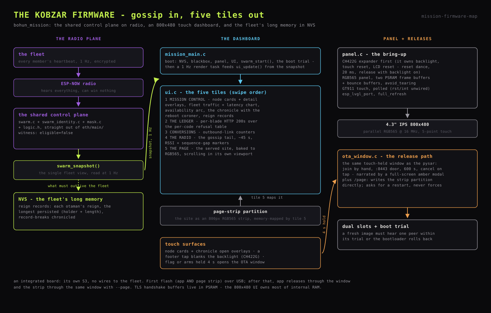

# Kobzar mission-control firmware

The bard: a Waveshare ESP32-S3-Touch-LCD-4.3B - an integrated board with its
own S3, an 800x480 touch panel and no wires to the fleet. It joins the
ESP-NOW control plane as the second **witness** (`eligible=false`) and turns
the gossip into a five-tile touch dashboard. Like the pysar, it compiles the
swarm control plane straight out of `eth/main/` and can never win the
election ([`20_firmware.md`](20_firmware.md), shared source layout). It rides behind THE FACE in
the rack ([`../1_hardware/16_rack.md`](../1_hardware/16_rack.md)).



## Hardware facts (vendor-sourced)

Transcribed from Waveshare's own repository for the board (the IO-test and
LVGL-porting examples carry the pin tables); the wiki confirms the module.

| Fact | Value |
|---|---|
| Module | ESP32-S3-WROOM-1-N16R8 (16 MB flash, 8 MB octal PSRAM) |
| Panel | 4.3" IPS 800x480, parallel RGB565, 5-point capacitive touch |
| RGB sync | HSYNC=46 VSYNC=3 DE=5 PCLK=7 @ 16 MHz, `pclk_active_neg` |
| RGB data | B3..B7 = 14,38,18,17,10 · G2..G7 = 39,0,45,48,47,21 · R3..R7 = 1,2,42,41,40 |
| Timings 800x480 | h: bp 8 / fp 8 / pw 4 · v: bp 16 / fp 16 / pw 4 |
| I2C | SDA=8 SCL=9 @ 400 kHz (touch and expander share the bus) |
| Touch | GT911 (registry `espressif/esp_lcd_touch_gt911`); INT/RST are not on S3 GPIOs |
| Expander | CH422G, address-as-register: 0x24=mode, 0x38=IO out; IO1=touch reset, IO2=**backlight**, IO3=LCD reset |
| Extras (unused) | CAN, RS485, isolated DI/DO, TF slot, PCF85063 RTC, battery boost |

Notes: G3=GPIO0 and G4=GPIO45 are strapping pins doing data duty (vendor
design, fine after boot). The backlight has no S3 GPIO - the CH422G owns it,
so bring-up order is expander first, then panel.

## Firmware layout (`firmware/mission/`)

- **`panel.c`** - the CH422G reset dance (assert all-low, 20 ms, release
  with backlight on), then the RGB panel with two PSRAM frame buffers plus
  bounce buffers, then GT911 (polled, rst/int unwired), then
  `esp_lvgl_port`'s RGB flavour with `bb_mode + avoid_tearing +
  full_refresh`. Uses the current `i2c_master` API throughout (the legacy
  I2C driver is deprecated; vendor demo code still uses it and is not
  copied) and `in_color_format = LCD_COLOR_FMT_RGB565`.
- **`ui.c`** - the five tiles (next section).
- **`mission_main.c`** - NVS, blackbox, vitals, netif, event loop, panel,
  UI, `swarm_start()`, the OTA boot trial, then a 1 Hz render task that
  feeds `ui_update()` from `swarm_snapshot()`.
- sdkconfig: 16 MB flash, octal PSRAM at 80 MHz, CPU 240 MHz, Montserrat
  fonts. Partitions: dual OTA slots, the dedicated page-strip partition, and
  coredump + blackbox ([`26_ota_deployments.md`](26_ota_deployments.md)).

Build and flash:

```
cd firmware/mission
idf.py build                      # single board - root sdkconfig
idf.py -p /dev/cu.usbmodemXXXX flash monitor    # first flash: app AND page strip, over USB
```

After the first USB flash, app releases travel through the OTA window
(`tools/deploy_observer.sh mission <ip>`), and the page strip through the
same window with `--page`. A version bump follows the fleet rule
([`20_firmware.md`](20_firmware.md), variants).

First-light triage, should the panel misbehave: colours inverted or shifted
mean the data-pin order; dead touch means the GT911 is at its backup address
0x14 (the component probes 0x5D first); tearing means a taller bounce buffer.

## Five tiles (swipe order)

1. **Mission control.** Header: IVAN BOHUN, the mask's address, the current
   otaman, and an amber release chip whenever an OTA is flowing anywhere in
   the fleet. Left: up to eight tappable node cards - status dot, name,
   role, RSSI bar (which moonlights as an amber progress bar while that node
   receives an OTA), served share, uptime. Tapping a card opens a detail
   overlay: address, sequence-derived stats, generation, request count and
   latency, with 60 s RSSI and latency sparklines. Right: a 60-point
   fleet-wide traffic and latency chart derived from heartbeat deltas,
   quorum, generation, stable-age, an availability arc, die temperature -
   and **the chronicle**: uppercase event lines with the **reboot coroner**
   (when a member returns, the line names its reset cause and how long it
   had lived), the kobzar's own boots with their cause, and heap warnings by
   tier. The card shows the latest lines; a tap opens the full-history
   modal. **Reign records** live here too: the kobzar tracks each otaman's
   reign, persists the longest (holder and length) in NVS, and chronicles
   record-breaks. Reigns are measured from first sighting, so a reign
   already running when the kobzar boots is undercounted.
2. **THE LEDGER.** One column per serving blade: its HTTP 200 count above a
   row-per-error-code refusal table (the heartbeat's per-code tallies drop
   straight in; the name table is `_Static_assert`-pinned to the error-kind
   count), with the fleet 200-OK total in the corner.
3. **CONVERSIONS.** Counters for the page's outbound links, per blade and
   fleet-wide.
4. **THE RADIO.** The gossip tail: every heartbeat heard in the last ~45 s,
   newest first, with sender, RSSI and sequence-gap markers - the radio's
   own health, visible.
5. **The served page.** The site itself, baked to RGB565 and memory-mapped
   from the page partition, vertically scrollable. The tall image lives in
   its own inner viewport: the viewport owns vertical scrolling while the
   tileview keeps horizontal swipes, and scroll chaining is off so a drag on
   the page never leaks into tile navigation (parenting a ~7500 px image
   straight to the tile would make the tileview itself that tall, and the
   two scrolls fight).

## Baking the page strip

`render_page_asset.py` renders `assets/personal.html` with headless Chrome at
a 1280 px CSS viewport scaled by 0.625 - a desktop reflow, emitted exactly
800 px wide - decodes the PNG in pure Python, trims the empty tail, and
writes `main/page_strip.bin` (little-endian RGB565) plus `page_strip.h` (the
height constant). The height is capped so the strip always fits the page
partition; the desktop viewport exists because a narrow mobile reflow makes
the strip taller than the partition allows.

The strip deliberately lives in a **dedicated data partition**, outside the
app image: embedded in rodata it would ride along on every app OTA and, with
`SPIRAM_RODATA`, drag megabytes into PSRAM that the frame buffers need.
`idf.py flash` writes it over USB; over the air it goes through the window:

```
tools/deploy_observer.sh mission <ip> --page
```

`/page` writes the partition directly and asks for a restart instead of
rebooting by itself - an interrupted strip write is re-pushed, and the strip
can never brick a boot. Regenerate and re-push after any change to the served
page. (`render_arms_asset.py` likewise bakes the small coat-of-arms bitmap
that rides in rodata.)

## Touch

- **The flag and the arms** in the header are the OTA hold surfaces: a full
  4 s press on either opens the window
  ([`26_ota_deployments.md`](26_ota_deployments.md)). Neither has a tap
  action, so the release that ends the hold lands on nothing. A full-screen
  amber-bordered modal narrates the window (joining, open with address,
  receive percentage, failure); tapping the modal cancels it.
- **A footer tap blanks the glass** - the backlight is cut through CH422G
  IO2 (on/off only; the expander cannot PWM), resets stay high and touch
  stays live, so any touch wakes it.
- Node cards and the chronicle card open their overlays (five tiles); tapping an
  overlay closes it.
