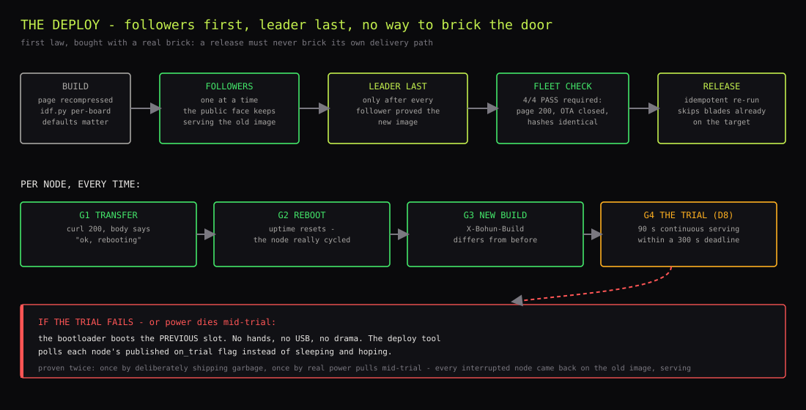
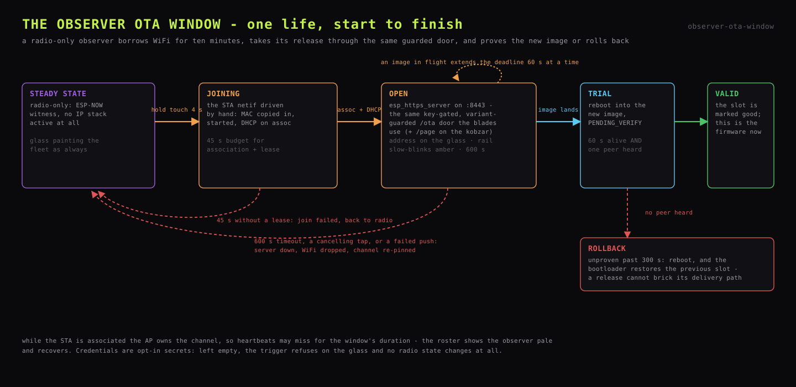

# OTA and deployments

How a release reaches the fleet. Every image lands through the same key-gated,
variant-guarded `/ota` door; the blades roll fleet-wide through gates, the
observers through a touch-held window; every fresh image must prove itself or
the bootloader rolls it back. A release must never brick its own delivery
path.

## Update door

`POST /ota` on port 8443, which is LAN-only because the router never forwards
it. Two gates guard it:

- **The key.** `X-Bohun-Key`, minted by `gen_secrets.sh`, checked on
  every administrative POST.
- **The variant guard, fail-closed.** The incoming image's `esp_app_desc_t`
  is parsed from the stream **before** `esp_ota_begin`, and anything whose
  `project_name` is not this variant is refused with 409 - nothing is
  written. A guard that cannot verify must refuse: an unreadable descriptor
  is a refusal, never consent.

All app slots are dual, and a fresh image boots `PENDING_VERIFY` - it earns
permanence through a serving trial on the blades (blade deploys, gate 4) or a
peer-hearing trial on the observers (observer OTA window).

## Blade deploys

`tools/deploy.sh` discovers the fleet from any blade's admin roster, computes
the pushed image's identity (the ELF SHA from the app descriptor - a
link-time hash that changes when anything does, unlike a compile-date stamp),
and rolls **followers first, leader last**, so the public face keeps serving
the old image until every other blade has proven the new one. Per node, in
order:

- **gate 0** - wait out any trial still running (`esp_ota_begin` refuses
  while the running image is `PENDING_VERIFY`); skip nodes already on the
  target SHA, so the script is idempotent;
- **gate 1, transfer** - HTTP 200 and a body that says `ok, rebooting`;
- **gate 2, reboot** - the node's own uptime comes back lower;
- **gate 3, new build** - the `X-Bohun-Build` stamp changes to the pushed
  SHA, read from the blade's **own backend port** (asking the public port
  answers from whichever backend the splicer picked);
- **gate 4, the trial** - the fresh image must survive **90 s of continuous
  serving within a 300 s deadline** or the bootloader rolls back to the
  previous slot. The script polls the node's published `on_trial` flag rather
  than sleeping and hoping.

Any failure aborts the roll, leaving the leader on the last good image.

## Page releases

The page travels inside the firmware image, so a page change is a release
like any other, with one extra staleness trap: editing `assets/personal.html`
without regenerating the compressed blobs leaves the fleet serving the old
bytes while the source says otherwise. The guards:

- Blobs are generated deterministically (`gzip -9 -n`; without `-n` gzip
  stamps the mtime into the header and the content tag changes on a bare
  `touch`).
- `fleet_check.sh` fails if the source is newer than the blob, or if the
  served `X-Bohun-Page` tag differs from the local blob's.



The sequence, every time the page changes:

```
gzip -9 -n -c assets/personal.html > firmware/eth/main/personal.html.gz
brotli -f -q 11 assets/personal.html -o firmware/eth/main/personal.html.br
cd firmware/eth && idf.py -B build.lilygo -D SDKCONFIG=build.lilygo/sdkconfig build
tools/deploy.sh        # followers first, leader last; ends with fleet_check
```

## Observer OTA window

The two observers cannot use the blade path as-is: they are radio-only by
design - ESP-NOW witnesses with no Ethernet and no standing WiFi - and both
are bonded to the rack's faceplate, where their USB ports are the hardest to
reach in the whole chassis. The OTA window gives them the same air path
without giving them a standing network.

**The options weighed:**

| | Shape | Why not |
|---|---|---|
| A | Observers join home WiFi permanently | Couples the swarm channel to the router's whim; a channel change strands the fleet's radio. A standing attack surface on always-on firmware |
| B | Chunked images over ESP-NOW via a blade | Thousands of frames per app image at heartbeat discipline; a protocol, a resend layer and a flash-staging area invented for two devices |
| **C** | **On-demand window: touch opens WiFi + the same `/ota` door, auto-expires** | **chosen** |

C reuses everything that already exists: `ota.c`'s handler (with its exact
`project_name` guard, so a display image can never land on a blade or vice
versa), the fleet's cert pair, the OTA key, and the same dual-slot
trial-or-rollback shape the blades obey. The new code is one file.




**The trigger is touch-only and deliberately slow.** Four full seconds of
finger - far past any accidental brush, past a tap (blank), and past the
pysar's 1.2 s blackout hold. On the kobzar it is the flag and the arms in
the header; on the pysar, anywhere on the glass.

**You cannot miss that it fired.** The pysar wakes its screen, replaces the
head with an amber `OTA WINDOW` banner (state, address, seconds left,
receive %), and turns the entire six-pixel LED rail into a slow amber blink -
visible across the room. The kobzar throws a full-screen amber-bordered
modal with the same story. A tap on either cancels the window.

**The window always closes.** 600 s and it tears down on its own - HTTPS
server stopped, WiFi disconnected, ESP-NOW channel re-pinned. An image in
flight extends the deadline 60 s at a time, so a slow transfer is never cut
mid-write. While the STA is associated the AP owns the channel, so
heartbeats may miss for the window's duration; the roster shows the observer
pale for a few minutes and recovers. That is the cost of not being coupled
to the router the rest of the year.

**The join is driven by hand.** The STA netif is created mid-life, so the
boot-time events its default lifecycle glue keys on have already fired and
never will again. The window does every step itself - copies the radio's MAC
into the netif, starts it, brings it up and starts DHCP on association,
tears it down on disconnect. Association plus DHCP get a 45 s budget before
the glass declares the join failed. On the kobzar, mbedTLS's handshake
buffers are placed in PSRAM (`CONFIG_MBEDTLS_EXTERNAL_MEM_ALLOC`): the
800x480 LVGL UI owns most of internal RAM, and a TLS session needs ~20 KB.

**Credentials are opt-in.** `BOHUN_WIFI_SSID`/`_PASS` live in the
gitignored `secrets.h`, hand-filled - `gen_secrets.sh` mints empty fields
and will not guess a network. Left empty, the trigger refuses with `no wifi
creds` on the glass and no radio state changes at all. The blades never read
these fields.

**Rollback is the same contract the blades obey.** Dual OTA slots +
`CONFIG_BOOTLOADER_APP_ROLLBACK_ENABLE`: a fresh image boots
`PENDING_VERIFY`, and `ota_window_boot_trial()` marks it valid only after
60 s alive *with at least one peer heard on the radio* - an observer that
boots deaf is a brick with a backlight, so hearing the swarm is the proof of
life. Unproven past 300 s, it reboots and the bootloader restores the
previous slot.

## Observer partition tables

Both observers run dual OTA slots:

| | pysar (display) | kobzar (mission) |
|---|---|---|
| ota_0 / ota_1 | 0x20000 / 0x320000, 3 MB each | 0x20000 / 0x210000, 1.94 MB each |
| page strip | - | 0x400000, 12.19 MB |
| coredump / blackbox | 0x620000 / 0x630000 | 0xFA0000 / 0xFB0000 |

Partition tables never travel over the air, so adopting or changing one
costs a USB flash per observer. That is also USB's only remaining job in the
update story.

## Pushing an observer release

```
hold 4 s -> read the address off the glass
tools/deploy_observer.sh display <ip>          # app -> pysar
tools/deploy_observer.sh mission <ip>          # app -> kobzar
tools/deploy_observer.sh mission <ip> --page   # page strip -> kobzar
```

No fleet gates - a window push touches one observer, and the boot trial is
the safety net. `/page` writes the kobzar's strip partition directly
(4 KB-aligned erase, chunked writes, progress on the glass) and asks for a
restart rather than rebooting by itself: an interrupted strip write is
re-pushed, and the strip can never brick a boot.

## Files

- `firmware/eth/main/ota.c` - the `/ota` door: key gate + variant guard;
  one handler for all three variants
- `firmware/eth/main/ota_window.{c,h}` - the observer window; compiled into
  both observer firmwares, never into the blades
- `firmware/eth/main/selftest.c` - the blades' post-OTA serving trial
- `swarm.c` - the window's accessors: own-update state, peers heard, channel
  re-pin
- `tools/deploy.sh` / `tools/deploy_observer.sh` - the push tools
