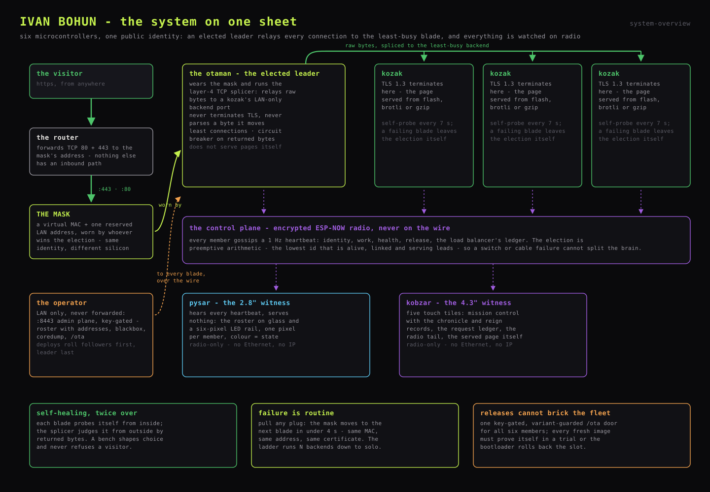
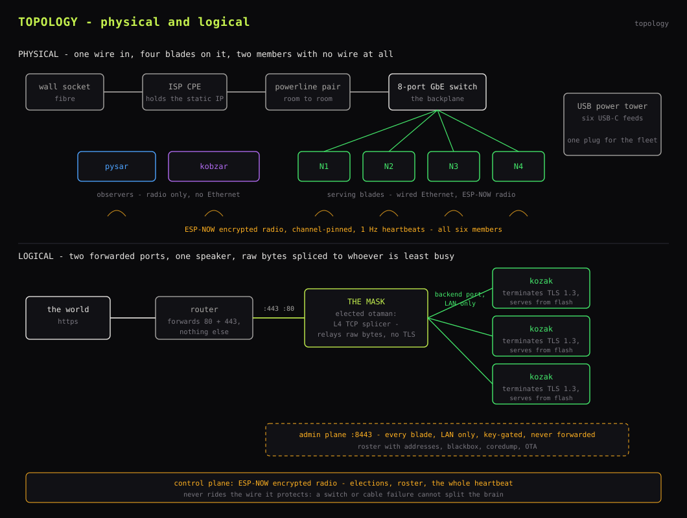

# IVAN BOHUN - Swarm Design

A personal website served from six ESP32-S3 microcontrollers on a shelf in a
London flat. Four **serving blades** hold an election over encrypted radio; the
winner wears **the mask** - a virtual MAC and the one LAN address the router
forwards - and becomes a **layer-4 TCP splicer**, relaying every public
connection to the least-busy of the other blades, which terminate TLS 1.3 and
serve the page from flash. Two **observers** watch the radio and paint the
fleet on glass. There is no cloud, no reverse-proxy box, no Pi. Load balancing
is an elected role that moves between blades, and every part of the serving
path can die without taking the site down.

## Map

| Folder | Concern | Start with |
|---|---|---|
| [`1_hardware/`](1_hardware/) | building the fleet: soldering, power, wiring, the LED rail, blade cases, the rack | `10_hardware.md` |
| [`2_firmware/`](2_firmware/) | the three firmwares: serving, the swarm, both observers, intake, OTA and deploys | `20_firmware.md` |

Each folder owns its own `diagrams/` with every image the docs embed.

## Fleet

| Member | Board | Role |
|---|---|---|
| N1..N4 | LILYGO T-ETH-Lite ESP32-S3 (W5500 wired Ethernet) | serving blade; one of them is elected leader |
| Display (pysar) | diymore ESP32-S3 DevKitC N16R8 + 2.8" ST7789 TFT + SK6812 rail | witness - paints the fleet on glass and light |
| Mission Control (kobzar) | Waveshare ESP32-S3-Touch-LCD-4.3B | witness - touch dashboard |

Identity lives in one ledger, `firmware/eth/main/swarm_identity.c`, keyed by
each board's factory eFuse MAC. A board not in the ledger boots, says so, and
serves nothing. Witnesses hear everything and can never be elected.

Naming is Ukrainian: the elected leader is the **otaman**, the serving blades
**kozaky**, the scribe screen the **pysar**, the bard screen the **kobzar**,
the printed cases **kuriny**.

## Topology, physical and logical

- **Wall socket -> the ISP's router**, which holds the static public IP.
- **Router -> powerline pair -> an 8-port GbE switch** - the swarm's backplane.
  The four blades jack in; the observers have no wire at all.
- **Two port-forwards and nothing else**: TCP/80 and TCP/443 to the mask's
  reserved LAN address, which sits outside the DHCP pool. The admin plane
  (8443) is never forwarded. There is no inbound path to anything but the
  mask.
- **The control plane stays off the wire**: ESP-NOW encrypted radio,
  channel-pinned, 1 Hz heartbeats. The election that decides who owns the wire
  never rides the wire it protects, so a switch or cable failure cannot split
  the brain.

## Mask

The public identity is a locally administered virtual MAC that no factory ever
issued, paired with the reserved LAN address. Both are deployment
configuration, defined in one place in the firmware.

The elected leader writes the virtual MAC into its own W5500 (SHAR register),
claims the address, and announces with a gratuitous ARP so the switch relearns
the port. Losing the mask is the mirror image: drain the in-flight relays,
restore the board's own MAC, rejoin as a kozak. The splicer itself never stops
- every blade runs one against the day it is elected; without the mask's
address it simply receives nothing. Two hardenings make the handover
invisible:

- **Lease memory**: a blade that abdicates re-uses its remembered DHCP lease
  immediately instead of waiting out a fresh DHCPDISCOVER, so an ex-leader is
  reachable on its own address the moment it steps down.
- **Immediate abdication on serve-loss**: a leader whose own server dies hands
  the mask over at the next tick rather than reigning over nothing
  (`mask_tick`: wearing while not ready means drain, abdicate, re-elect).

The visitor never learns that anything died: same MAC, same IP, same
certificate, different silicon.

## Election

The election is deterministic arithmetic: **the lowest fleet id that is alive
on the radio, healthy on the wire, and actually serving leads.** Every node
computes the same answer from the same heartbeats, so there is no consensus
protocol to wedge and nothing to time out.

| Parameter | Value |
|---|---|
| Heartbeat period | 1 s |
| Peer declared lost | 3 s of silence |
| Election tick | 200 ms |
| Serve gate | `serving` flag in the heartbeat (TLS listener up and self-probe passing) |
| Link grace | 6 s before a wire-down blade is ineligible |
| Handover | under 4 s from power-pull to first served byte |

A blade that is alive but cannot serve (booting, wedged, probe-failing) is
simply not a candidate. A generation counter tracks every change of reign; the
kobzar keeps reign records in NVS.

## Load balancer

The otaman does not serve pages. It runs `splice.c`: a **layer-4 TCP splicer**
that accepts on 443 and relays raw bytes to a kozak's LAN-only backend port.
It never terminates TLS and never parses HTTP - the encrypted session runs
from the browser straight past it to the blade that answers.

Its rules:

- **Least connections, with round-robin on ties.**
- **Hard caps instead of queues**: 12 relay pairs total, 4 in flight per
  backend, listen backlog 8. Past the cap it stops accepting and SYNs park in
  the backlog.
- **The backend set is rebuilt every second** from the gossip roster - alive,
  serving, holding an address. No configuration file names a backend.
- **The bench only shapes backend choice; it never refuses a visitor.** A
  backend that accepts and returns nothing three times running sits out 15 s,
  doubling to 240 s; one with a bench history re-benches after a single
  failure; any byte returned clears it completely. If every backend is
  benched, one is picked anyway.
- **Bench state is keyed by node id** rather than table slot, because the
  table is rebuilt every second in unstable order and benches must survive
  that.
- **Solo is the last rung.** With no other backend alive, the leader splices
  to its own server over loopback. The degradation ladder is N backends, then
  fewer, then one, then solo - the site keeps serving from a single blade.

A deliberate stand-down drains relays gracefully, so a handover kills nothing.
A power-pull takes its in-flight relays with it, and the next request lands on
the new leader.

## Self-healing

Two independent mechanisms, one per side of the relay:

- **Self-probe (every blade)**: a TCP connect to its own public port over
  loopback every 7 s. Two consecutive failures: the blade reports itself
  not-serving, leaves the election, and every splicer benches it within ~2 s.
  Six failures (~42 s of a dead server): a deliberate `abort()`, so the
  coredump names the task the server was stuck in, then reboot.
- **Circuit breaker (the load balancer)**: judges backends by the bytes that
  actually come back, independently of the health each backend reports about
  itself.

## Serving path

| Port | Who answers | What |
|---|---|---|
| 443 | the mask (splicer) | the site, relayed to a kozak; TLS 1.3 terminates on the kozak |
| 80 | the mask | redirect to https only |
| backend port | every blade, LAN only | the server the splicer relays to - never forwarded |
| 8443 | every blade, LAN only | admin: roster with addresses, blackbox, coredump, cpu, standby, OTA - never forwarded |

The page is one self-contained `assets/personal.html`, embedded in the
firmware image brotli- and gzip-compressed, served as a memcpy from flash with
memoized ETags. The TLS handshake is the only expensive thing the fleet does,
which is exactly why it is the thing the load balancer spreads. Certificates are
Let's Encrypt (DNS-01), baked into the image; renewal is a redeploy.

## Heartbeat

One frame, 132 bytes, sent every second by every member over encrypted
ESP-NOW. The frame is versioned and zero-filled: readers gate each field group
on the version they require, so a mixed-version fleet during a rolling update
is always safe. What it carries:

| Group | Fields |
|---|---|
| Identity | magic, version, fleet id, sequence, uptime, address |
| Work | requests served, refusals, per-code error tallies, last latency, own p50/p95 |
| Health | link up, serving, reset reason, free + minimum heap, die temperature, lwIP PCB census |
| Release | OTA in progress + percent, firmware version (each variant's `version.txt`) |
| Load balancer | the splicer's ledger: backends known, accepted/done/refused/killed/idle, p50 connect/first-byte/total, p95, benched bitmask |

Consumers: the election, the public `/roster` JSON (which never carries
addresses - the admin variant on 8443 adds them), and both observers.

## Observability

- **Public**: the site's live fleet table polls `/roster` every 3 s - roles,
  status in plain words, served counts, link bars, die temperature, the
  load balancer's ledger, fleet p50/p95 averaged over the serving blades. No IPs,
  no MACs, no internal ports.
- **Pysar (2.8")**: identity and firmware version, radio-loss line, roster
  with per-blade served counts, fleet totals and availability, rail mirror,
  tap-to-blank, and a touch-held OTA window.
- **Kobzar (4.3")**: five tiles - mission control (status and served columns,
  fleet-wide traffic chart, chronicle with the reboot coroner, reign records),
  THE LEDGER (per-blade HTTP-200s above the refusal table), CONVERSIONS,
  THE RADIO (the gossip tail, 45 s window, seq-gap markers), and the served
  page itself, baked to RGB565 at build time.
- **LED rail** (6x SK6812 RGBW, one pixel per member, one global brightness
  cap): lost red, booting amber fast-blink, release amber slow-blink, benched
  amber solid, balancing deep green, serving faint white, pysar deepest blue,
  kobzar deepest purple, OTA window amber slow-blink across the rail.
- **Flight recorder**: every node keeps a blackbox ring in flash (4096 events,
  survives reboots and OTAs, `GET :8443/blackbox`) plus a coredump partition
  (`GET :8443/coredump`, read with `espcoredump.py`). Between them, no reboot
  goes unexplained - the heartbeat carries the cause.

## Updates that cannot brick the fleet

Blades update over the admin plane, orchestrated by `tools/deploy.sh`:

1. **Followers first, leader last** - the public face keeps serving the old
   image until everyone else has proven the new one.
2. Gates 1-3 per node: image accepted, node rebooted, build hash changed.
3. **Gate 4, the trial**: a fresh image must survive 90 s of continuous
   serving within a 300 s deadline or the bootloader rolls back to the
   previous slot. The deploy polls each node's published `on_trial` flag
   rather than sleeping and hoping.

Every variant carries a version (`version.txt`, baked into the app descriptor,
gossiped in the heartbeat, shown on every glass), so any screen can name the
exact image any member runs.

The radio-only observers have no standing network, so they update through an
**OTA window**: a deliberate 4-second touch-hold joins WiFi on demand, opens
the same key-gated OTA door the blades use, shows its address on the glass
while the LED rail blinks amber, and closes itself after 10 minutes, on
cancel, or on success. A fresh observer image must hear at least one peer on
the radio within its trial window or the bootloader rolls it back
([`2_firmware/26_ota_deployments.md`](2_firmware/26_ota_deployments.md)).

All slots are dual, and partition-table changes are the one thing that still
requires USB.

## Security posture

- **Two forwards, one speaker**: only the mask answers the world; followers
  are wire-silent. From outside, the swarm is one quiet machine.
- **Port split**: everything administrative lives on 8443, LAN-only, never
  forwarded, key-gated (`X-Bohun-Key`, minted by `tools/gen_secrets.sh`
  into a gitignored header). The backend port likewise never leaves the LAN.
- **Encrypted control plane**: ESP-NOW with PMK/LMK from the same secrets
  header. A neighbour cannot vote in the election.
- **No egress**: blades speak when spoken to. The only outbound traffic is
  DHCP and ARP.
- **Public JSON discipline**: `/roster` carries no addresses; the page carries
  no internal ports, no MAC, no LAN topology. Cross-origin reads of the
  roster are refused; robots are asked to leave it alone.
- **Crash-only**: no graceful shutdown exists anywhere. Pulling a plug is a
  supported operation and the only recovery procedure is boot.

